> :exclamation: Dê um feedback para esse documento no rodapé.[^1]

# Tipos de alerta

Este artigo apresenta os tipos de alerta que devem ser utilizados na documentação. Todos os alertas trazem as seguintes informações:


1 - Em que contexto utilizar cada tipo de alerta.

2 - A sintaxe markdown para ser copiada e uma visualização de como ficará o alerta na nossa documentação.

3 - Como os tipos de alertas estão sendo utilizados em documentações consolidadas de outras empresas.

## Alerta de Observação

### Quando usar

Use este alerta para destacar informações. São as informações que o usuário deve notar principalmente quando estiver percorrendo rapidamente o texto, para identificar informações-chave relacionadas ao assunto do artigo em questão. 

### Sintaxe markdown

```
> :information_source: **Observação** 
> 
> Coloque o texto do alerta aqui.
```

> :information_source: **Observação** 
> 
> Utilize esta sintaxe para criar os alertas da nossa documentação.

### Exemplos
AWS (eles usam o título nota)

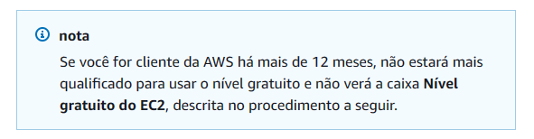

Google

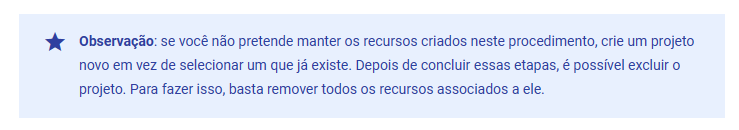

Microsoft

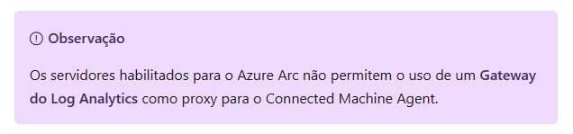


## Alerta de Dica

### Quando usar

Use este alerta para ajudar o usuário a ter mais sucesso na conclusão do passo a passo, normalmente com links que direcionam para outras páginas.

### Sintaxe markdown

```
> :bulb: **Dica** 
> 
> Coloque o texto do alerta aqui.
```

> :bulb: **Dica** 
> 
> Utilize esta sintaxe para criar os alertas da nossa documentação.

### Exemplos

AWS

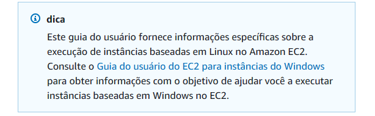

Microsoft

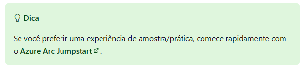


## Alerta de Importante

### Quando usar

Use este alerta para:

1 - informar passos essenciais que o usuário deve seguir para concluir a ação com sucesso.

2 - para informações que o usuário deve lembrar.

### Sintaxe markdown

```
> :grey_exclamation: **Importante** 
> 
> Coloque o texto do alerta aqui.
```

> :grey_exclamation: **Importante**
>
> Utilize esta sintaxe para criar os alertas da nossa documentação.

### Exemplos
AWS

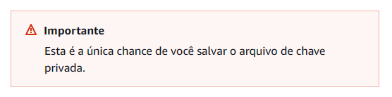

Google

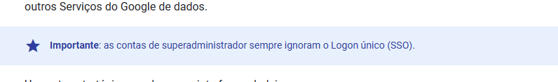

Microsoft


## Alerta de Atenção

### Quando usar
Use este alerta para:

1 - chamar a atenção do usuário sobre as consequências da ação a ser executada.

2 - quando há mais opções de configuração, para justificar porque ele deve seguir a instrução da forma como estamos ensinando. 

### Sintaxe markdown

```
> :warning: **Atenção** 
> 
> Coloque o texto do alerta aqui.
```

> :warning: **Atenção** 
> 
> Utilize esta sintaxe para criar os alertas da nossa documentação.

### Exemplos
AWS

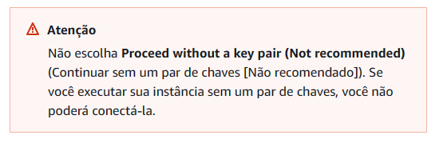

Google

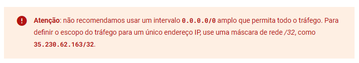


## Alerta de Cuidado

### Quando usar
Use este alerta SOMENTE quando a consequência do passo a passo for irreversível.

### Sintaxe markdown

```
> :red_circle: **Cuidado** 
> 
> Coloque o texto do alerta aqui.
```

> :red_circle: **Cuidado** 
> 
> Utilize esta sintaxe para criar os alertas da nossa documentação.

### Exemplos
Google

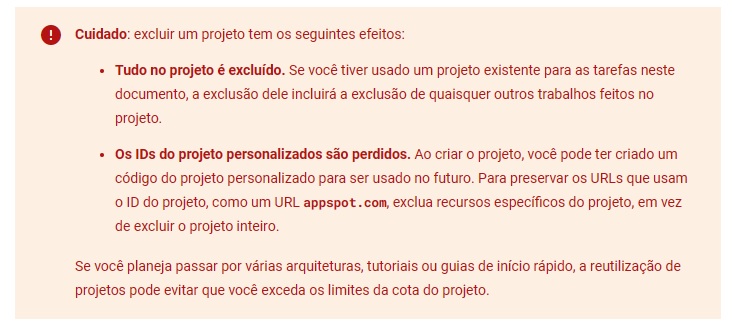

Microsoft

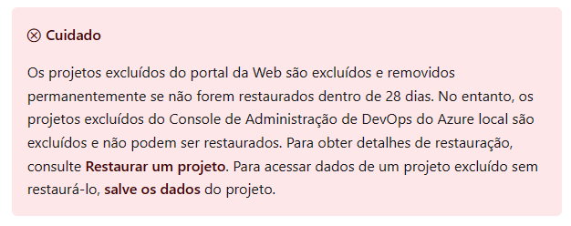

---
[^1]: [👍👎](http://feedback.dev.intranet.bb.com.br/?origem=roteiros&url_origem=fontes.intranet.bb.com.br/dev/publico/roteiros/-/blob/master/Diataxis/tipos_de_alertas.md&internalidade=Diataxis/tipos_de_alertas)