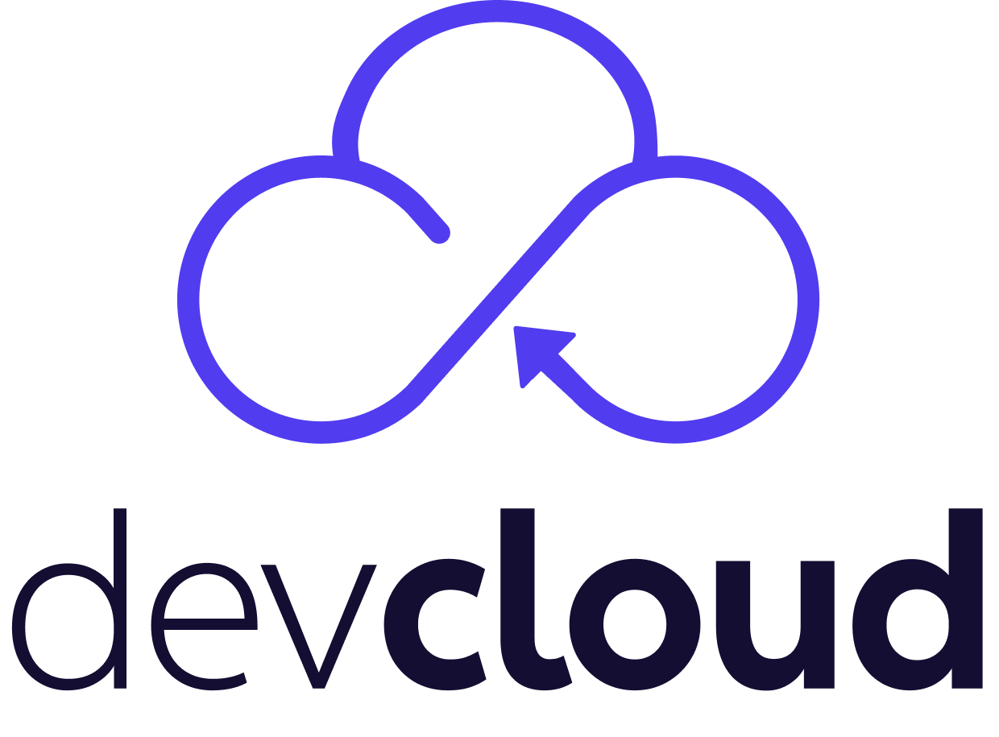

> :speech_balloon: Deixe seu feedback no rodapé.[^1]
 

 

# BASE DE CONHECIMENTOS DOS DESENVOLVEDORES DA CLOUD

Aqui, você encontra os documentos separados por temáticas para facilitar sua jornada de desenvolvimento na cloud. 

Para informações adicionais sobre a **devCloud**, acesse nosso **[Portal:](https://cloud.dev.intranet.bb.com.br)**

- [Devo migrar minha aplicação para a cloud?](https://cloud.dev.intranet.bb.com.br/#devo-ir-para-nuvem)
- [Como me preparar para a cloud?](https://cloud.dev.intranet.bb.com.br/#como-ir-para-nuvem)
- [Quais são todos os produtos e serviços cloud?](https://cloud.dev.intranet.bb.com.br/produtos-e-servicos)

### Regras de integração permitidas para a Cloud

- [Padrões aceitos de integração](https://banco365.sharepoint.com/sites/CCoE/Documentos%20Partilhados/Forms/AllItems.aspx?id=%2Fsites%2FCCoE%2FDocumentos%20Partilhados%2FDocumento%20%2D%20Integra%C3%A7%C3%A3o%20%2D%20COE%2Epdf&parent=%2Fsites%2FCCoE%2FDocumentos%20Partilhados)

[DX - Criar documentacao sobre o Twelve Factors - verificar curso Alura]: #
[SafeCloud - Escrever sobre a SQUAD de Migração]: #
[DS - Verificar se ainda existe serviço de consultoria https://fontes.intranet.bb.com.br/dev/publico/atendimento#solicita%C3%A7%C3%A3o-de-consultoria]: #
 

## >:open_file_folder: CRIAR UMA SOLUÇÃO NA CLOUD

Para começar a implementar sua solução, utilize a documentação abaixo para orientá-lo na criação de um projeto pronto para ser executado na cloud.
### :green_book: Provisionar os recursos para sua solução
- [Aprenda a provisionar recursos para executar sua solução na cloud, e, de forma automatizada, crie repositórios de código-fonte, pipelines de compilação e liberação.](/ofertas/Como_gerenciar_microsservicos.md)
### :green_book: Criar e configurar certificados TLS
- [Aprendar a criar e configurar certificados TLS para garantir criptografia de dados trafegados pela sua solução.](https://fontes.intranet.bb.com.br/dev/publico/roteiros/-/blob/master/certificado/Como_solicitar_certificados_PKI_SSL_interno.md)

 

## :open_file_folder: CONFIGURAÇÃO DE AMBIENTE

Utilize a documentação abaixo para auxiliá-lo na configuração do ambiente de desenvolvimento.

[?? - Criar roteiro solicitação e configuração VDI]: #
[DX - Mencionar roteiros isolados de configuração de ferramenta]: #

### :orange_book: Configuração Windows e WSL com Pengwin (Recomendado)

- [Funcionários (chave F) que utilizam Windows 10 ou superior, e desejam utilizar WSL com configuração automatizada.](https://fontes.intranet.bb.com.br/dev/publico/roteiros/-/blob/master/enxovalBB/Como_configurar_ambiente_local_dev.md)

### :orange_book: Configuração Windows e WSL com configuração manual

- [Funcionários (chave F) que utilizam Windows 10 ou superior, e desejam utilizar WSL com configuração manual.](https://fontes.intranet.bb.com.br/dev/publico/dev-wsl-config)

### :orange_book: Configuração de VDI (Recomendado para chave C)
Funcionários (chave C), independente do sistema operacional utilizado, devem seguir os roteiros:

- [Como solicitar acessos BB](https://fontes.intranet.bb.com.br/dev/publico/roteiros/-/blob/master/enxovalBB/Como_solicitar_acessos_BB.md)
- [Como configurar a VPN Check Point](https://fontes.intranet.bb.com.br/dev/publico/roteiros/-/blob/master/enxovalBB/Como_configurar_VPN.md)
- [Como configurar a VDI BB](https://fontes.intranet.bb.com.br/dev/publico/roteiros/-/blob/master/enxovalBB/Como_configurar_VDI.md)

### :orange_book: Configuração Kubectl

- [Configuração do Kubectl, uma ferramenta de linha comando para interagir com os recursos do Kubernets.](https://fontes.intranet.bb.com.br/dev/publico/roteiros/-/blob/master/kubernetes/Como_usar_kubectl_em_cluster.md)
- [Exemplos de comandos do Kubectl (Cheat Sheet).](https://github.com/dennyzhang/cheatsheet-kubernetes-A4)

### :orange_book: Configuração OpenShift

- [Instalação do oc em ambiente Vagrant.](kubernetes/Install_oc.md)
- [OpenShift no BB.](./openshift/openshift.md)

### :orange_book: Configuração Docker/Docker-compose

- [Orientações sobre as redes utilizadas no Docker.](docker/OrientacoesRedes.md)
- [Configuração da rede no Docker-compose.](docker/RedesNoDockerCompose.md)
- [Configuração Docker VPN.](docker/DockerVPN.md)

### :orange_book: Configuração Microsserviços

- [Como gerenciar os recursos de microsserviços](https://fontes.intranet.bb.com.br/dev/publico/roteiros/-/blob/master/kubernetes/Como_gerenciar_recursos_microsservicos.md)
 

## :open_file_folder: DESENVOLVER UMA SOLUÇÃO NA CLOUD

Utilize a documentação abaixo para auxiliá-lo na implementação de soluções para a cloud.

### :ledger: Imagens base para aplicações em Java

- [Imagens para Java 11 e 17.](java/Como_usar_imagens_base_java.md)

### :ledger: Banco de dados na cloud

- [Uso de banco de dados na cloud.](https://fontes.intranet.bb.com.br/dev/publico/roteiros/-/blob/master/desenvolvendo-solucao-para-nuvem/banco-de-dados/uso-de-banco-de-dados-na-nuvem.md)
- [Banco de dados no Java-Quarkus.](https://fontes.intranet.bb.com.br/dev/publico/roteiros/-/blob/master/desenvolvendo-solucao-para-nuvem/banco-de-dados/banco-de-dados-no-java-com-quarkus.md)
- [Solução de problemas com banco de dados.](https://fontes.intranet.bb.com.br/dev/publico/roteiros/-/blob/master/desenvolvendo-solucao-para-nuvem/banco-de-dados/solucao-de-problemas.md)
- [Melhorar mensagens de erro no DB2, com Java.](https://fontes.intranet.bb.com.br/dev/publico/roteiros/-/blob/master/desenvolvendo-solucao-para-nuvem/banco-de-dados/db2/melhorando-mensagens-de-erro-db2-no-java.md)
- [Paginação de resultados no DB2 12, com Java.](https://fontes.intranet.bb.com.br/dev/publico/roteiros/-/blob/master/desenvolvendo-solucao-para-nuvem/banco-de-dados/db2/paginacao-resultados-db2-v12-no-java.md)
- [Hosts de conexão com DB2.](https://fontes.intranet.bb.com.br/dev/publico/roteiros/-/blob/master/desenvolvendo-solucao-para-nuvem/banco-de-dados/db2/todos-hosts-db2.md)
- [Parâmetros de identificação do microsserviço na conexão ao db2.](https://fontes.intranet.bb.com.br/dev/publico/padroes/blob/master/conexao-db2.md)
- [Como solicitar Redis pela Oferta OAAS.](https://fontes.intranet.bb.com.br/dev/publico/roteiros/-/blob/master/databases/Como_configurar_Redis_Sentinel.md)
- [Como usar o DBeaver - Db2](./dbeaver/Como_conectar_db2.md)
- [Como usar o DBeaver - Oracle](./dbeaver/Como_conectar_oracle.md)
- [Parâmetros de Conexão DB2 e Oracle.](https://ad.intranet.bb.com.br/?p=6074)

### :ledger: Criar testes unitários

- [Utilizar H2 para testes.](desenvolvendo-solucao-para-nuvem/banco-de-dados/banco-de-dados-no-java-com-quarkus.md#configurando-as-dependências)
- [Testes de contrato/API](testes/TestesDeContrato.md)
- [Testes com WireMock](testes/Como_configurar_Wiremock.md)
- [Testes com Mockito - RestClient](testes/Como_configurar_Mockito.md)
- [Testes com JUnit](testes/referencias/roteiroJUnit/Testes_JUnit.md)
- [Cobertura incorreta no Java-Quarkus](testes/CoberturaIncorreta.md)
- [Vincular testes de interface (QTeste) na análise do Motor](https://fontes.intranet.bb.com.br/ath/publico/atendimentomotor/-/wikis/M%C3%A9tricas#teste-de-interface-e-api)

### :ledger: Sonar

- [Configurar o SonarLint](sonar/Como_configurar_SonarLint.md)
- [Configurar o acionamento do SonarQube](sonar/Como_configurar_SonarQube.md)

### :ledger: Debug

- [Debug aplicações Java.](debug/debug-java.md)
- [Debug aplicações Typescript.](debug/debug-typescript.md)

### :ledger: Guias para o Quarkus

- [Imagens - Java 11 e 17.](./java/Como_usar_imagens_base_java.md)
- [Atualizar para o Quarkus 3.](https://fontes.intranet.bb.com.br/dev/publico/roteiros/-/blob/master/frameworks/quarkus/atualizacao-quarkus-3.md)
- [Migrar o projeto do Kumuluzee para o Quarkus.](./frameworks/quarkus/migracao-quarkus.md)
- [Configurar o Swagger em Desenvolvimento e Homologação.](./frameworks/quarkus/swagger.md)
- [Usar banco de dados em projetos Java-Quarkus.](./desenvolvendo-solucao-para-nuvem/banco-de-dados/banco-de-dados-no-java-com-quarkus.md)
- [Como configurar o dev-services (test containers) para banco de dados em contêiner](testes/Como_configurar_Dev_Services.md)
- [Configurar o CORS em projetos Quarkus](seguranca/Ref_configuracao_CORS.md)
- [Dev java erro - crie suas exceptions compatíveis com o msg e o Curió.](https://fontes.intranet.bb.com.br/dev/dev-java-erro/)
- [Extensão Dev Dx - entenda como ele gera seus logs, métricas e padrão de erros.](/extensoes-quarkus/dev-dx-quarkus-ext.md) (DEPRECIADA)
- [Processamento assíncrono.](./frameworks/quarkus/processamento-assincrono.md)
- [Gravar o log da aplicação em um arquivo dentro de um volume do kubernetes.](./frameworks/quarkus/configuracao_log_file.md)
- [Exemplo de projeto e roteiro para configurar trustsstore (https) e OIDC para oauth2.](https://fontes.intranet.bb.com.br/dev/publico/exemplos/quarkus-bb-sia)

### :ledger: Operações IIB

- [Consumo de operações IIB em Java.](https://fontes.intranet.bb.com.br/dev/publico/roteiros/-/blob/master/iib/Como_configurar_aplicacao_consumo_operacoes_iib.md)
- [Provimento de operações IIB em Java.](./desenvolvendo-solucao-para-nuvem/operacoes-catalogo-iib/provendo-operacao-iib-curio-java.md)
- [Guia do Curio](https://fontes.intranet.bb.com.br/iib/publico/iib-container/iib-curio/iib-curio#iib-curi%C3%B3).
- [Como rodar Cúrio local com Docker.](https://fontes.intranet.bb.com.br/dev/publico/roteiros/-/blob/master/desenvolvendo-solucao-para-nuvem/operacoes-catalogo-iib/curio-local-docker.md)
- [Guia de mensageria, com os padrões e como cadastrar](https://mensagens.labbs.com.br/?docs=metodos)
- [Tratamento de Erros Melhorados e prontos para serem usado na mensageria com dev-java-erro.](https://fontes.intranet.bb.com.br/dev/dev-java-erro/-/blob/master/README.md#filtro-de-erro-do-curio)
- [Criando chave IDH para utilizar no Cúrio](https://fontes.intranet.bb.com.br/idh/publico/roteiros/-/wikis/Criando-uma-credencial-para-a-aplica%C3%A7%C3%A3o).
- [Configurando Cúrio no ambiente Local para utilizar chave IDH.](https://fontes.intranet.bb.com.br/idh/publico/roteiros/-/wikis/Configura%C3%A7%C3%A3o-da-credencial-de-aplica%C3%A7%C3%A3o#aplica%C3%A7%C3%A3o-arq-30)
- [Investigando problemas com mensageria.](https://fontes.intranet.bb.com.br/dev/publico/roteiros/-/blob/master/desenvolvendo-solucao-para-nuvem/operacoes-catalogo-iib/troubleshooting-msg.md)
- [Segurança no consumo e provimento de operações via Curió/IIB](https://fontes.intranet.bb.com.br/idh/publico/roteiros/-/wikis/Seguran%C3%A7a-de-Aplica%C3%A7%C3%B5es-no-IIB)
- [Obter e Repassar o canal em operações IIB Curio](./iib/Como_repassar_info_via_header_infocnl.md)
- [Obter e Repassar Estado Integração em operações IIB Curio](./iib/Curio_EstadoIntegracao.md)
- [Obter e Repassar usuário em operações IIB Curió](./iib/Como_utilizar_token_atendimento_curio.md)
- [Obter e Repassar o usuário logado na Plataforma (IIB-Cyborg)](https://fontes.intranet.bb.com.br/iib/publico/iib-cyborg)

### :ledger: Guias para o NodeJS + Typescript + Express

- [Como gerar e usar código Typescript em Modo Treinamento](node/typescript_modo_treinamento.md)
- [Atualizando o Node 18 para o Node 20](node/atualizacao-node-20.md)

### :ledger: Python em aplicações da cloud

- [Repositório python-cloud-bb](https://fontes.intranet.bb.com.br/dev/publico/python/-/blob/master/python-cloud-bb.md)
- [Instruções para utilização do pipeline CI para projetos que utilizam Python como código-fonte](https://fontes.intranet.bb.com.br/aic/publico/atendimento/-/blob/master/documentacoes/build/pipelines/cloud/python.md)

### :ledger: Proxy

- [Adicionar proxy ao projeto.](./proxy/proxy.md)

### :ledger: Brokers de integração

- [Kafka - Versão BIG e Red Hat/OpenShift.](./brokers-integracao/kafka/kafka.md)
- [IBM WebSphere MQ.](./brokers-integracao/ibm-mq/ibm-mq.md)
- [RabbitMQ.](./brokers-integracao/rabbitmq/rabbitmq.md)

### :ledger: Processamento de arquivos

- [Integração via arquivos usando o BB-SIA.](./processamento-arquivos/bb-sia_v2.md)

### :ledger: Métricas

- [Conceitos gerais de métricas e padrão BBDEV.](metricas/Metricas.md)
- [Criar métricas para projetos Typescript.](metricas/metricasTypescript.md)
- [Criar métricas para projetos Javascript.](metricas/metricasJavascript.md)
- [Criar métricas para projetos Java Kumuluzee.](metricas/metricasJava.md)
- [Criar métricas com o padrão B5.](metricas/metricasB5.md)

### :ledger: Segurança

- [Colocar senhas em ambientes para desenvolvimento local.](seguranca/configuracao_env_local.md)
- [Heimdall - autenticação e autorização de aplicações na Arq3.](https://banco365.sharepoint.com.mcas.ms/sites/Heimdall/SitePages/Autentica%C3%A7%C3%A3o-e-Autoriza%C3%A7%C3%A3o-de-Aplica%C3%A7%C3%B5es.aspx)
- [Vulnerabilidade do Log4j.](seguranca/vulnerabilidade_log4j.md)
- [Certificados em aplicações Java.](java/certificados-java.md)
 

## :open_file_folder: COMPILAÇÃO (BUILD) DO CÓDIGO

Com o término da implementação, é necessário compilar (build) o projeto para criar *ativo* e disponibilizá-lo para implantação.

[DX - Criar ou linkar documentação sobre a esteira de build do AIC]: #

### Esteira de construção de projetos (CI Jenkins)

- [CI Jenkins para Java.](https://fontes.intranet.bb.com.br/aic/publico/atendimento/-/wikis/Pipelines/Java)
- [CI Jenkins para Javascript.](https://fontes.intranet.bb.com.br/aic/publico/atendimento/-/wikis/Pipelines/Javascript)
- [CI Jenkins para Python.](https://fontes.intranet.bb.com.br/aic/publico/atendimento/-/wikis/Pipelines/Python)
- [CI Jenkins para imagens Docker.](https://fontes.intranet.bb.com.br/aic/publico/atendimento/-/wikis/Pipelines/Docker)
- [Manual da esteira de integração contínua (Jenkins) - Java.](https://fontes.intranet.bb.com.br/aic/publico/aic-documentation/-/blob/master/roteiros/EsteiraJava.md)
- [Manual da esteira de integração contínua (Jenkins) - Javascript.](https://fontes.intranet.bb.com.br/aic/publico/aic-documentation/-/blob/master/roteiros/EsteiraJavaScript.md)

 

## :open_file_folder: IMPLANTAÇÃO (RELEASE OU DEPLOY) DA SOLUÇÃO

Utilize a documentação abaixo para implantar sua solução nos ambientes produtivos ou pré-produção.

[DX - Criar ou linkar documentação explicando o BBAplic e o DNS]: #

### :closed_book: Utilizar o Brave Release

- [Utilizar o portal Brave para efetuar a implantação da solução de forma guiada e evitando erros.](https://fontes.intranet.bb.com.br/dev/publico/roteiros/-/blob/master/release/brave-release.md)

### :closed_book: Implantar em produção

- [Passos adicionais para implantar em produção.](https://fontes.intranet.bb.com.br/dev/publico/roteiros/-/blob/master/deploy-producao/Como_implantar_aplicação_ambiente_prod.md)

### :closed_book: Atualizar o BBAplic

- [Atualizar o BBAplic.](https://fontes.intranet.bb.com.br/dev/publico/roteiros/-/blob/master/release/atualizar-bbaplic.md)

### :closed_book: DNS para acesso externo

- [Solicitar DNS para acesso externo em produção.](https://fontes.intranet.bb.com.br/psc/publico/atendimento/-/blob/master/Roteiro_solicitacao_DNS_INTERNET.md)

### :closed_book: Utilizar o deploy canário

- [Deployment Canário.](./kubernetes/deployment-canario.md)

[## Monitorando sua solução]: #
[DX - Roteiros estão sob gestão da Plataforma de Monitoração, analisar e verificar quais vincular, principalmente os de AppDynamics]: #
[Logs e Tracing]: #

 

## :open_file_folder: SELO CLOUD DE QUALIDADE

Todas as soluções da cloud são avaliadas qualitativamente pelo Selo Cloud. Confira as [regras e mais informações.](https://fontes.intranet.bb.com.br/dev/publico/selo-digital#selo-cloud-de-qualidade)

### :notebook: Consultar o Selo Cloud do projeto

- [Consultar o Selo Cloud do projeto através do Brave.](https://brave.dev.intranet.bb.com.br)

### :notebook: Consultar estatísticas Selo Cloud

- [Consultar as estatísticas Selo Cloud da sigla através do Brave.](https://brave.dev.intranet.bb.com.br/selo-cloud-estatistica)

 

## :open_file_folder: MONITORAR NA CLOUD

Utilize a documentação abaixo para auxiliá-lo a monitorar a aplicação na cloud.

- [PLatMon - monitorar a aplicação Java com Apdynamics.](https://fontes.intranet.bb.com.br/sgs/publico/plataforma-monitoracao/-/blob/master/roteiros/AppD_Instrumentacao_java.md)
- [PLatMon - monitorar a aplicação NodeJS com Apdynamics.](https://fontes.intranet.bb.com.br/sgs/publico/plataforma-monitoracao/-/blob/master/roteiros/AppD_Instrumentacao_nodejs.md)
- [PLatMon - monitorar a aplicação Python com Apdynamics.](https://fontes.intranet.bb.com.br/sgs/publico/plataforma-monitoracao/-/blob/master/roteiros/AppD_Instrumentacao_python.md)
- [Criar alertas para a aplicação.](./monitoracao/Como_gerar_alertas_monitoracao.md)
- [Criar stack de monitoração de forma automatizada pelo Portal.](https://fontes.intranet.bb.com.br/sgs/publico/documentacao/-/blob/master/Roteiro%20Cria%C3%A7%C3%A3o%20Stack%20B%C3%A1sica.md)
- [Configurar esteira de dashboards para o Grafana.](<https://fontes.intranet.bb.com.br/sgs/publico/roteiros/-/blob/master/Esteira%20de%20Dashboards%20Grafana.md>)
- [Criar log para a aplicação.](./monitoracao/CriandoLogs.md)
- [Visualizar logs da aplicação.](./monitoracao/VisualizandoLogs.md)
- [Troubleshooting de Monitoração.](./monitoracao/Troubleshooting.md)
- [Configurar Tracing Jaeger no Java.](./tracing/tracing.md)
- [Atualizar o Grafana.](./monitoracao/atualizar-grafana.md)
- [Dashboards básicos Arq3.](./monitoracao/referencias/paineis_basicos.md)

 

## :open_file_folder: DÚVIDAS E SUPORTE

[Acesse essa página](https://fontes.intranet.bb.com.br/dev/publico/atendimento#atendimento) para aprender a abrir uma solicitação de suporte e entender como funciona o atendimento.

[## Guildas Cloud]: #
[As Guildas Cloud ocorrem semanalmente e nela são abordados assuntos relacionadas ao desenvolvimento de soluções na nuvem, confira mais informações no Portal DevCloud, clique aqui(https://cloud.dev.intranet.bb.com.br/guilda). ]: #

### :bookmark_tabs: Tags das issues

- [Significado das tags nas issues.](https://fontes.intranet.bb.com.br/dev/publico/atendimento/-/labels?search=&subscribed=)

### :bookmark_tabs: FAQ

- [FAQ](https://fontes.intranet.bb.com.br/dev/publico/roteiros/-/blob/master/faqs/faq.md)

 

## :open_file_folder: LINKS ÚTEIS

### :link: Portal devcloud

- devcloud (https://cloud.dev.intranet.bb.com.br)

### :link: Repositório de Charts para a BB Cloud

- Charts Cloud (https://charts.nuvem.bb.com.br/charts/bb-cloud)

### :link: Criação de Charts (requerimentos)

- [Criação de charts (abra primeiro uma issue no dev para avaliar a necessidade).](https://fontes.intranet.bb.com.br/psc/publico/atendimento/-/blob/master/roteiros/criacao-chart.md)

### :link: Portal de Ofertas OAAS

- Portal Nuvem (Ofertas) (https://portal.nuvem.bb.com.br)

### :link: Plataforma de Monitoração

- Portal da PlatMon (https://banco365.sharepoint.com.mcas.ms/sites/PlataformadeMonitoracao)

### :link: Portal de Monitoração

- Portal de Monitoração (http://portal.sgs.intranet.bb.com.br/)

### :link: Repositórios de Código Fonte

- Fontes (https://fontes.intranet.bb.com.br)
- Fontes das siglas de Canais (https://canais.fontes.intranet.bb.com.br)

### :link: Esteira Jenkins (Pipeline)

- Cloud CI (Jenkins) (https://cloud.ci.intranet.bb.com.br)

- CI das siglas de canais (Jenkins) (https://canais.ci.intranet.bb.com.br)

### :link: Resultados de análises do Sonar (gerados pela esteira Jenkins)

- Sonar (master) (https://qsonar.intranet.bb.com.br ou http://qsonar.intranet.bb.com.br:9000)

- Sonar-Snapshots (develop) (https://qsonar-snapshot.intranet.bb.com.br ou http://qsonar-snapshot.intranet.bb.com.br:9000)

### :link: Repositório de Builds (imagens docker compiladas)

- Artifactory WebApp (http://atf.intranet.bb.com.br/artifactory/webapp/#/home)

- Artifactory Builds (http://atf.intranet.bb.com.br/artifactory/bb-docker-repo/bb/)

### :link: Calendário de Congelamento do GSTI

- GSTI (https://gsti.bb.com.br/hps/APPS/docs/2023-calendariosft.pdf)

### :link: Operação de Aplicações na cloud

- Rancher (https://caas.nuvem.bb.com.br)

- Rancher das siglas de canais (https://caas.apps.nuvem.bb.com.br)

- Rancher do silo data (https://caas.data.nuvem.bb.com.br/)

- ArgoCD Desenvolvimento (https://des.deploy.nuvem.bb.com.br)

- ArgoCD Homologação (https://hml.deploy.nuvem.bb.com.br)

- ArgoCD Produção (https://prd.deploy.nuvem.bb.com.br/)

### :link: Tracing de aplicações

- Jaeger k8s-Desenvolvimento (https://tracing.nuvem.desenv.bb.com.br)

- Jaeger k8s-Homologação (https://tracing.nuvem.hm.bb.com.br)

- Jaeger k8s-Produção (https://tracing.svc.nuvem.bb.com.br ou http://tracing.svc.nuvem.bb.com.br - sem https, contingência)

- Jaeger k8s-data-des (https://tracing.data.nuvem.desenv.bb.com.br)

- Jaeger k8s-apps-des (https://tracing.k8s-apps-des.nuvem.desenv.bb.com.br/search)

- Jaeger k8s-apps-hml (https://tracing.k8s-apps-hml.nuvem.hm.bb.com.br/search)

- Jaeger k8s-apps-prd (https://tracing.k8s-apps-prd.nuvem.bb.com.br/search)

---

[^1]: [👍👎](http://feedback.dev.intranet.bb.com.br/?origem=roteiros&url_origem=fontes.intranet.bb.com.br/dev/publico/roteiros/-/blob/master/README.md&internalidade=README)

