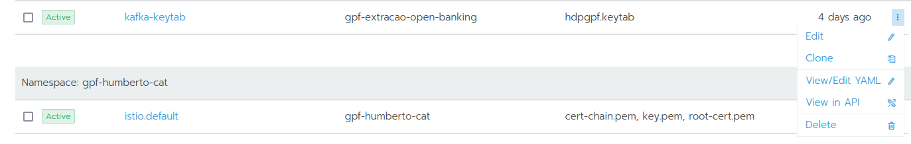
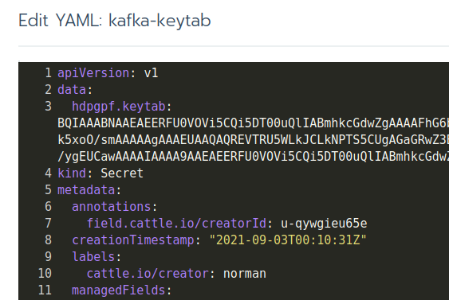

> :exclamation: Dê um feedback para esse documento no rodapé.[^1]

# Kafka Corporativo


- Agenda
  - [Objetivo](#Objetivo)
  - [Roteiro da Requisção](#Roteiro-da-Requisi%C3%A7%C3%A3o)
  - [Referências](#Refer%C3%AAncias)
  - [Configurar Kafka no K8s](#Configurar-Kafka-no-K8S)
  - [Configurando o Kafka no Projeto Java com Quarkus](#configurando-o-kafka-no-projeto-java-com-quarkus)

## Objetivo

Instruir o analista na solicitação de criação de instâncias kafka corporativo.

## Roteiro da Requisição

1. Acesse a oferta Criação de Tópicos Kafka em "**Automações Adhoc**" - "**BigData**", no portal nuvem: https://portal.nuvem.bb.com.br/adhocs/category/Bigdata
2. Selecione o item "**Operações sobre Tópicos Kafka CDP**"
3. Informe os dados solicitados (Obs.: no Nome do Tópico não informe . ou _)
4. Aguarde a recepção de email com os dados de configuração e a keytab do Kerberos.

## Kerberos

O controle de segurança existente para que a aplicação possa acessar o servidor Kafka é feito pelo protocolo de rede Kerberos, [este fazap do BIG](https://fontes.intranet.bb.com.br/big/publico/atendimento/-/blob/master/fazap/kerberos/conhecendo-o-kerberos.md) explica em detalhes como ele funciona.

## Referências

[HDP 2.6](https://docs.cloudera.com/HDPDocuments/HDPforCloud/HDPforCloud-2.6.5/hdp-release-notes/content/hdp_comp_versions.html)

[HDP 3.1](https://docs.cloudera.com/HDPDocuments/HDP3/HDP-3.1.0/release-notes/content/comp_versions.html)


## Configurar Kafka no K8s

1) Acesse seu arquivo values.yaml 
2) Declare como variáveis de ambiente da sua aplicação que utiliza kafka as seguintes entradas

```
- name: JAAS_FILE
  value: /etc/config-kafka/kafka_client_jaas.conf
- name: KRB5_FILE
  value: /etc/config-kafka/krb5_[ENVIRONMENT].conf

```

  A equipe resonsável pela criação do seus brokers são responsáveis por enviar esses arquivos

  3) No values.yaml, procure por <strong>volumeMounts</strong>    
  3.1) Adicione:  

```

  - name: config-kafka
    mountPath: /etc/config-kafka
  - name: kafka-keytab
    mountPath: /etc/config-kafka-keytab
    readOnly: true
```


4) Ainda dentro do values.yaml, procure por <strong>volumes:</strong>   

4.1) Adicione:  

```
  - name: config-kafka
    configMap:
      name: config-kafka
  - name: kafka-keytab
    secret:
      secretName: kafka-keytab
```

5) Agora procure por <strong>configMaps:</strong>  
5.1) Adicione  

```
  - name: config-kafka
    data:
      kafka_client_jaas.conf: CONTEÚDO_DO_ARQUIVO_JAAS.CONF
      krb5_[ENVIRONMENT].conf: [CONTEÚDO_DO_ARQUIVO_KRB5.CONF]
```    

5.2) Note que o conteúdo do arquivo <strong>kafka_client_jaas.conf</strong> possui a propriedade "keytab" que faz referência ao arquivo .keytab. Altere-o para o seguinte valor:   
  `/etc/config-kafka-keytab/bigpve01.keytab`

6) Por fim, crie uma secret no Kubernetes de nome <strong>kafka-keytab</strong>   

6.1) A chave dessa secret deverá coincidir com o nome do arquivo .keytab dentro do seu arquivo kafka_client_jaas.conf, exemplo:  


```
    KafkaClient {
          com.sun.security.auth.module.Krb5LoginModule required
          useKeyTab=true
          keyTab="/etc/config-kafka-keytab/bigpve01.keytab"
          principal="bigpve01@DESENVOLVIMENTOHWBB.COM.BR"
          useTicketCache=false
          renewTicket=true
          doNotPrompt=true
          serviceName=kafka;
        }; 
```


 No caso do arquivo acima o key da secret será <strong>bigpve01.keytab</strong>

6.2) O conteúdo da secret deverá ser colocado em base64, para isso, no linux execute:  

6.2.1) 
`
cat [CAMINHO_ABSOLUTO_PARA_KEYTAB] | base64  
`


6.2) Copie e cole o resultado dessa operação no conteúdo da secret

Caso você receba o erro `javax.security.auth.login.LoginException: Unable to obtain password from user`, faça a inclusão do conteúdo da secret conforme esta [issue](https://fontes.intranet.bb.com.br/big/publico/atendimento/-/issues/2066#note_564993). 

Edite o conteúdo da secret usando o `View/Edit YAML`:



Edite a secret que vai aparecer na keytab:



Outra opção seria cadastrar a secret com o conteúdo keytab via linha de comando com Kubectl ou OC, conforme [este roteiro](https://fontes.intranet.bb.com.br/dev/publico/roteiros/-/blob/master/kubernetes/kubectl-cheat-sheet.md).

7) A keytab cadastrada na secret será a mesma para todos os microserviços da mesma sigla, no entanto cada ambiente (desenvolvimento, homologação, produção) terá uma keytab diferente.


## Configurando o Kafka no Projeto Java com Quarkus

O projeto [gpf-demo-kafka](https://fontes.intranet.bb.com.br/gpf/gpf-demo-kafka) foi criado, pela equipe do GPF, com o objetivo de servir como uma aplicação Java/Quarkus de demonstração para o uso do Kafka.

Foi feito um deploy desta aplicação no ambiente de desenvolvimento, de modo que é possível utilizar o seu [projeto de release de desenvolvimento](https://fontes.intranet.bb.com.br/gpf/gpf-demo-kafka/des-gpf-demo-kafka) como exemplo.

Ele é uma aplicação simples, onde você pode acessar o seu [swagger](http://demo-kafka.gpf.desenv.bb.com.br/api-docs/) e enviar uma mensagem para um tópico Kafka. Este tópico Kafka é lido pela própria aplicação e é publicada uma mensagem na sua console de log.

Esta aplicação foi criada à partir de um projeto BBDEV. O Quarkus foi evoluído para a versão `1.13.7.Final` e o Dockerfile foi atualizado conforme abaixo:

```dockerfile
FROM atf.intranet.bb.com.br:5001/bb/lnx/lnx-jre-centos:11.0.5
WORKDIR /app

COPY target/quarkus-app/ /app/
COPY target/quarkus-app/quarkus-run.jar /app/app.jar

CMD [ "sh", "-c", "java  -Djava.security.auth.login.config=$JAAS_FILE -Djava.security.krb5.conf=$KRB5_FILE -jar /app/app.jar"]
```

A imagem Linux Alpine gerada no projeto do BBDEV não funciona para a leitura de mensagens do Kafka com o controle do Kerberos, dá um erro, por isso acima foi substituído pela imagem do CentOS.

No projeto de deploy, os parâmetros `JAAS_FILE` e `KRB5_FILE` acima são informados.

Neste projeto, o docker-compse.yaml foi ajustado para a inclusão do Zookeeper e do Kafka.

Caso deseje rodar o projeto somente com o `mvn quarkus:dev`, entre na pasta `kafka-local-test` e suba o docker-compose.yaml dela com:
```
$ docker-compose up
```

Este docker-compose.yaml vai subir um Zookeeper e um Kafka rodando em localhost na sua máquina, depois basta você startar o projeto com:
```
$ mvn quarkus:dev
```

E acessar o seu swagger em localhost:8080/api-docs


---
[^1]: [👍👎](http://feedback.dev.intranet.bb.com.br/?origem=roteiros&url_origem=fontes.intranet.bb.com.br/dev/publico/roteiros/-/blob/master/brokers-integracao/kafka/corporativo-kafka.md&internalidade=brokers-integracao/kafka/corporativo-kafka)
