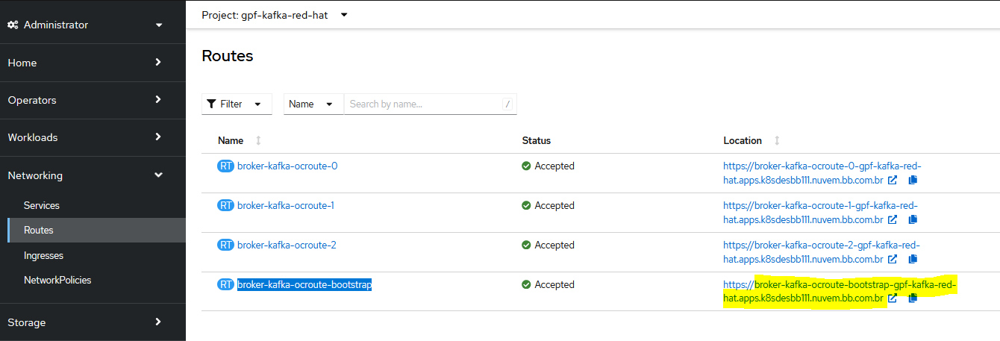
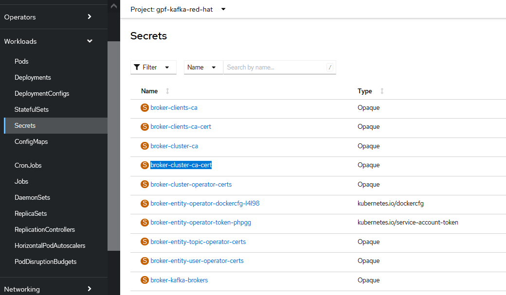

> :exclamation: Dê um feedback para esse documento no rodapé.[^1]


O [IIB-KAFKA](https://fontes.intranet.bb.com.br/iib/helm_charts/iib-kafka-documentacao/-/wikis/Documenta%C3%A7%C3%A3o-da-Oferta-para-Cria%C3%A7%C3%A3o-de-Kafka-Red-Hat) Red Hat é disponibilizado pela equipe do IIB e é uma alternativa ao [kafka mantido pela sigla BIG](../kafka/corporativo-kafka.md)

# Kafka Red Hat

Roteiro de como criar um Kafka Red Hat e o acessar por meio de uma aplicação Java/Quarkus.

[Exemplos de projeto Kafka Red Hat, código fonte Java/Quarkus e deploy Java/Quarkus](https://fontes.intranet.bb.com.br/dev/publico/exemplos/kafka).

**IMPORTANTE**:
- O Kafka Red Hat é executado dentro de um cluster OpenShift.
- Caso seja utilizado fora do cluster OpenShift você deverá realizar uma conexão SSL utilizando um certificado do tipo truststore, confira [aqui](./kafka-com-ssl.md) como fazer.
- Confira [aqui](/openshift/openshift.md) o roteiro de como usar o OpenShift no BB.
- Só é permitido utilizar este Kafka para fazer integração intra-sigla, ou seja entre microsserviços da sua própria sigla.

- Tópicos
  - [Criando o seu Kafka Red Hat](#criando-o-seu-kafka-red-hat)
  - [Subindo um testador publisher / consumer dentro do seu namespace Kafka Red Hat](#subindo-um-testador-publisher--consumer-dentro-do-seu-namespace-kafka-red-hat)
  - [Criando uma aplicação Java/Quarkus para se conectar no Kafka](#criando-uma-aplicação-javaquarkus-para-se-conectar-no-kafka)
  - [Fazendo deploy aplicação Java/Quarkus para se conectar no Kafka](#fazendo-deploy-aplicação-javaquarkus-para-se-conectar-no-kafka)


# Criando o seu Kafka Red Hat


[Seguir roteiro oficial da oferta Kafka Red Hat](https://fontes.intranet.bb.com.br/iib/helm_charts/iib-kafka-documentacao/-/wikis/Documenta%C3%A7%C3%A3o-da-Oferta-para-Cria%C3%A7%C3%A3o-de-Kafka-Red-Hat#3-preenchimento-do-formul%C3%A1rio)
======================

1. [Acessos necessários para solicitação da oferta.](https://fontes.intranet.bb.com.br/iib/helm_charts/iib-kafka-documentacao/-/wikis/Documenta%C3%A7%C3%A3o-da-Oferta-para-Cria%C3%A7%C3%A3o-de-Kafka-Red-Hat#2-acessos-necess%C3%A1rios)
------------------------------------------------------------------------
2. [Preenchimento do formulário para a solicitação da oferta.](https://fontes.intranet.bb.com.br/iib/helm_charts/iib-kafka-documentacao/-/wikis/Documenta%C3%A7%C3%A3o-da-Oferta-para-Cria%C3%A7%C3%A3o-de-Kafka-Red-Hat#3-preenchimento-do-formul%C3%A1rio)

## Criação de secret com usuário e senha 

Crie uma secret no seu namespace do openshift.

Nome da secret: 
- kafka-user-password

Key/value:
- `kafka-password` / `valor da sua senha - na oferta, o exemplo vem com "12345"`
- `kafka-username` / `nome do seu usuário - na oferta, o exemplo vem com "kafka-user"`

Criando via CLI do OC [roteiro de como configurar o OC](/openshift/openshift.md):
```shell
$ oc project <namespace do seu projeto>

$ oc create secret generic kafka-user-password --from-literal=kafka-username='<nome do seu usuario>' --from-literal=kafka-password='<senha>'

$ oc project dev-kafka

$ oc create secret generic kafka-user-password --from-literal=kafka-username='kafka-user' --from-literal=kafka-password='12345'
```


# Subindo um testador publisher / consumer dentro do seu namespace Kafka Red Hat

Dentro do seu namespace do Kafka, é possível subir um pod para ser um publisher e outro pod para ser o consumer.

Abra um terminal e execute o comando abaixo para criar o consumer:
```shell
oc run kafka-consumer -ti --image=registry.redhat.io/amq7/amq-streams-kafka-33-rhel8:2.3.0 --rm=true --restart=Never -- bin/kafka-console-consumer.sh --bootstrap-server broker-kafka-bootstrap:9092 --topic topico-exemplo-1 --group GRUPO-1 --from-beginning --consumer-property security.protocol=SASL_PLAINTEXT --consumer-property sasl.mechanism=SCRAM-SHA-512 --consumer-property sasl.jaas.config="org.apache.kafka.common.security.scram.ScramLoginModule required username=\"kafka-user\" password=\"12345\";"
```

Abra outro terminal e execute o comando abaixo para criar o publisher:
```shell
oc run kafka-producer -ti --image=registry.redhat.io/amq7/amq-streams-kafka-33-rhel8:2.3.0 --rm=true --restart=Never -- bin/kafka-console-producer.sh --bootstrap-server broker-kafka-bootstrap:9092 --topic topico-exemplo-1 --producer-property security.protocol=SASL_PLAINTEXT --producer-property sasl.mechanism=SCRAM-SHA-512 --producer-property sasl.jaas.config="org.apache.kafka.common.security.scram.ScramLoginModule required username=\"kafka-user\" password=\"12345\";"
```

Observação - atualizar os dados abaixo conforme configuração do usuário:
- topico-exemplo-1 (nome do topico)
- kafka-user (usuário do topico)
- 12345 (password)
- GRUPO-1 (nome do grupo de consumidor)


# Criando uma aplicação Java/Quarkus para se conectar no Kafka
##### Caso a aplicação que você deseja se conectar já exista, não será necessária uma nova criação, apenas a configuração

## Configure o Kafka no seu projeto

Configure o Kafka no seu projeto sem se preocupar com a forma de autenticação.

É preciso informar para o modo `test` que será usado um broker "in memory", senão o Quarkus vai tentar subir um container do Kafka durante o `mvn test` utilizando a feature [Quarkus DevServices](https://pt.quarkus.io/guides/dev-services).

Roteiros do Quarkus:
- https://quarkus.io/guides/kafka
- https://quarkus.io/guides/kafka-reactive-getting-started
- https://pt.quarkus.io/guides/dev-services

### Exemplo do application.properties

```properties
# Se não informar o kafka server, o DEV service do Quarkus vai tentar subir um container do Kafka
kafka.bootstrap.servers=localhost:9092

# Tópico de saída 'cliente' - channel 'cliente-out'
mp.messaging.outgoing.cliente-out.connector=smallrye-kafka
mp.messaging.outgoing.cliente-out.topic=cliente
mp.messaging.outgoing.cliente-out.value.serializer=io.quarkus.kafka.client.serialization.ObjectMapperSerializer

# Tópico de entrada 'cliente' - channel 'cliente-in'
mp.messaging.incoming.cliente-in.connector=smallrye-kafka
mp.messaging.incoming.cliente-in.topic=cliente
mp.messaging.incoming.cliente-in.value.deserializer=br.com.bb.gpf.models.ClienteDeserializer

# LOG Kafka
quarkus.log.category."org.apache.kafka.clients".level=INFO
quarkus.log.category."org.apache.kafka.common.utils".level=INFO
quarkus.log.category."org.apache.kafka.common.metrics".level=INFO
```

### Exemplo do application.properties de teste

```
%test.kafka.bootstrap.servers=localhost:9092
%test.mp.messaging.outgoing.cliente-out.connector=smallrye-in-memory
%test.mp.messaging.incoming.cliente-in.connector=smallrye-in-memory
```

### Exemplo de pom.xml

```xml
    <!-- Kafka -->
    <dependency>
      <groupId>io.quarkus</groupId>
      <artifactId>quarkus-smallrye-reactive-messaging-kafka</artifactId>
    </dependency>
    <dependency>
      <groupId>io.smallrye.reactive</groupId>
      <artifactId>smallrye-reactive-messaging-in-memory</artifactId>
      <scope>test</scope>
    </dependency>
```

### Exemplo de endpoint de teste que faz publish

```java
@Tag(name = "Teste de envio para tópico Kafka")
@ApplicationScoped
@Path("/kafka/producer")
public class KafkaProducerResource {

    private final Logger LOG = LoggerFactory.getLogger(KafkaProducerResource.class);

    @Channel("cliente-out")
    Emitter<Cliente> clienteEmitter;

    @Path("/{id}/{cpf}/{nome}")
    @Produces(MediaType.TEXT_PLAIN)
    @GET
    @Operation(summary = "Teste Kafka", description = "Após a requisição, uma mensagem será enviada ao Kafka, será lida pela própria aplicação e exibida no LOG")
    public String testKafaProducer(
            @Parameter(example = "1") @PathParam("id") int id,
            @Parameter(example = "1234") @PathParam("cpf") long cpf,
            @Parameter(example = "José dos testes") @PathParam("nome") String nome) {
        LOG.info("testKafkaProducer() cliente = " + id + " nome = " + nome +
                " cpf = " + cpf);

        var cliente = new Cliente(id, cpf, nome);

        clienteEmitter.send(cliente);

        LOG.info("testKafkaProducer() " + cliente + " mensagem enviada");

        return "mensagem enviada ";
    }

}
```

### Exemplo de Consumer que printa o que foi lido na console

```java
@ApplicationScoped
public class KafkaConsumer {

    private final Logger LOG = LoggerFactory.getLogger(KafkaConsumer.class);

    @Incoming("cliente-in")
    public void get(Cliente cliente) {
        LOG.info("Cliente recebido " + cliente);
    }
}
```

### Exemplo do DTO que vai trafegar no kafka
```java
public class Cliente {
    private final int id;
    private final long cpf;
    private final String nome;
    public Cliente(int id, long cpf, String nome) {
        this.id = id;
        this.cpf = cpf;
        this.nome = nome;
    }
    public int getId() {
        return id;
    }
    public String getNome() {
        return nome;
    }
    public long getCpf() {
        return cpf;
    }
    @Override
    public String toString() {
        return "Cliente [id=" + id + ", cpf=" + cpf + ", nome=" + nome + "]";
    }    
}
```

### Exemplo de deserializador

```java
import io.quarkus.kafka.client.serialization.ObjectMapperDeserializer;

public class ClienteDeserializer extends ObjectMapperDeserializer<Cliente> {

    public ClienteDeserializer() {
        super(Cliente.class);
    }

}
```

# Fazendo deploy aplicação Java/Quarkus para se conectar no Kafka

## Crie as secrets para armazenar o nome do usuário e senha do seu kafka

```shell
$ oc project <seu nampespace da aplicação>

$ oc create secret generic kafka-user-password --from-literal=kafka-username='<nome do seu usuario>' --from-literal=kafka-password='<senha>'

$ oc project dev-kafka-quarkus

$ oc create secret generic kafka-user-password --from-literal=kafka-username='kafka-user' --from-literal=kafka-password='12345'
```

## Descubra o endereço via service name do seu Kafka

###### Referência documentação da oferta IIB -> [Link](https://fontes.intranet.bb.com.br/iib/helm_charts/iib-kafka-documentacao/-/wikis/Documenta%C3%A7%C3%A3o-da-Oferta-para-Cria%C3%A7%C3%A3o-de-Kafka-Red-Hat#512-acesso-via-rota-com-ssl)

#### Via terminal openshift
Descubra a rota do seu kafka:
```shell
$ oc project <namespace do seu kafka>
$ oc get route 

$ oc project gpf-kafka-red-hat
Now using project "gpf-kafka-red-hat" on server "https://api.k8sdesbb111.nuvem.bb.com.br:6443".

$ oc get route
NAME                             HOST/PORT                                                                           PATH   
broker-kafka-ocroute-0           broker-kafka-ocroute-0-gpf-kafka-red-hat.apps.k8sdesbb111.nuvem.bb.com.br
broker-kafka-ocroute-1           broker-kafka-ocroute-1-gpf-kafka-red-hat.apps.k8sdesbb111.nuvem.bb.com.br
broker-kafka-ocroute-2           broker-kafka-ocroute-2-gpf-kafka-red-hat.apps.k8sdesbb111.nuvem.bb.com.br
broker-kafka-ocroute-bootstrap   broker-kafka-ocroute-bootstrap-gpf-kafka-red-hat.apps.k8sdesbb111.nuvem.bb.com.br
```

#### Via Portal Openshift

Na criação do chart iib-kafka é gerado uma rota para publicação e consumo de informações nos tópicos com SSL.
Para usar essa funcionalidade é necessário extrair o certificado CER da secret **broker-cluster-ca-cert** e gerar um JKS conforme exemplo:

```
keytool -import -trustcacerts -alias root -file ca.crt -keystore truststore.jks -storepass password -noprompt
```

Exemplo de `PUBLICAÇÃO` no tópico do kafka com utilizaçao de `rota, SSL e autenticação`


###### Importante: Caso não possua uma aplicação producer/consumer do Kafka, obtenha aqui [no site oficial do Kafka](https://kafka.apache.org/quickstart).

```
./kafka-console-producer.sh --bootstrap-server broker-kafka-ocroute-bootstrap-iib-chart-kafka-desenv.apps.k8sdesbb103.desenv.bb.com.br:443 --topic topico-exemplo-1 --producer-property security.protocol=SASL_SSL --producer-property sasl.mechanism=SCRAM-SHA-512 --producer-property sasl.jaas.config="org.apache.kafka.common.security.scram.ScramLoginModule required username=\"kafka-user\" password=\"12345\";" --producer-property ssl.truststore.password=password --producer-property ssl.truststore.location=truststore.jks
```

Exemplo de `CONSUMO` no tópico do kafka com utilizaçao de `rota, SSL e autenticação`

```
./kafka-console-consumer.sh --bootstrap-server broker-kafka-ocroute-bootstrap-iib-chart-kafka-desenv.apps.k8sdesbb103.desenv.bb.com.br:443 --topic topico-exemplo-1 --from-beginning --group GRUPO1 --consumer-property security.protocol=SASL_SSL --consumer-property sasl.mechanism=SCRAM-SHA-512 --consumer-property sasl.jaas.config="org.apache.kafka.common.security.scram.ScramLoginModule required username=\"kafka-user\" password=\"12345\";" --consumer-property ssl.truststore.password=password --consumer-property ssl.truststore.location=truststore.jks
```

Obs:
- O endereço da rota deverá ser consultado na console do openshift em "Networking / Routes / broker-kafka-ocroute-bootstrap"


Exemplo de como localizar a **rota** e o **certificado **via console do OpenShift:


Rota:




Secret com o certificado:




## Faça o deploy da sua aplicação

Preencha os parâmetros de ambiente abaixo no seu values.yaml para configurar a conexão da sua aplicação com o Kafka Red Hat.

**IMPORTANTE**:
- Para as variáveis `$(APP_KAFKA_USERNAME)` e `$(APP_KAFKA_PASSWORD)` funcionarem corretamente, os parâmetros APP_KAFKA_USERNAME e APP_KAFKA_PASSWORD precisam ser declarados antes do parâmetro `kafka.sasl.jaas.config`. Com o `$()`, o Kubernetes consegue criar uma variável com a informação de outra variável.
<br><br>
**IMPORTANTE 2**: Caso esteja acessando via rota TLS/SSL, a porta padrão de conexão é 443.
```yaml
      environments:
        - name: kafka.bootstrap.servers
          value: "broker-kafka-ocroute-bootstrap.gpf-red-hat.apps.k8sdesbb111.nuvem.bb.com.br:9092"
        - name: kafka.security.protocol
          value: "SASL_SSL"
        - name: kafka.sasl.mechanism
          value: "SCRAM-SHA-512"
        - name: kafka.ssl.protocol #Obrigatório no uso do SSL
          value: "TLSv1.2"
        - name: APP_KAFKA_USERNAME
          valueFrom:
            secretKeyRef:
              name: "kafka-user-password"
              key: "kafka-username"
        - name: APP_KAFKA_PASSWORD
          valueFrom:
            secretKeyRef:
              name: "kafka-user-password"
              key: "kafka-password"
        - name: kafka.sasl.jaas.config
          value: "org.apache.kafka.common.security.scram.ScramLoginModule required username=\"$(APP_KAFKA_USERNAME)\" password=\"$(APP_KAFKA_PASSWORD)\";"
        - name: kafka.group.id
          value: "demo"
        - name: mp.messaging.outgoing.cliente-out.topic
          value: "topico-exemplo-1"
        - name: mp.messaging.incoming.cliente-in.topic
          value: "topico-exemplo-1"
        - name: mp.messaging.incoming.cliente-in.topic.ssl.truststore.location
          value: "/etc/config-kafkatruststore/truststore.jks" # Valor declarado de acordo com o volume mount, baseado na secret criada no passo anterior.
        - name: mp.messaging.outgoing.cliente-out.topic.ssl.truststore.location
          value: "/etc/config-kafkatruststore/truststore.jks" # Valor declarado de acordo com o volume mount, baseado na secret criada no passo anterior.
        - name: mp.messaging.incoming.cliente-in.topic.ssl.truststore.password
          value: "password" # Valor declarado de acordo com a password criada na truststore gerada
        - name: mp.messaging.outgoing.cliente-out.topic.ssl.truststore.password
          value: "password" # Valor declarado de acordo com a password criada na truststore gerada
        - name: mp.messaging.outgoing.cliente-out.topic.ssl.truststore.password
          value: "password" # Valor declarado de acordo com a password criada na truststore gerada
#... demais informações do values ...
          volumeMounts: # Valor declarado para montagem do certificado truststore.jks
        - name: kafkatruststore
          mountPath: /etc/config-kafkatruststore
          readOnly: true
      volumes:
        - name: kafkatruststore
          secret:
            secretName: kafkatruststore

```

## Teste seu processo

Acesse o dns criado da sua aplicação, vá no `/api/docs` execute um teste no endpoint `/kafka/producer/{id}/{cpf}/{nome}` e verifique na console se a mensagem foi enviada e recebida pelo seu testador com sucesso.

Ou execute via terminal:
```shell
$ curl -X 'GET' \
  'http://demo.kafka.red.hat.gpf.desenv.bb.com.br/kafka/producer/1/1234/Jos%C3%A9%20dos%20testes' \
  -H 'accept: text/plain'
```

Acesse o log da sua aplicação:
```shell
$ oc project gpf-demo-kafka-red-hat
Already on project "gpf-demo-kafka-red-hat" on server "https://api.k8sdesbb111.nuvem.bb.com.br:6443".
$ oc get pods
NAME                                                            READY   STATUS    RESTARTS   AGE
des-gpf-demo-kafka-red-hat-chart-name-regular-97494dc8f-wmnbv   1/1     Running   0          20h
$ oc logs -f des-gpf-demo-kafka-red-hat-chart-name-regular-97494dc8f-wmnbv
```

Na console do projeto de exemplo, vai aparecer algo assim:
```shell
08:55:27 INFO  [br.co.bb.gp.ka.KafkaProducerResource] (executor-thread-27) 5d03fe02-3ed8-4454-a312-ddff8097a534 testKafkaProducer() cliente = 1 nome = José dos testes cpf = 1234
08:55:27 INFO  [br.co.bb.gp.ka.KafkaProducerResource] (executor-thread-27) 5d03fe02-3ed8-4454-a312-ddff8097a534 testKafkaProducer() Cliente [id=1, cpf=1234, nome=José dos testes] mensagem enviada
08:55:27 INFO  [br.co.bb.de.lo.fi.LogBBFilter] (executor-thread-27) 5d03fe02-3ed8-4454-a312-ddff8097a534 Resp {path=/kafka/producer/{id}/{cpf}/{nome}, method=GET, status=200, elapsed=1 ms}
08:55:27 INFO  [br.co.bb.gp.ka.KafkaConsumer] (vert.x-eventloop-thread-0)  Cliente recebido Cliente [id=1, cpf=1234, nome=José dos testes]
```
<br>
<br>


#### Processo do Desenvolvedor gerar a truststore via SSL e subir na secret da namespace do serviço -> [Link](kafka-com-ssl.md)


---
[^1]: [👍👎](http://feedback.dev.intranet.bb.com.br/?origem=roteiros&url_origem=fontes.intranet.bb.com.br/dev/publico/roteiros/-/blob/master/brokers-integracao/kafka/kafka-red-hat.md&internalidade=brokers-integracao/kafka/kafka-red-hat)
