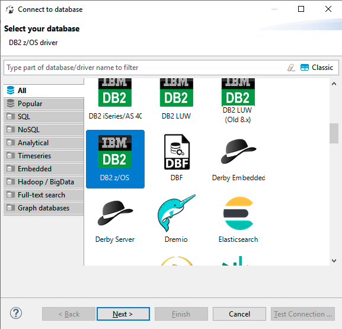
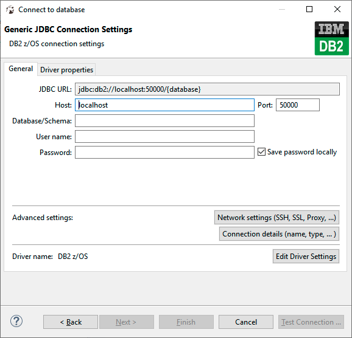
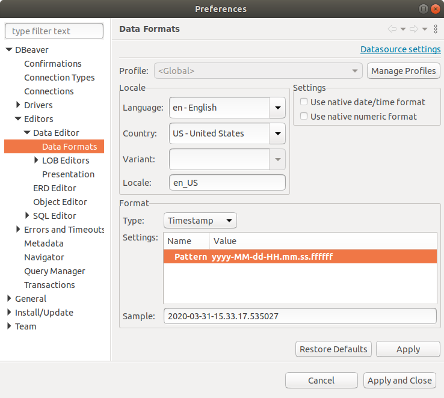
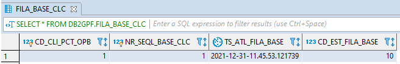
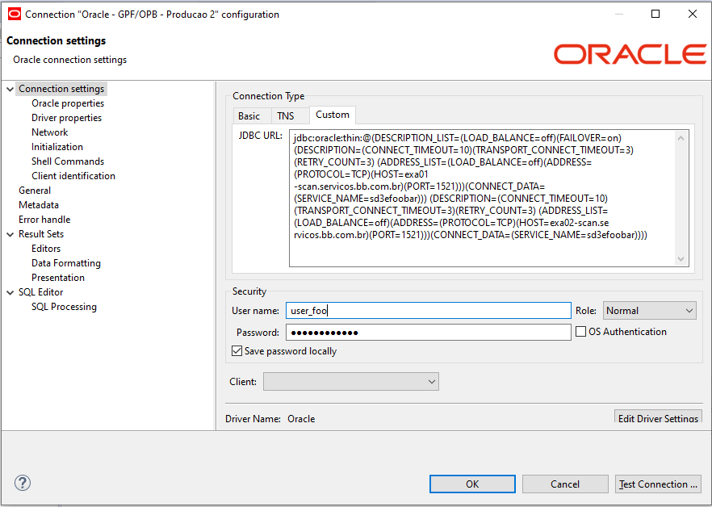

> :exclamation: Dê um feedback para esse documento no rodapé.[^1]

# DBeaver


O DBeaver é um client usado para acessarmos o banco de dados e executarmos instruções SQL. Ele serve para acessarmos todos os bancos de dados (DB2, Oracle, MySQL, etc.).

Você pode baixar ele para Windows, Linux ou Mac OS no site do [DBeaver](https://dbeaver.io/).

O projeto está disponível no [GitHub](https://github.com/dbeaver/dbeaver).

Índice
- [DB2](#db2)
- [Oracle](#oracle)

# DB2

## Criar nova conexão

Clique em "New Connection", selecione "DB2 z/OS"
- 

* Atenção, se selecionar DB2 LUW, vai conectar, mas os metadados não serão carregados corretamente, o problema será que o autocomplete não vai dar certo. **Conecte em "DB2 z/OS"**!

## Incluir Drivers 

Clique em "Edit Driver Settings":
- 

Delete os drivers que já existem e inclua os 4 drivers (jars) neste [link](https://fontes.intranet.bb.com.br/db2/publico/atendimento/-/wikis/Db2-Connect-Drivers-Tipo-4):
* db2jcc.jar
* db2jcc4.jar
* sqlj.zip
* sqlj4.zip


## Informe os parâmetros de conexão

Para todos os ambientes, desmarque a opção "Save password locally".

**Host**: gwdb2.bb.com.br

**Port**: 50100

Informe o **Database/Schema** de acordo com o ambiente:
- Desenvolvimento D0G1: DSDB2D01
- Homologação D8G1 (Geral): BDB2H01
- Homologação D8G5 (Finanças): HMDB2G5
- Homologação D8G7 (Seguridade e crédito): HMDB2G7
- Produção D3G1 (Corporativo): BRDB2P1
- Produção DCG1 (Finanças): B3DB2G1
- Produção D3G3 (Intranet): BDB2P0R
- Produção D3G4 (Datawarehouse): BDB2P04
- Produção 2 - D2G1 (Crédito, seguridade e gestão): B2DB2G1
- Produção 2 - D2G2 (Internet): B2DB2G2
- Produção 2 - D2G3 (Swift/WBI): B2DB2G3
- Produção 2 - D2G4 (Compensação): B2DB2G4
- Produção 3 - DCG2 (Compensação): B3DB2G2


## Configuração de Timestamp no formato DB2 z/OS

 Se quiser configurar o timestamp para aparecer no formato do DB2:

- Clicar com o botão direito em cima da aba "database navigator", selecionar "edit connection", na próxima tela, marcar "result sets - data formatting", clicar no canto direito superior em "Global settings", daí clicar em "Editors-Data Editor-Data Formats e selecionar o type "Timestamp". Clicar no pattern e mudar para "yyyy-MM-dd-HH.mm.ss.ffffff": 

- 

 Quando você executar uma query, o resultado vai aparecer neste formato:
-  


# Oracle

## Criar nova conexão

Clique em "New Connection", selecione "Oracle"


## Incluir Drivers 

Clique em "Edit Driver Settings"

Delete os drivers que já existem e inclua o driver (jars) abaixo:
- [ojdbc8.jar](./oracle/ojdbc8.jar)


## Informe os parâmetros de conexão

Após criar um banco de dados Oracle, você vai receber no seu email os dados de conexão, que serão parecidos com os abaixo:
```properties
Host: exa01-scan.desenv.bb.com.br
Porta: 1521
Serviço: sd3efoobar
Schema: ORAFOOOW0002
Usuário: usr_foo
Senha: foo_foo
```

No DBeaver, informar nos campos:
- Host: o host do email, no exemplo exa01-scan.desenv.bb.com.br
- Port: a porta do email, no exemplo 1521
- Database: o serviço do email, no exemplo sd3efoobar
- User Name: usuário, user_foo
- Password: senha, foo_foo

## Conexão em produção

O Oracle de produção do BB funciona com redundância, ou seja ele roda em dois servidores ao mesmo tempo. Um fica ativo e o outro como contingência.

Quando você criar o usuário de produção, você vai receber um email com os parâmetros de conexão.

Os parâmetros de conexão poderão vir como este **tnsname**:
```sql
jdbc:oracle:thin:@(DESCRIPTION_LIST=(LOAD_BALANCE=off)(FAILOVER=on) (DESCRIPTION=(CONNECT_TIMEOUT=10)(TRANSPORT_CONNECT_TIMEOUT=3)(RETRY_COUNT=3) (ADDRESS_LIST=(LOAD_BALANCE=off)(ADDRESS=(PROTOCOL=TCP)(HOST=exa01
-scan.servicos.bb.com.br)(PORT=1521)))(CONNECT_DATA=(SERVICE_NAME=sd3efoobar))) (DESCRIPTION=(CONNECT_TIMEOUT=10)(TRANSPORT_CONNECT_TIMEOUT=3)(RETRY_COUNT=3) (ADDRESS_LIST=(LOAD_BALANCE=off)(ADDRESS=(PROTOCOL=TCP)(HOST=exa02-scan.se
rvicos.bb.com.br)(PORT=1521)))(CONNECT_DATA=(SERVICE_NAME=sd3efoobar))))
```

Neste caso, você pode fazer duas conexões no DBeaver, uma para o host **exa01
-scan.servicos.bb.com.br** e outra para o host **exa02-scan.se
rvicos.bb.com.br** . No entanto, somente uma vai funcionar a cada momento, depende da onde o banco de dados estiver ativo.

Outra opção é você criar uma conexão Custom e informar todo o tnsname, como:
- 


---
[^1]: [👍👎](http://feedback.dev.intranet.bb.com.br/?origem=roteiros&url_origem=fontes.intranet.bb.com.br/dev/publico/roteiros/-/blob/master/dbeaver/dbeaver.md&internalidade=dbeaver/dbeaver)
