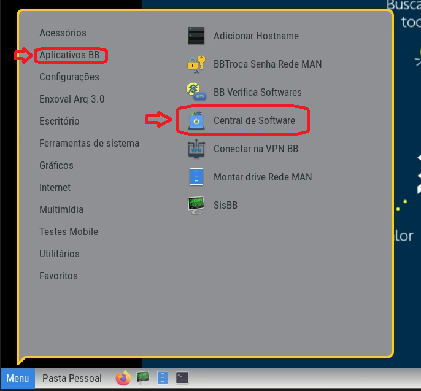
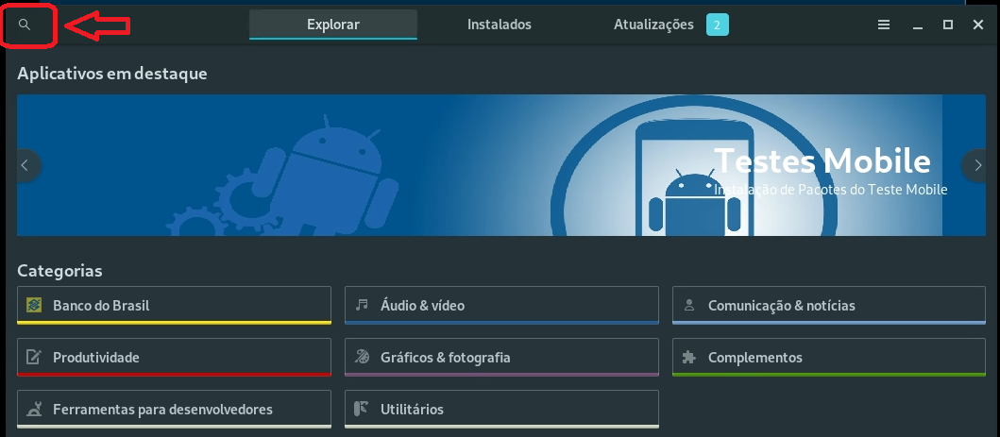
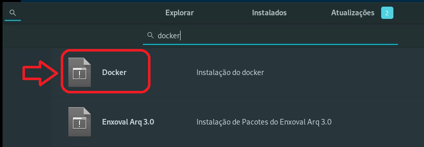
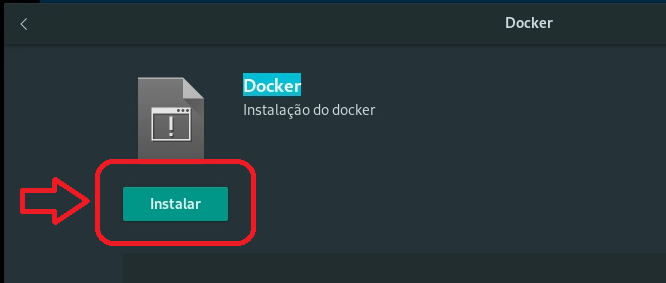
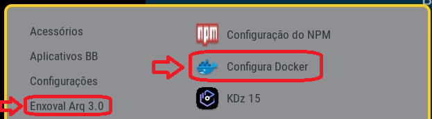
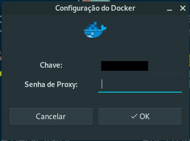
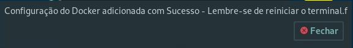
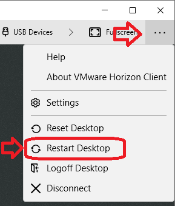

> :exclamation: Dê um feedback para esse documento no rodapé.[^1]

Este roteiro contém a configuração necessária para o correto funcionamento do Docker pela VPN.


Caso tenha alguma dificuldade durante a execução do roteiro, pesquise antes se já existe uma [Issue](https://fontes.intranet.bb.com.br/dev/publico/atendimento/issues) similar ao seu caso.
Em caso negativo, abra uma [Issue](https://fontes.intranet.bb.com.br/dev/publico/atendimento/issues) na área de atendimento do Arq 3.0.
Ao concluir, abra também uma issue reportando os pontos que você teve mais dificuldade, para podermos melhorar sua experiência futura.

- [1. Suse](#1-suse)
- [2. Windows e Mac](#2-windows-e-mac)
- [3. Ubuntu](#3-ubuntu)


# 1- Suse (matriz BB)

Conforme divulgado na guilda #79 sobre ambiente local, a matriz Suse em VDI deve ser a opção **preferencial** para desenvolver os microsservivos na Arq3.0.

Para solicitar uma VDI, acesse https://pls.intranet.bb.com.br. 

Mas caso já tenha uma VDI e queira instalar o docker, siga os passos abaixo:

1.1: Clique em Menu -> Aplicativos BB -> Central de Software:



1.2: Na tela da Central de Softwares, clique no canto esquerdo da tela no ícone de lupa (pesquisa):



1.3: Escreva "docker" no campo de pesquisa + ENTER e clique no primeiro ícone da lista:



1.4: Agora clique em "Instalar" e aguarde a instalação:



1.5: Quando terminar a instalação, clique em Menu -> Enxoval Arq3.0 -> Configura Docker:



1.6: Verifique se sua chave está com a inicial minúscula, exemplo f1234567, e no campo de senha, digite a senha SisBB/LDAP e clique em OK:



1.7: Por fim, clique em Fechar e agora Reinicie o Computador/VDI:





1.8: Após reiniciar a VDI, teste se o docker está funcionando, abrindo um terminal e rodando os seguinte comandos:

```bash
docker info
docker run atf.intranet.bb.com.br:5001/bb/lnx/lnx-jre-alpine:11.0.3
```
Verifique se baixou corretamente a imagem docker acima e pronto! o docker já está configurado.

# 2 - Windows e Mac

 - **Atenção**: Conforme atualização dos termos pela Docker Co., a partir de 31/01/2022, o software Docker Destokp para Windows e para Mac será cobrado de empresas com mais de 250 usuários. E, como o Banco ainda não adquiriu licenças do Docker, se caso tiver instalado o Docker Desktop, por favor remova a instalação até data de 31/01/2022.


Mais informações: https://docs.docker.com/desktop/windows/wsl/

 
 Caso seja de empresa contratada cuja empresa tenha adquirido as licenças do Docker, a configuração necessária será essa:
 

 - 2.1 Em Resources -> Network, altere a Subnet do Docker para `192.168.203.128/27` conforme figura abaixo e salve:

    


 - 2.2 E na seção Docker Engine, inclua o conteúdo abaixo:

```json
{
  "registry-mirrors": ["https://atf.intranet.bb.com.br:5001"],
  "insecure-registries": [],
  "debug": false, 
  "ipv6": false,
  "mtu": 1400,
  "log-level": "warn",
  "log-driver": "json-file",
  "log-opts": {
    "max-size": "10m",
    "max-file": "5"
  }
}
  ```
  
OBS: Para versões mais antigas do Docker Desktop (<3.0), abra o arquivo `%userprofile%\.docker\daemon.json` e verifique se o arquivo contém as configs acima. Dica: Abra a pasta pelo "Executar" (Windows + R)

 - Salve as alterações. Se já estiver rodando o docker, clique em "Apply & Restart":

    

- 2.3 E se for de empresa contratada será também necessário informar a configuração de proxy em Resources -> Proxies, informando o mesmo endereço IP do proxy que utiliza como proxy no navegador.

- 2.4 No caso do item 2.3, como estará utilizando um computador pessoal ou da empresa contratada, e se AUTORIZADO pela gerência, poderá importar os dois certificados listados abaixo e marcá-los como "Confiar Sempre":

https://pki.bb.com.br/ACRAIZC/cacerts/raiz_v3.der

https://pki.bb.com.br/ACINTA5/cacerts/acsr_v1.der

- 2.5. Mas se por algum motivo não puder instalar os certificados acima, substitua o trecho do item 2.2, do `registry-mirrors` por `insecure-registries` assim: 
```json
  ...
 "registry-mirrors": [],
 "insecure-registries": ["atf.intranet.bb.com.br:5001"],
  ...
 ```


# 3 - Ubuntu

- 3.1 Com o editor de texto de sua preferência abra o arquivo `/etc/docker/daemon.json`. Exemplo:
  ```bash
  sudo gedit /etc/docker/daemon.json
  ```
  
  Caso o arquivo /etc/docker/daemon.json não exista, poderá criá-lo com o comando: `sudo touch /etc/docker/daemon.json`, voltando depois ao passo 3.1 para editá-lo;

- 3.2 Inclua no arquivo as seguintes configurações:

  ```json
  {
   "debug": false, 
   "bip": "192.168.203.129/27",
   "mtu": 1400,
   "ipv6": false,
   "dns": ["172.17.71.192", "172.30.110.26"],
   "dns-opt": "options single-request-reopen",
   "registry-mirrors": ["https://atf.intranet.bb.com.br:5001"],
   "storage-driver": "overlay2",
   "log-level": "warn",
   "log-driver": "json-file",
   "log-opts": {
     "max-size": "10m",
     "max-file": "5"
   },
   "default-address-pools":[
     {"scope":"local","base":"192.168.203.160/27","size":27},
     {"scope":"global","base":"192.168.203.192/27","size":27},
     {"scope":"swarm","base":"192.168.203.224/27","size":27},
     {"scope":"swarm-global","base":"10.1.203.0/27","size":27}
   ]
  }
  ```
  
- 3.2.1 Se for de empresa contratada e esteja utilizando um computador pessoal ou da empresa que NÃO TENHA instalado os certificados Raiz v3 e Servidores V1 da PKI-BB, substitua na configuração do item 3.2 o seguinte trecho: 
  
  de:

```json
     "registry-mirrors": ["https://atf.intranet.bb.com.br:5001"],
```

  por:
    
```json    
     "registry-mirrors": [],
     "insecure-registries": [ "atf.intranet.bb.com.br:5001" ],
```

 e depois salve o arquivo /etc/docker/daemon.json.

- 3.2.2 Ainda no caso do item 3.2.1 E se caso for AUTORIZADO pela gerência, poderá instalar os certificados Raiz v3 e Servidores V1 da PKI-BB. 
Para isso, depois de salvar o arquivo /etc/docker/daemon.json com a configuração do item 3.2, volte ao terminal/prompt de comando e rode também os comandos abaixo :
    
```bash
    curl -fsSL https://pki.bb.com.br/ACRAIZC/cacerts/raiz_v3.der -O
    curl -fsSL https://pki.bb.com.br/ACINTA5/cacerts/acsr_v1.der -O
    openssl x509 -inform der -in raiz_v3.der -out raiz_v3.crt
    openssl x509 -inform der -in acsr_v1.der -out acsr_v1.crt
    sudo mkdir /usr/share/ca-certificates/bbcerts
    sudo mv raiz_v3.crt /usr/share/ca-certificates/bbcerts/
    sudo mv acsr_v1.crt /usr/share/ca-certificates/bbcerts/ 
    sudo dpkg-reconfigure ca-certificates
```

   Com esses comandos irá baixar e transformar os arquivos dos certificados em arquivos .crt, marcando-os no final como "Confiar Sempre".

   OBS: neste caso, de quando pode instalar os certificados, deverá deixar a configuração do docker idêntica ao item 3.2.


- 3.3 Se for contratado, será também necessário setar a configuração de proxy editando o arquivo `~/.docker/config.json`:

```json
{
 "proxies":
 {
   "default":
   {
     "httpProxy": "http://192.168.1.99:3128",
     "httpsProxy": "http://192.168.1.99:3128",
     "noProxy": "localhost,127.0.0.0/8"
   }
 }
}
```
OBS: o endereço acima, que é um exemplo, `192.168.1.99:3128` deve ser o mesmo IP de proxy que utiliza como proxy no navegador.

OBS2: funcionários acessando via VPN ou rede Man não necessitam da configuração de proxy deste item 3.4.

Referência para configuração de proxy: https://docs.docker.com/network/proxy/#configure-the-docker-client


- 3.4 Lembre-se de salvar as alterações nos arquivos `/etc/docker/daeom.json` e  `~/.docker/config.json`, se necessário e execute os seguintes comandos no terminal/prompt de comando para reiniciar o docker:

    ```
    sudo systemctl daemon-reload && sudo service docker restart
    ```

    OBS: se estiver usando o Ubuntu dentro do WSL, o comando acima irá falhar. Então nesse caso, deve apenas fazer:

    ```
    sudo service docker stop && sudo service docker start
    ```


 Pronto! Com estas configs você não deve ter problemas com conflitos com a intranet, certificado ATF e resolução de dns.


# 4 - Erros conhecidos (sistemas Linux):

4.1 Cannot connect to the Docker daemon at unix:///var/run/docker.sock:

```
docker info
Client:
 Context:    default
 Debug Mode: false
 Plugins:
  app: Docker App (Docker Inc., v0.9.1-beta3)
  buildx: Docker Buildx (Docker Inc., v0.7.1-docker)
  scan: Docker Scan (Docker Inc., v0.12.0)

Server:
ERROR: Cannot connect to the Docker daemon at unix:///var/run/docker.sock. Is the docker daemon running?
errors pretty printing info
```

**Passos para diagnóstico e resolução**: 

4.1.1 - Verifique se o daemon do docker está rodando: `sudo service docker status`

Se não estiver rodando, inicie o docker: `sudo service docker start`

4.1.2 - Verifique se seu usuário pertence ao grupo **docker**: `cat /etc/group |grep docker`

Se não pertencer, adicione seu usuário com o comando: `sudo usermod -aG docker $USER`

Referência: https://docs.docker.com/engine/install/linux-postinstall/

E, no caso da matriz Suse, apenas rode o "Configura Docker" do passo 1.5 e reinicie a máquina.

---
[^1]: [👍👎](http://feedback.dev.intranet.bb.com.br/?origem=roteiros&url_origem=fontes.intranet.bb.com.br/dev/publico/roteiros/-/blob/master/docker/DockerVPN.md&internalidade=docker/DockerVPN)
