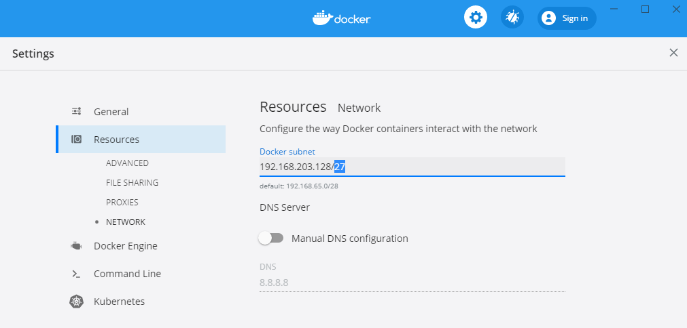
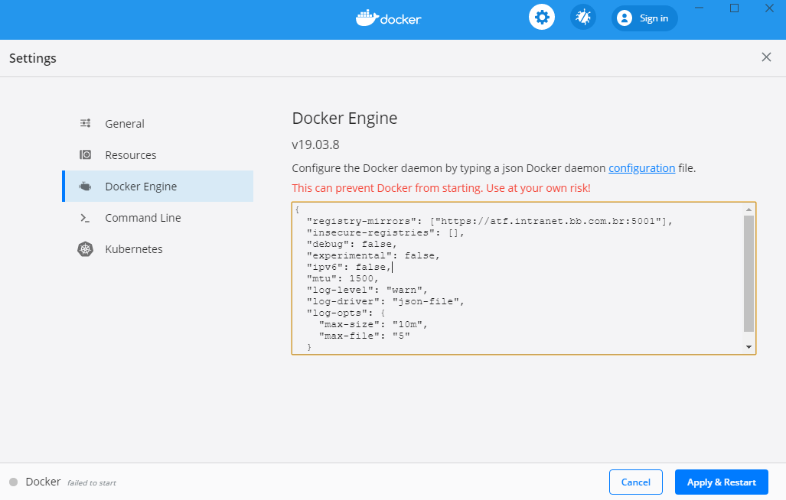

> :exclamation: Dê um feedback para esse documento no rodapé.[^1]

# Orientações sobre as redes utilizadas no Docker


**Atenção**: a faixa de endereços para os serviços docker mudou.

Foram criadas 5 faixas de endereçamento IPs privados para os serviços do docker:

A) 192.168.203.128/27 (129-158)

B) 192.168.203.160/27 (161-190)

C) 192.168.203.192/27 (193-222)

D) 192.168.203.224/27 (225-254)

E) 10.1.203.0/27 (1-29)

Cada uma dessas faixas tem até 29 ips livres para que os desenvolvedores da CloudBB possam rodar suas imagens docker localmente. 

A equipe DX está recomendando o seguinte uso para as cinco faixas:

* **FAIXA A** (`192.168.203.128/27`): (docker-daemon): reservada e já alocada para o docker-daemon e imagens que o desenvolvedor baixar diretamente através do comando *docker run nomedaimagem*.
* **FAIXA B** (`192.168.203.160/27`): (docker-compose-local): reservada para os atuais projetos do docker-compose que o desenvolvedor já esteja rodando no momento, exceto novos projetos gerados pelo BBDev.
* **FAIXA C** (`192.168.203.192/27`): (docker-compose-global): reservada para os projetos, novo template, do BBDev (docker-compose).
* **FAIXA D** (`192.168.203.224/27`): (docker-swarm-local): reservada para o docker swarm, escopo local.
* **FAIXA E** (`10.1.203.0/27`): (docker-swarm-global): reservada para o docker swarm, escopo global. 

> OBS: Caso o desenvolvedor não utilize o modo *docker-swarm* ainda terá a disposição a faixa D para uso.

Recomendamos **FORTEMENTE** que os desenvolvedores da CloudBB sigam o escopo das faixas reservadas acima, porque o uso de um IP fora destas faixas de IPs espeficadas acima poderá causar CONFLITOS de rede.

Nas seções abaixo seguem orientações para configurar estas redes nos diversos sistemas operacionais. O roteiro ["Configuração de Redes no Docker-Compose"](./RedesNoDockerCompose.md) inclui orientações sobre como ajustar o docker-compose para seguir este padrão.  

## 1. Matriz Suse

Conforme divulgado na guilda 79, a matriz Suse deve ser a opção **preferencial** de quem desenvolve na Arq3.0.

1.1 Nas estações de trabalho com a matriz Suse, o programa "Configura Docker" (Menu -> Enxoval Arq 3.0 -> Configura Docker) realiza a configuração do docker, bastando rodá-lo até o OK final.

Após rodar o "Configura Docker", verifique se a configuração do arquivo /etc/docker/daemon.json foi realizada e se está da seguinte forma:

```bash
cat /etc/docker/daemon.json
```

```json
{
  "debug": false, 
  "bip": "192.168.203.129/27",
  "ipv6": false,
  "mtu": 1500,
  "dns-opt": "options single-request-reopen",
  "registry-mirrors": ["https://atf.intranet.bb.com.br:5001"],
  "storage-driver": "overlay2",
  "log-level": "warn",
  "log-driver": "json-file",
  "log-opts": {
    "max-size": "10m",
    "max-file": "5"
  },
  "default-address-pools":[
    {"scope":"local","base":"192.168.203.160/27","size":27},
    {"scope":"global","base":"192.168.203.192/27","size":27},
    {"scope":"swarm","base":"192.168.203.224/27","size":27},
    {"scope":"swarm-global","base":"10.1.203.0/27","size":27}
  ]
}
```

OBS: as versões mais antigas da matriz Suse (< 15 SP1) utilizavam o `storage-driver: brtfs`.
Já em versões mais novas da matriz Suse (> 15 SP2 e SP3), a configuração deve ser `storage-driver: overlay2`.

O programa "Configura Docker" (Menu -> Enxoval Arq 3.0 -> Configura Docker) realiza essa verificação de qual storage-driver é o apropriado e faz o ajuste se necessário, bastando rodá-lo até o OK final. 

1.2 Entretanto, nas estações mais antigas com matriz Suse 15 SP1 ou menor ainda pode ser necessário:

1.2.1 listar todos os serviços docker (quer sejam eles: docker, docker-compose ou docker-swarm):

   ```
   docker ps
   ```

   ```bash
   docker-compose ps
   ```

   ```bash
   docker info -f '{{json .Swarm}}'
   ```

   e parar esses serviços, isso caso tiver algum serviço rodando:

   ```bash
   docker stop iddocontainer
   ```

   ```bash
   docker-compose down
   ```

   ```bash
   docker swarm leave --force
   ```

   OBS: para efetuar o comando *docker-compose down*, é obrigatório estar no mesmo diretório que estiver o arquivo docker-compose.yaml que iniciou os serviços que estão rodando.

1.2.2. em seguida, limpar as redes que não estiverem em uso:

```
docker network prune
```

1.2.3. alterar (todos) o(s) arquivo(s) *docker-compose.yaml* de seus projetos para a seguinte forma:

```yaml
networks:
  nomedonamespace-net:
    driver: bridge
    ipam:
      config:
        - subnet: 192.168.203.160/27
```

* lembrando que *nomedonamespace-net* é apenas um alias que NÃO precisa ser alterado, mas apenas o endereço espeficado na subnet. 

1.2.4. caso use swarm, será necessário recriar o cluster com o seguinte comando:

   ```bash
   docker swarm init --advertise-addr ip-da-eth0 --default-addr-pool 192.168.203.224/27 --default-addr-pool-mask-length 27
   ```

1.2.5. reiniciar os serviços que foram parados no passo 1.


Caso utilize a matriz Suse conectando-a pela VPN, siga as instruções adicionais abaixo na seção VPN.


## 2. Linux/Ubuntu 

2.1 O arquivo /etc/docker/daemon.json deve ser editado da sequinte forma:

```json
{
  "debug": false, 
  "bip": "192.168.203.129/27",
  "ipv6": false,
  "mtu": 1500,
  "dns-opt": "options single-request-reopen",
  "registry-mirrors": ["https://atf.intranet.bb.com.br:5001"],
  "storage-driver": "overlay2",
  "log-level": "warn",
  "log-driver": "json-file",
  "log-opts": {
    "max-size": "10m",
    "max-file": "5"
  },
  "default-address-pools":[
    {"scope":"local","base":"192.168.203.160/27","size":27},
    {"scope":"global","base":"192.168.203.192/27","size":27},
    {"scope":"swarm","base":"192.168.203.224/27","size":27},
    {"scope":"swarm-global","base":"10.1.203.0/27","size":27}
  ]
}
```

Note que diferentemente da configuração mais antiga para Suse que era brtfs, o parâmetro `storage-driver` pro Ubuntu deve ser `"storage-driver": "overlay2"`.

2.2 E caso seja de empresa contratada e esteja usando máquinas que não tenham os certificados do BB, substitua o parâmetro `registry-mirrors` na configuração do item 2.1 assim:

  "registry-mirrors": ["https://atf.intranet.bb.com.br:5001"],

por 

  "registry-mirrors": [],
  
  "insecure-registries": ["atf.intranet.bb.com.br:5001"],


Caso utilize o Ubuntu conectando-o pela VPN, siga as instruções adicionais abaixo na Seção VPN.


## 3. Windows 


**Atenção**: Conforme atualização dos termos pela Docker Co., a partir de 31/01/2022, o software Docker Destokp para Windows e para Mac será cobrado de empresas com mais de 250 usuários. E, como o Banco ainda não adquiriu licenças do Docker, se caso tiver instalado o Docker Desktop, por favor remova a instalação até data de 31/01/2022.

Mais informações: https://docs.docker.com/desktop/windows/wsl/

Mas caso seja de empresa contratada cuja empresa tenha adquirido as licenças do Docker, a configuração necessária será essa:

3.1. Em Resources -> Network, o IP que deve ser indicado como parâmetro bip é: "192.168.203.128/27". 

Isso porque para estações com Linux, o IP do bip deve ser o primeiro IP da rede pretendida, "192.168.203.129/27". 
Mas para estações Windows, o IP do bip é a própria rede, "192.168.203.128/27".



3.2. E em Docker-Engine, copie e cole a seguinte configuração abaixo, clicando depois em "Apply and Restart":




```json
{
  "registry-mirrors": ["https://atf.intranet.bb.com.br:5001"],
  "insecure-registries": [],
  "debug": false, 
  "ipv6": false,
  "mtu": 1500,
  "log-level": "warn",
  "log-driver": "json-file",
  "log-opts": {
    "max-size": "10m",
    "max-file": "5"
  },
  "default-address-pools":[
    {"scope":"local","base":"192.168.203.160/27","size":27},
    {"scope":"global","base":"192.168.203.192/27","size":27},
    {"scope":"swarm","base":"192.168.203.224/27","size":27},
    {"scope":"swarm-global","base":"10.1.203.0/27","size":27}
  ]
}
```


## 4 - VPN 

4.1 As orientações completas para configuração do docker para acesso pela VPN estão disponíveis aqui: https://fontes.intranet.bb.com.br/dev/publico/roteiros/-/blob/master/docker/DockerVPN.md

Em comparação com o roteiro acima que foi feito para rede MAN, na configuração para VPN é necessário abaixar o valor do MTU e em alguns casos especificar o servidor DNS dessa forma:

```json
"mtu": 1400,
"dns": ["172.17.71.192", "172.30.110.26"],
```

O MTU deve ser alterado de 1500 para 1400 bytes devido à segmentação de pacotes na VPN que adiciona dados a mais.

E os IPs dos servidores do DNS acima listados deverão ser confirmados na tela de conexão com a VPN, após o comando snx.---
[^1]: [👍👎](http://feedback.dev.intranet.bb.com.br/?origem=roteiros&url_origem=fontes.intranet.bb.com.br/dev/publico/roteiros/-/blob/master/docker/OrientacoesRedes.md&internalidade=docker/OrientacoesRedes)
