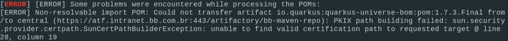

> :speech_balloon: Deixe o seu feedback sobre este roteiro no rodapé. [^1] 


# Como solucionar problemas de build em projetos JAVA
Este roteiro ensina como solucionar possíveis problemas ao executar o build do seu projeto java. Geralmente, esses problemas referem-se ao acesso ao repositório do binários do Banco, que deve ser feito com autenticação.

## Passo 1: Atualizar o settings.xml do Maven
Para atualizar o arquivo `settings.xml` será necessário baixá-lo e verificar se o arquivo foi adequadamente salvo.

#### Baixar um novo settings.xml
1. No seu navegador, acesse: https://binarios.intranet.bb.com.br
1. No canto direito superior da tela, faça o login com a **chave f ou c**, a inicial em formato minúsculo e senha Sisbb/LDAP.
1. Após logado, clique na sua matrícula, em **Set Me Up** e busque nesse campo o ícone do **maven**.
1. Em **Repository** selecione **maven-bb-dev-local** .
1. Em **Configure**, digite novamente a senha Sisbb/LDAP no campo correspondente e clique na seta ao lado para confirmar.
1. Clique em **Generate Maven Settings** e em **Generate Settings**.
1. Clique em **Download snippet**
1. Caso o navegador salve o arquivo `settings.xml` na pasta Downloads, transfira o arquivo baixado para a pasta de configuração do maven (~/.m2).

> :grey_exclamation: **Importante**  
> 
> Sobre o caminho do arquivo `settings.xml`:
> - O settings.xml é um arquivo que configura o Maven para buscar os repositórios de artefatos corretamente, no caso, para busca do binários. Mais detalhes em: https://maven.apache.org/settings.html
> - Por padrão:
>   - No Windows, o settings.xml fica em `C:\Users\f1234567\\.m2\settings.xml`, sendo f1234567 a chave do usuário.
>   - No Linux, o settings.xml fica em `~/.m2/settings.xml` ou em `/home/f1234567/.m2/settings.xml`, sendo f1234567 a chave do usuário.
>   - No MacOS, o settings.xml fica em `~/.m2/settings.xml` ou em `/Users/f1234567/.m2/settings.xml`, sendo f1234567 a chave do usuário.
>   - Caso esteja usando um usuário impessoal, o padrão de diretórios acima deve ser alterado com o nome do usuário atual (impessoal).

> :warning: **Atenção**
> 
> Em computadores do BB, **NÃO É recomendável** copiar o `settings.xml` gerado pelo atf para o diretório `/conf/` da instalação do Maven, porque todos os usuários da máquina utilizariam o mesmo token (seu token) para baixar os artefatos. Por isso, utilize o padrão de salvar no seu diretório home `~/.m2/settings.xml`.
> Para verificar o caminho correto do `settings.xml`, execute em seu terminal:
> - No Windows: `echo %HOMEDRIVE%%HOMEPATH%\.m2\settings.xml`.
> - No Linux e MacOS: `echo $HOME/.m2/settings.xml`.

### Verificar arquivo salvo
9. Para saber se o arquivo foi salvo com https, abra o settings.xml com ajuda de um editor de texto (notepad ou bloco de notas) e verifique se os endereços do binários estão conforme este padrão: `https://binarios.intranet.bb.com.br:443/artifactory/maven`.
10. Ainda no arquivo `settings.xml`, verifique se o token está entre as tags `<password></password>`. 
11. Verifique também se a chave do usuário está em minúsculo entre as tags `<username></username>`, conforme o exemplo a seguir:

 ```xml
      <username>f1234567</username>
      <password>AP2XxXXxxxXXXXXxxxxxxxXXXX</password>
      <id>central</id> 
```
12. Caso seja contratado, a chave também deve estar com inicial minúscula, exemplo: c1234567. Verifique também a configuração de proxy, conforme [Passo 4: Configurar o proxy no settings.xml para contratados desse roteiro](#passo-4-configurar-o-proxy-no-settingsxml-para-contratados).

> :warning: **Atenção**
> 
> Será necessário gerar um novo arquivo `settings.xml` quando:
> - os endereços não estiverem com https e sim http e/ou não contiverem a porta :443.
> - as tags estiverem com valor vazio.
> - a chave estiver com inicial maiúscula, exemplo: F1234567.

>  :information_source: **Observação** 
>
> Caso esteja usando VDI SUSE, é recomendável utilizar o **maven-config** disponível na Central de Software para configurar o Maven, conforme os passos acima.

## Passo 2: Configurar certificados para JVM do Java
Ao realizar o build da sua aplicação, pode ocorrer um erro contendo o trecho **PKIX path building failed**, conforme imagem abaixo:



Caso isso aconteça, é preciso incluir os certificados do Banco no Java. Isso pode ser feito manualmente ou você pode instalar o java com os certificados utilizando o Alfred.

>  :information_source: **Observação** 
>
> Caso esteja usando VDI SUSE e seja apresentado o erro acima para certificados, é necessário reinstalar o pacote **Openjdk** pela Central de Software/Portal da Empresa.

### Corrigir manualmente

>  :grey_exclamation: **Importante**  
>
>Para realizar a correção manual é necessário ter acesso de administrador na sua máquina. Caso esteja utilizando VDI Linux, esse acesso é concedido pelo papel **WIN00009**.

1. Baixe os certificados em https://pki.bb.com.br, lembrando que este endereço só é acessado de dentro do BB (rede física/MAN).
2. Clique em **Autoridade Certificadora Servidores**.
3. Baixe os certificados abaixo clicando com o botão direto e na opção `Salvar Link Como` nos seguintes links:
- Baixar o certificado **Banco do Brasil v3**: Salvar como `raiz_v3.der`
- Baixar o certificado **Autoridade Certificadora Servidores v1**: Salvar como `acsr_v1.der`

4. Depois de baixados, é necessário incluir eles no cacerts do seu Java.
Antes, precisamos ver onde fica o local de instalação do java na sua máquina. Execute o comando em qualquer diretório:

```shell
echo $JAVA_HOME
```
ou

```shell
/usr/libexec/java_home -V
```

É possível também verificar qual versão do Java o Maven está utilizando:
```shell
mvn -version
```

Esses comandos devem retornar um PATH do local onde o java/runtime está instalado; você vai utilizar esse PATH (caminho) no próximo comando.

No diretório onde estão os certificados baixados execute o seguinte comando, substituindo o `PATH_JAVA` pelo resultado do comando anterior como path do local de instalação java:

```shell
sudo keytool -import -alias raiz_v3 -trustcacerts -file raiz_v3.der -keystore PATH_JAVA/lib/security/cacerts -storepass changeit -noprompt
```

Execute o comando para o outro certificado realizando a mesma substituição:

```shell
sudo keytool -import -alias acsr_v1 -trustcacerts -file acsr_v1.der -keystore PATH_JAVA/lib/security/cacerts -storepass changeit -noprompt
```

### Utilizando o Alfred

A instalação do java e configuração dos certificados pode ser feito utilizando o Alfred, que é um assistente local para ferramentas de repositório e de desenvolvimento dentro do ambiente do Banco do Brasil.

Para instalar o Alfred basta seguir esse [roteiro](https://fontes.intranet.bb.com.br/aic/publico/aic-alfred). Caso ja tenha instalado e queria apenas instalar o java e os certificados, basta seguir esse [roteiro](https://fontes.intranet.bb.com.br/aic/publico/atendimento/-/tree/master/roteiros/alfred#instalando-e-executando-openjdkmaven) de configuração.

## Passo 3: Atualizar processo de execução

Em projetos gerados pelo BBDev Generator antes de 20/04/2021, também será necessário realizar a atualização de alguns arquivos para o processo de execução do seu projeto local.

### Arquivo .gitignore

O primeiro deles é o .gitignore, para evitar que o arquivo `.env` e o `.env.bak` sejam commitados no seu projeto. Esses arquivos possuem variáveis de ambiente (environments) que devem ser utilizadas somente
na fase de desenvolvimento local.

```txt
#Environments
.env
.env.bak
```

>  :grey_exclamation: **Importante**  
>
>Nos projetos mais recentes gerados pelo [Brave](https://brave.dev.intranet.bb.com.br) a configuração acima não é necessária.


### Atualizar o script run.sh

Por fim, temos a alteração no script `run\run.sh`. O script é responsável por configurar e executar o projeto com algumas opções, realizando a busca do usuário e do token no settings para verificar se o token ainda é valido. Caso não seja, ele vai solicitar um novo token e atualizar. O script também realiza a configuração e execução do quarkus, do curio e do arquivo docker-compose.

>  :grey_exclamation: **Importante**  
>
>Caso as configurações do seu maven fiquem na pasta `.m2` do seu usuário, esse script também irá realizar a atualização do seu token. Para evitar bloqueios de senha, a cada 5 tentativas mal-sucedidas ele solicita uma nova autenticação. O script possui um contador interno da quantidade de execuções realizadas.
>
> Assim, após alterar a sua senha é necessário gerar um novo token para atualizar o campo password do arquivo `settings.xml`.


Em projetos gerados pelo BBDev Generator antes de 20/04/2021, é necessário atualizar o script `run.sh` que fica dentro da pasta run do seu projeto, com um dos scripts abaixo:

**Observação**: utilizar a matricula em minúsculo quando solicitado pelo script.

- Script com DB2 [run.sh](./scripts/db2/run.sh)
- Script sem DB2 [run.sh](./scripts/run.sh)

Depois, na raiz do projeto, atribuir permissão de execução ao run.sh com o comando abaixo:

```shell
chmod 775 ./run/run.sh
```

## Passo 4: Configurar o proxy no settings.xml para contratados

Para colaboradores de empresas contratadas, em alguns casos (vide observação abaixo), será necessário adicionar a seção `proxies` no arquivo `settings.xml`:

1. Abra o arquivo `settings.xml` para editá-lo.
2. Copie e cole o exemplo abaixo no arquivo `settings.xml`, entre as tags `<settings ...>` e `<servers>`.
3. Agora, verifique na configuração de proxy do navegador (Opções -> proxy) o ip e porta utilizados para acessar os endereços `*.bb.com.br`:
4. Copie o `ip:porta` da configuração de proxy do navegador, que no exemplo abaixo seria: `XXX.XX.49.180:3128`.
5. Cole o ip e a porta obtidos no passo anterior, entre a tag `<host>` e `<port>`, respectivamente, conforme exemplo abaixo:

```xml
<?xml version="1.0" encoding="UTF-8"?>
<settings xsi:schemaLocation="http://maven.apache.org/SETTINGS/1.1.0 http://maven.apache.org/xsd/settings-1.1.0.xsd" xmlns="http://maven.apache.org/SETTINGS/1.1.0"
    xmlns:xsi="http://www.w3.org/2001/XMLSchema-instance">
  <proxies>
    <proxy>
      <id>cachebb-https</id>
      <active>true</active>
      <protocol>https</protocol>
      <host>XXX.XX.49.180</host>
      <port>3128</port>
      <nonProxyHosts>localhost|127.0.0.1</nonProxyHosts>
    </proxy>
    <proxy>
      <id>cachebb-http</id>
      <active>true</active>
      <protocol>http</protocol>
      <host>XXX.XX.49.180</host>
      <port>3128</port>
      <nonProxyHosts>localhost|127.0.0.1</nonProxyHosts>
    </proxy>
  </proxies>
  <servers>
...
```

6. Salve o arquivo `settings.xml` e tente baixar os artefatos novamente.


**Observação**: Não é necessário configurar esta seção de proxies acima se estiver rodando em VDI/matriz_BB dentro de ambiente de rede do BB. Configure apenas caso esteja utilizando máquina pessoal e acessando pela VPN da empresa contratada.

## Troubleshooting

### Erro: Unknown binarios.intranet.bb.com.br

#### Verifique se existe conectividade com o site binarios.intranet.bb.com.br

```bash
ping -c 5 binarios.intranet.bb.com.br

no Linux/Mac:
traceroute -I binarios.intranet.bb.com.br

no Windows:
tracert binarios.intranet.bb.com.br

por fim:
telnet binarios.intranet.bb.com.br 443
```

**Observação**: 

a) a verificação de conectividade deverá ser feita tanto na máquina host quanto dentro do container.

Para entrar dentro do container:
- Verifique o nome do container com o `docker ps`;
- Execute `docker exec -it nomedocontainer /bin/sh`;
- Repita os comandos acima para testar a conectividade.

Utilize também o comando:
`docker run --network=host -it docker.binarios.intranet.bb.com.br/bb/mvn/mvn-java11-maven36:3.6.3 /bin/sh` para testar a conectividade do container sem estar na subrede do docker.


b) para o caso de contratados, em geral, estes testes de conectividade falham porque a empresa contratada geralmente faz uso de proxy e/ou NAT para acesso aos servidores do binários.
Neste caso, verifique se o endereço `binarios.intranet.bb.com.br` foi mapeado no arquivo hosts: `/etc/hosts` (Linux e MacOS) ou `C:\Windows\System32\drivers\etc\hosts (Windows)`.
Se necessário, adicione um mapeamento de extra_hosts no arquivo `run/docker-compose.yaml`, conforme:

```yaml
version: "3.4"
services:
 sigla-nome-aplicacao:
     ...
    ports:
     ...
    extra_hosts:
     - "binarios.intranet.bb.com.br:170.66.XX.XX"
```

* Adicione o extra_hosts no mesmo alinhamento de ports. Observe também que **NÃO DEVE HAVER** um caractere de espaço entre host:ip, nesse exemplo, binários.intranet.bb.com.br:170.66.XX.XX.

* Altere o endereço 170.66.XX.XX para o endereço IP do arquivo hosts repassado pela empresa contratada. O arquivo hosts deve estar em /etc/hosts (Linux e MacOS), ou C:\Windows\System32\drivers\etc\hosts (Windows).

* No arquivo arquivo hosts repassado pela empresa deve haver uma linha com os dados:
`170.66.XX.XX binarios.intranet.bb.com.br`, no qual 170.66.XX.XX é o ip que deve ser adicionado no parâmetro extra_hosts conforme exemplo acima. Diferentemente do `docker-compose.yaml`, em extra_hosts, **DEVE HAVER** um carácter de espaço entre o ip e o host.

* Verifique se **NÃO HÁ** duplicidade de apontamentos para o mesmo host do binários no arquivo:
`170.66.XX.XX binarios.intranet.bb.com.br`
...
`170.66.YY.YY binarios.intranet.bb.com.br`. 
Caso exista duplicidade, esta deve ser retirada, mantendo-se apenas um apontamento. Confirmar com a empresa qual é apontamento o correto.

#### Faça o build local da aplicação

```bash
cd ~/pastadoprojeto
mvn compile quarkus:dev
```

#### Caso tenha sucesso, limpe as redes do docker e os containers baixados

```bash
docker stop $(docker ps -a -q)
docker rm $(docker ps -a -q)
docker image prune -a
docker network prune 
docker system prune -a
docker volume prune
```

#### Verifique se os certificados para o cacerts do Java foram importados

Siga o passo [Verificar arquivo salvo](#passo-2-configurar-certificados-para-jvm-do-java) desse roteiro.

#### Verifique no arquivo `/etc/docker/daemon.json` se os DNS indicados são os mesmos da conexão VPN

**Observação**: 

a) para o caso de contratados, em geral, não é necessário informar DNS no arquivo `/etc/docker/daemon.json`.

#### Verifique se possui o acesso ALMPLTO

1. Acessa a [Plataforma BB](https://plataforma.atendimento.bb.com.br:49286/estatico/gaw/app/spas/index/index.app.html#/).
2. Vá para **Negócios > Segurança > Acesso Fácil > [Painel](https://plataforma.atendimento.bb.com.br:49286/estatico/gaw/app/spas/index/index.app.html?cd_modo_uso=1&app=aceSegurancaAcessoPainel#/)**.
2. No campo de busca, encontre o papel **ALMPLTO** e solicite-o.
 
O papel **ALMPLTO** é necessário para baixar os artefatos bbdev-generator.
Em geral, colaboradores da Ditec já possuem este acesso/papel. No entanto colaboradores de outras diretorias não tem este acesso de forma automática.

#### Verifique o acesso VPN07

* Para funcionários: é necessário o papel VPN07. [Verifique se você possui o acesso](#verifique-se-possui-o-acesso-almplto) VPN07 para conexão da Ditec.

* Para contratados (todas as empresas): Não é necessário o papel VPN07, mas é necessário configurar o proxy conforme o [Passo 4: Configurar o proxy no settings.xml para contratados](#passo-4-configurar-o-proxy-no-settingsxml-para-contratados) deste roteiro.

*  Tente efetuar um: `docker login docker.binarios.intranet.bb.com.br` e verifique se o retorno foi `Login Succeeded`;

#### Adicionar volume

Após [atualizar o settings.xml](#passo-1-atualizar-o-settingsxml-do-maven), realize um teste e adicione a seguinte linha no volumes do arquivo `run/docker-compose.yaml`.
 
```yaml
version: "3.4"
services:
 sigla-nome-aplicacao:
     ...
     volumes:
      - $HOME/.m2/repository:/temp/.m2/repository
      - $PWD:/app
      - $HOME/.m2/settings.xml:/usr/share/java/maven-3/conf/settings.xml

```

### Erro: PKIX path building failed
Siga o passo [Passo 2: Configurar certificados para JVM do Java](#passo-2-configurar-certificados-para-jvm-do-java) deste roteiro.

## Saiba mais
Para saber mais sobre o tema deste roteiro, acesse as documentações de referência:
* [Certificado Java](https://fontes.intranet.bb.com.br/dev/publico/roteiros/-/blob/master/java/certificados-java.md)
* [Como usar imagens base para desenvolver aplicações Java](https://fontes.intranet.bb.com.br/dev/publico/roteiros/-/blob/master/java/Como_usar_imagens_base_java.md)
* [Portal AIC](https://fontes.intranet.bb.com.br/aic/publico/atf-documentation/-/blob/master/README.md)

## Precisa de ajuda?
Em caso de problemas na execução de qualquer roteiro, abra uma [nova issue](https://fontes.intranet.bb.com.br/dev/publico/atendimento/-/issues) e relate a situação. O time de atendimento da devCloud está disponível para auxiliar! 

## Este roteiro foi útil?
[^1]: [👍👎](http://feedback.dev.intranet.bb.com.br/?origem=roteiros&url_origem=fontes.intranet.bb.com.br/dev/publico/roteiros/-/blob/master/enxovalBB/arquivados/Como_solucionar_problemas_build_java.md&internalidade=enxovalBB/arquivados/Como_solucionar_problemas_build_java)

