> :exclamation: Dê um feedback para esse documento no rodapé.[^1]

**Sumário**


[[_TOC_]]

...

# 1 - Objetivo e considerações iniciais

## 1.1 - Objetivo 

Este roteiro visa ajudar o analista BB que recebeu o notebook  Dell 3410 ou Dell 3420 com Windows 10 Enterprise a configurar o ambiente da Arq 3.0 nas ferramentas que possuímos hoje. Não é definitivo nem oficial. 

**Pré requisitos**

- Notebook Dell 3410 ou 3420 rodando o sistema Windows 10 Enterprise pré instalado. 
- Este roteiro abrange o acesso à rede MAN de forma cabeada.

**Público alvo**

Para este roteiro, o público alvo é: Funcionários BB (chave F) lotados na DITEC.

**O que faremos neste roteiro**

A partir do Windows, iremos:
- Realizar download do Vagrant, que vai rodar e instalar uma imagem Linux, mais flexível e com diversas configurações já feitas por padrão, ganhando tempo de configuração significativo;
- Esta imagem será evoluída com ainda mais automação em momento futuro.

## 1.2 - Quais os softwares que serão utilizados

A listagem abaixo já contempla versões compatíveis com Arq 3.0, esteira e compliances (latest). 

Estao cobertos apenas os padrões do Brave, pois estes estão homologados pelo CRT via arq3

1.2.1 - Lista de Softwares que serão instalados diretamente no Windows do notebook Dell:

- VirtualBox, para criação de máquinas virtuais (ele vai basicamente suportar o Vagrant);
- Vagrant, que vai executar uma máquina virtual contendo o sistema operacional Linux (Ubuntu);
- VSCode, como editor para código fonte. Neste caso o VSCode utilizará acesso remoto, o que significa dizer que ele roda no seu windows, mas acessa sua máquina virtual criada de maneira remota (ssh).

1.2.2 -  Lista de Softwares que serão instalados dentro da máquina virtual Linux:

- Docker: Já está instalado na máquina virtual por padrão. Será utilizado no Linux (Via Vagrant) pois a versão para Windows a própria Docker inc. tornou paga. Não está autorizado utilizar docker no Windows nativo por falta de licenças;
- Kubectl: Interação com o Kubernetes via terminal;
- Git: Já está instalado na máquina virtual por padrão. Controle de Versionamento;
- Stack de desenvolvimento: Java e Maven; 
- Stack de desenvolvimento: NodeJS e NPM.

## 1.3 - Acessos necessários para este roteiro

1.3.1 - **Como conceder os acessos necessários:** 

Acesse:  "Plataforma BB" -> "Negócios" -> "Segurança" -> "Acesso Fácil" -> "Painel"

Solicitar os seguintes acessos:

- **ALMPLTO**: Acesso ao Artifactory - atf.intranet.bb.com.br
- **ALMFDT99**: acesso de desenvolvedor da sigla - Alterar T99 para sua sigla, ex: ALMFDVIP, ALMFDSGN, ALMFDCMU
- **ALMFET99**: acesso de mantenedor da sigla - Alterar T99 para sua sigla, ex: ALMFEVIP, ALMFESGN, ALMFECMU
- **MWGAAA4**: para permitir a instalação do Kubectl
- **VPN07**: Acesso Especial (Restrito à Ditec)

1.3.2 - **Solicitar também o acesso de administrador temporário do notebook**

Este acesso é necessário para instalar softwares no notebook. Será necessário:
- Despacho pelo gerente (AP5); 
- Necessário reinicialização da máquina para novo login, somente assim sensibiliza o novo acesso concedido;
- Este acesso tem duração de apenas 24 horas, mas pode ser solicitado novamente no dia seguinte.

Como proceder:

1.3.2.1 - Anote o numero de hostname do seu notebook da seguinte maneira: 

- Abra o terminal do windows (cmd) e digite o comando 'hostname' + enter para obter o nome da máquina:


1.3.2.2 - Como conceder o acesso na plataforma: 

Acesse **"Plataforma BB" -> "Administrativo" -> "EStação de Trabalho" -> "Administrador temporário"**.

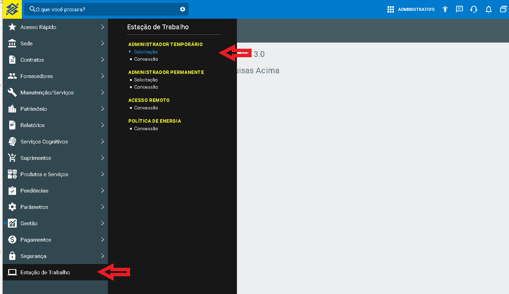

Como preencher a tela de acesso de administrador:

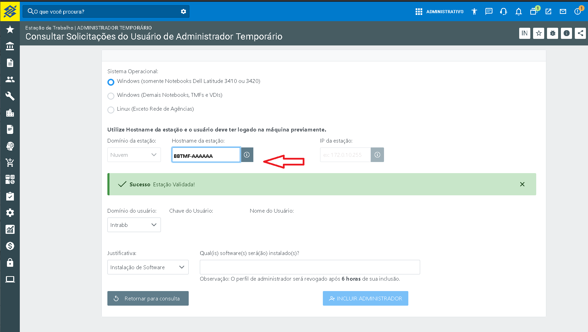

## 1.4 - Suporte

Este roteiro não é uma solução definitiva, entretanto tentamos ajudar no quesito configuração, reduzindo este tempo. 

Não há suporte oficial, seria interessante os analistas formarem grupos de pair-programming/troubleshooting para solução de casos pontuais;

**Qual a solução oficial?** 

Existe um comitê de discussão para o assunto, fora da Arq 3.0, para uma solução definitiva já em andamento (via Gesat).  Este comitê prevê soluções em três camadas, "3 Tier":

- Red Hat CodeReady: Solução SaaS;
- VDI: Aquisição de mais de 5 mil licenças a serem distribuídas entre Linux e Windows;
- Possibilidade de programar a partir de um Sistema Operacional nativo (Linux/Mac/Windows).
- Este grupo visa a solução corporativa, deve ser considerada como padrão quando oficializado.

## 1.5 - Este roteiro não abrange
    
- VPN e acessos externos - fora da rede do BB;
- Configuração do ambiente para: parceiros/contratados/subsidiárias.

**IMPORTANTE** - Para estes casos acima:

- Quando for analista BB: deverá envolver o PO e Scrum Master, montar um grupo para avaliar possibilidades e soluções similares, "pair programming".
- Quando for para ajuste do ambiente para parceiros/contratados: Ainda não existe roteiro similar, em função da multiplicidade de contratos diferentes, recursos possíveis ou não de serem acessados, bem como permissões e VLANs específicas. A mesma instrução acima deve ser seguida, sendo acompanhada com o "encarregado técnico" da fábrica para roteirizar entre si as configurações e especificidades relativas aos recursos e acessos.

# 2 - Configurações e instalações de softwares no Windows

## 2.1 -  Adicionar os certificados PKI de todos os ambientes no navegador e marcar como confiáveis

2.1.1 - O QUE SERÁ FEITO: 

- Será necessário adicionar três certificados PKI no navegador Firefox para desenvolvimento e mais três para homologação;
- Será necessário marcar todos os certificados adicionados como confiáveis para o navegador.

**Para ambiente de produção** 

Certificados de produção já vêm instalados no notebook por padrão. Não precisa fazer nada aqui.

**Para ambiente de desenvolvimento e homologação**  

O desenvolvedor sempre precisa utilizar os ambientes de desenvolvimento e de homologação para trabalho. Neste caso, tem de:
- Instalar manualmente os certificados e
- Setar no firefox como confiáveis manualmente
 
2.1.2 - **Como realizar download dos certificados de desenvolvimento e também de homologação**

Acesse o link `http://pki.desenv.bb.com.br/` e realize o Download dos seguintes certificados:

- Certificado Raiz AC Banco do Brasil v3 - https://pki.desenv.bb.com.br/ACRAIZC/cacerts/raiz_v3.der
- Autoridade Certificadora Usuários - http://pki.desenv.bb.com.br/ACINTB2/cacerts/acus_v1.der
- Autoridade Certificadora Servidores v1 - http://pki.desenv.bb.com.br/ACINTA5/cacerts/acsr_v1.der

Acesse o link  `http://pki.hm.bb.com.br/` e realize o Download dos seguintes certificados:

- Certificado AC Banco do Brasil v3 - https://pki.hm.bb.com.br/ACRAIZC/cacerts/raiz_v3.der
- Autoridade Certificadora Usuários v1 - https://pki.hm.bb.com.br/ACINTB2/cacerts/acus_v1.der
- Autoridade Certificadora Servidores v1 - https://pki.hm.bb.com.br/ACINTA5/cacerts/acsr_v1.der

Após o download, os três arquivos deverão estar na pasta Downloads.

2.1.3 - Como instalar os certificados, marcando como confiáveis:

**IMPORTANTE** - O passo aqui mostrado deverá ser realizado para cada um dos certificados baixados, uma vez para cada arquivo

**Passo 1** 

- Pegue o primeiro arquivo baixado, dê dois cliques e siga conforme abaixo:
 
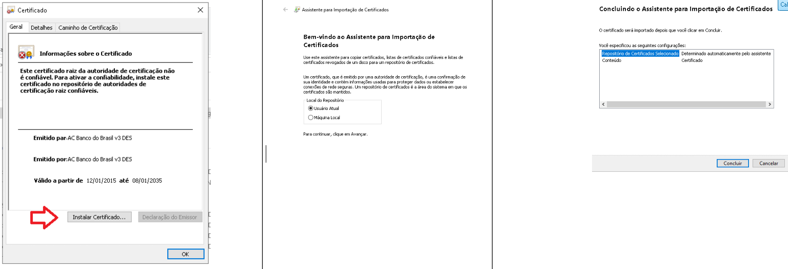

**Passo 2**

2.1.4 - Setar os certificados como confiáveis

- Todos os certificados em todos os ambientes devem ser marcados como confiáveis no seu firefox:

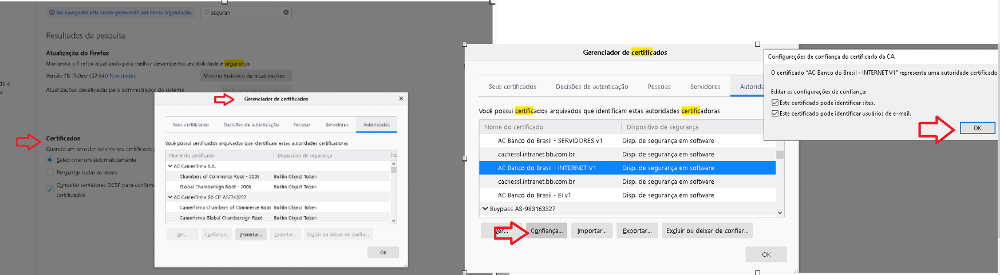

## 2.2 - Instalar VirtualBox

VirtualBox é um software de virtualização. Visa criar ambientes para instalação de sistemas operacionais distintos. Basicamente ele vai ser utilizado para rodar o Vagrant.

Download link: [Download VirtualBox](http://atf.intranet.bb.com.br/artifactory/bb-binarios-local/gaw/VirtualBox-6.1.26-145957-Win.exe).

Como instalar: utilizar o instalador nos moldes: "next, next, finish".

## 2.3 - Desativar HyperV

Para utilizar o Vagrant, o Hyper-V do Windows deve estar desativado pois utilizaremos o VirtualBox como virtualizador para o Vagrant.

Como fazer:

- Para verificar, clique com o botão direto do mouse no ícone do windows e clique em "Apps e Recursos":


- No canto inferior, clique em "Programas e Recursos"

- Na nova janela que será aberta, no lado esquerdo, clique em "Ativar ou Desativar recursos do Windows"

- Desative o HyperV desmarcando a caixa de seleção e clicando OK.

- Feche as janelas que estiverem abertas e pronto.

## 2.4 - Instalação do Vagrant

Vagrant é um software de código aberto utilizado para criação e manutenção de ambientes de desenvolvimento virtuais. Vamos utilizá-lo para simplificar o gerenciamento de uma imagem Linux que será executada utilizando o VirtualBox.

Antes de realizar o download, é necessário criar uma pasta para os arquivos do Vagrant. Esta pasta deve ser chamada `C:\>kdimv`

### 2.4.1 - Criar a pasta KDIMV

- Abra o terminal do windows (prompt), clicando no menu Iniciar e digitando **cmd**.
- Altere para a pasta raíz com o comando `cd \`.
- Crie a pasta com o comando `mkdir kdimv`.

### 2.4.2 - Download e instalação do Vagrant

Download link: [Download Vagrant](http://atf.intranet.bb.com.br/artifactory/bb-binarios-local/gaw/vagrant_2.2.16_x86_64.msi).

Como instalar: utilizar o instalador nos moldes: "next, next, finish".

## 2.5 - Instalação e configuração do VSCode

### 2.5.1 - Definição

O Visual Studio Code é um editor de código-fonte desenvolvido pela Microsoft para Windows, Linux e macOS. Ele inclui suporte para depuração, controle de versionamento Git incorporado, realce de sintaxe, complementação inteligente de código, snippets e refatoração de código.

O VSCode também disponibiliza através de um plugin a conexão a áreas de trabalho remotas. Dessa forma será possível utilizar o VSCode no Windows conectado ao código fonte dentro da máquina virtual rodando Linux, no Vagrant.

### 2.5.2 - Instalação do VSCode

Baixe a versão mais recente do VSCode para Windows.

Download link: [Download VSCode](https://code.visualstudio.com/sha/download?build=stable&os=win32-x64-user).

Como instalar: utilizar o instalador nos moldes: "next, next, finish".

### 2.5.3 - Instalação de extensões

Para instalar extensões no VSCode clique na opção **Extensions** no menu, identificada pelo ícone 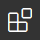, ou acesse pelas teclas de atalho `CTRL + SHIFT + X`.

Digite o nome de cada extensão na caixa de busca e instale clicando em Install (ou Instalar, se o VSCode já estiver com o LanguagePack em Português):

2.5.3.1 Extensão: "Remote - SSH": "ms-vscode-remote.remote-ssh".

**IMPORTANTE** - Este plugin, pela rede cabeada do BB, consta bloqueado neste momento. Como proceder? 
- Uma alternativa válida é desconectar o cabo de rede e utilizar a rede BB Wireless (mudança de rede é realizada automaticamente pelo Cisco AnyConnect), visto que esta possui menos restrições que a cabeada, relativamente.

ou

- Download e instalacao manual(consultar doc oficial). 

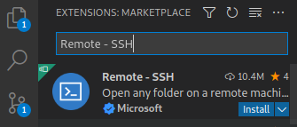

Referência: https://marketplace.visualstudio.com/items?itemName=ms-vscode-remote.remote-ssh

2.5.3.2 Extensão: "Extension Pack for Java": "vscjava.vscode-java-pack".
 
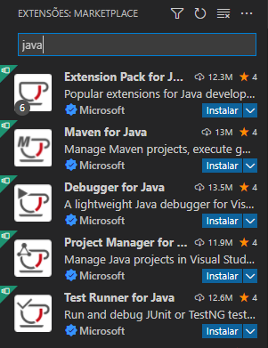

Referência: https://marketplace.visualstudio.com/items?itemName=vscjava.vscode-java-pack

# 3 - Configurações para a máquina virtual Linux

## 3.1 - Configurar a utilização do repositório corporativos Maven

3.1.1 - Gerar arquivo settings.xml

3.1.2 - Siga os passos no Tópico [Gerando o settings.xml via interface do binarios.intranet](https://fontes.intranet.bb.com.br/aic/publico/atf-documentation#op%C3%A7%C3%A3o-2-gerando-o-settingsxml-via-interface-do-binariosintranet)

3.1.3 - Copie o arquivo settings.xml baixado no passo anterior para a pasta `C:\kdimv`.

## 3.2 - Configurar a utilização do repositório corporativos NPM

3.2.1 - Estando dentro da pasta c:\kdimv siga os passos do Tópico [Repositório NPM](https://fontes.intranet.bb.com.br/aic/publico/atf-documentation#reposit%C3%B3rio-npm)

## 3.3 - Provisionar a máquina virtual para o Vagrant

3.3.1 Acesse o terminal (cmd no Windows)

Se você seguiu nossa sugestão de nome de pasta (no passo 5.1), digite:

```cmd
cd c:\kdimv [ENTER]
```

3.3.2 Para incluir a box, base da nossa máquina virtual, no vagrant, execute:

```cmd
vagrant box add kdi-box https://binarios.intranet.bb.com.br:443/artifactory/generic-bb-binarios-gaw-local/publico/kdi-box.json [ENTER]
```

E aguarde pela mensagem:
```cmd
==> box: Successfully added box 'kdi-box' (v1.0.1) for 'virtualbox'!
```

3.3.3 Em seguida:
```cmd
vagrant init kdi-box [ENTER]
```

3.3.4 Agora vamos fazer uma pequena alteração no arquivo Vagrantfile.
Ou se preferir, pode baixar o arquivo já modificado [aqui](https://fontes.intranet.bb.com.br/dev/publico/roteiros/-/blob/master/EnxovalBB/kdimv/Vagrantfile?inline=false) e substituir na pasta C:\kdimv.

3.3.4.1 Com o editor de texto (notepad) abra o arquivo Vagrantfile  e abaixo do comando:
```
config.vm.box = "kdi-box"
```
Inclua as seguintes linhas:

```
config.vm.network "forwarded_port", guest: 8081, host: 8091, host_ip: "127.0.0.1"
config.vm.network "forwarded_port", guest: 16686, host: 16686, host_ip: "127.0.0.1"
```

3.3.4.2 Substitua também o trecho

```
# config.vm.provision "shell", inline: <<-SHELL
#   apt-get update
#   apt-get install -y apache2
# SHELL
```
Por

```
config.vm.provision "shell", inline: <<-SHELL
  openssl s_client -showcerts -connect atf.intranet.bb.com.br:5001 < /dev/null | sed -ne '/-BEGIN CERTIFICATE-/,/-END CERTIFICATE-/p' > ca.crt
  mv ca.crt /usr/local/share/ca-certificates/
  update-ca-certificates
SHELL
```

Atenção! Caso esteja acessando a rede do BB através de proxy, realize as configurações adicionais descritas [neste link](https://fontes.intranet.bb.com.br/gaw/publico/gaw-kdi-box#configurar-proxy-para-rede-de-terceirizadas).

3.3.4.3 Salve o arquivo.

# 4 - Inicialização do ambiente virtual Linux

## 4.1 - VirtualBox

Para a inicialização do Vagrant o VirtualBox precisa estar em execução. Abra o aplicativo pelo ícone que foi criado durante a instalação.

## 4.2 - Primeira execução do Vagrant

4.2.1 Acesse o terminal (cmd no Windows) e mude para a pasta `kdimv`:

```cmd
cd c:\kdimv [ENTER]
```

4.2.2 Inicialize o Vagrant com o comando abaixo:

```cmd
vagrant up [ENTER]
```

A primeira execução pode levar algum tempo, pois o ambiente será criado e várias ferramentas serão instaladas e configuradas.

4.2.3 Quando terminar, para testar se tudo está OK e conectar em um terminal dentro do Vagrant, digite:

```cmd
vagrant ssh [ENTER]
```

Para sair desse terminal e voltar ao do Windows utilize o comando `exit`. O Vagrant permanecerá em execução.

## 4.3 - Configuração da conexão com o ambiente remoto no VSCode

4.3.1 Abra o VSCode e clique no ícone do plugin **Remote Explorer** no menu lateral: 


4.3.2 Clique em "+" (Add New)

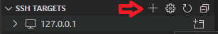

4.3.3 Na tela a seguir digite: `ssh vagrant@127.0.0.1 -p 2222` [ENTER]

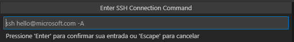

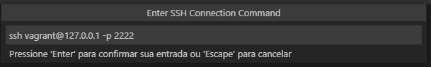

4.3.4 Clique no arquivo .ssh/config (o que fica na pasta do usuário, que pelo nosso exemplo seria `C:\Users\f9999999\.ssh\config`)

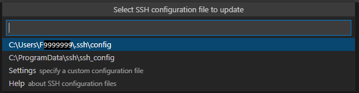

4.3.5 Para se conectar clique no ícone connect:


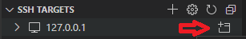

4.3.6 Quando solicitado, digite a senha "vagrant" + [ENTER].

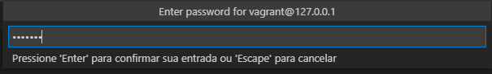

4.3.7 Se solicitado, informe que o tipo de sistema remoto é "Linux".

4.3.8 Resolução de problemas de conexão:

Caso ocorra algum erro de conexão verifique se o arquivo `.ssh/config` está com essa configuração:

```
Host 127.0.0.1
  HostName 127.0.0.1
  User vagrant
  Port 2222
```

E verifique também se a máquina virtual está rodando (`vagrant up`).

# 5 - Uso do VSCode conectado na máquina virtual no dia a dia

## 5.1 - Verificar conexão com o ambiente remoto

Se a conexão do passo anterior funcionou normalmente, você deve estar com duas janelas do VSCode abertas. Uma conectada ao Vagrant e uma local no Windows. A janela local pode ser fechada nesse momento.

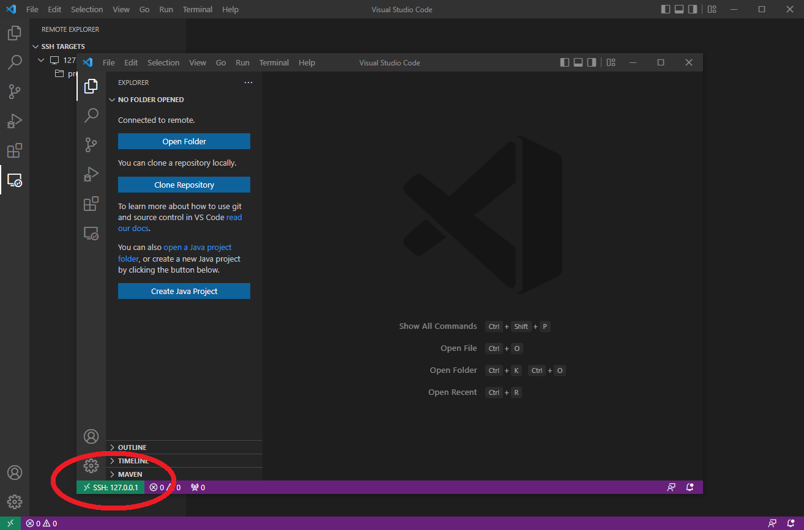

No exemplo acima a janela maior é a que utilizamos para fazer a conexão, e está rodando localmente no Windows. A janela menor está conectada ao Vagrant.

A conexão pode ser verificada pela área em verde no canto inferior, que está destacada na imagem.

Podem ser abertas outras janelas do VSCode, conectadas à máquina remota ou não. E também é possível fechar a conexão remota clicando na mesma área em verde para abrir o menu.

## 5.2 - Instalação de extensões no ambiente remoto

No passo **2.5.3.2** desse roteiro instalamos a **Extension Pack for Java**. Ao clicar novamente na aba de extensões, ela vai aparecer com um aviso indicando que é necessário instalar também para o ambiente remoto:

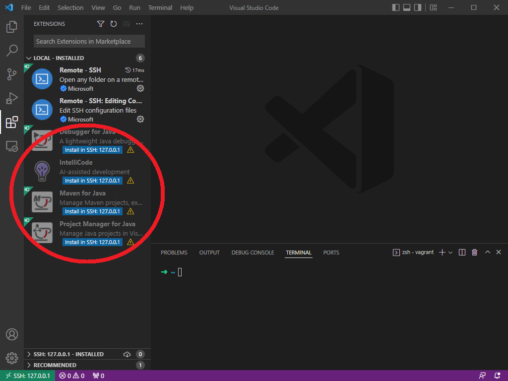

Pesquise e instale novamente a mesma extensão, conforme indicado no passo **2.5.3.2**.

## 5.3 - Abertura de pastas e arquivos

Embora o VSCode esteja sendo executado no Windows, nessa janela remota ele está conectado a um ambiente de trabalho dentro do sistema Linux no Vagrant. Dessa forma as pastas e arquivos abertos estão também dentro da máquina virtual.

Pode ser utilizado o menu para abertura de arquivos, ou então os botões abaixo, para abrir pastas ou clonar repositórios a partir do fontes.intranet.bb.com.br:

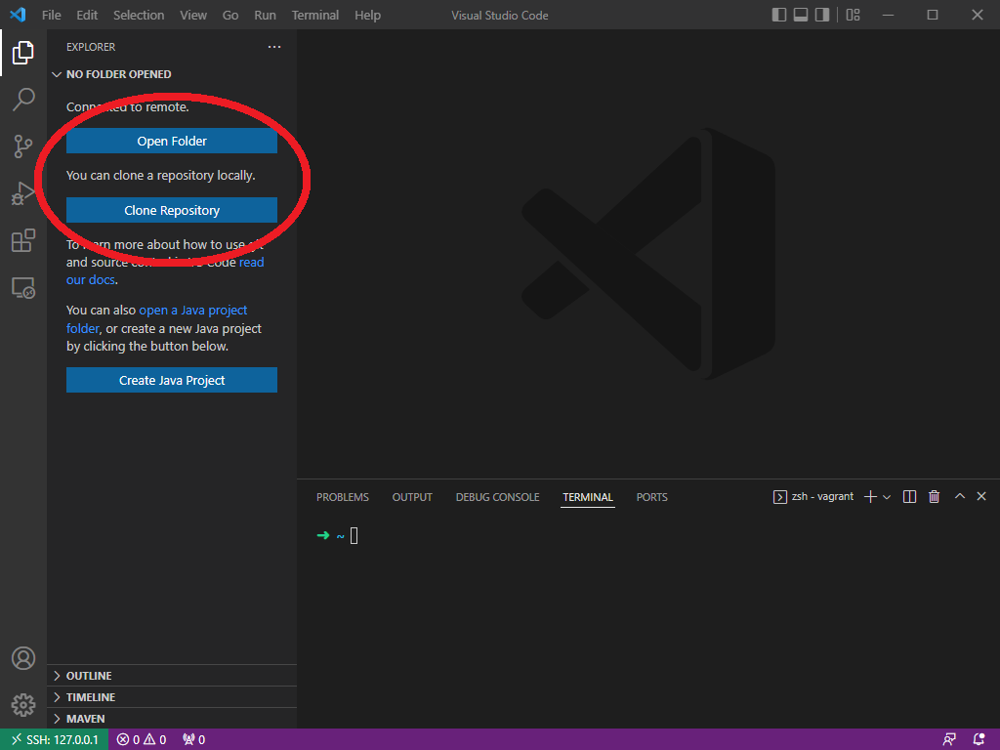

## 5.4 - Interação com o sistema remoto

O sistema Linux que utilizamos com o Vagrant não tem uma interface gráfica. A interação com ele deve ser feita a partir de comandos em um terminal.

Essa interação pode ser feita utilizando o terminal do Windows e o comando `vagrant ssh` como demonstrado no passo **4.2.3** desse roteiro, mas também pode ser feita diretamente no VSCode.

Para abrir um terminal dentro do VSCode clique no menu **Terminal** e em **New Terminal**. Será aberto um terminal dentro do VSCode, conforme abaixo:

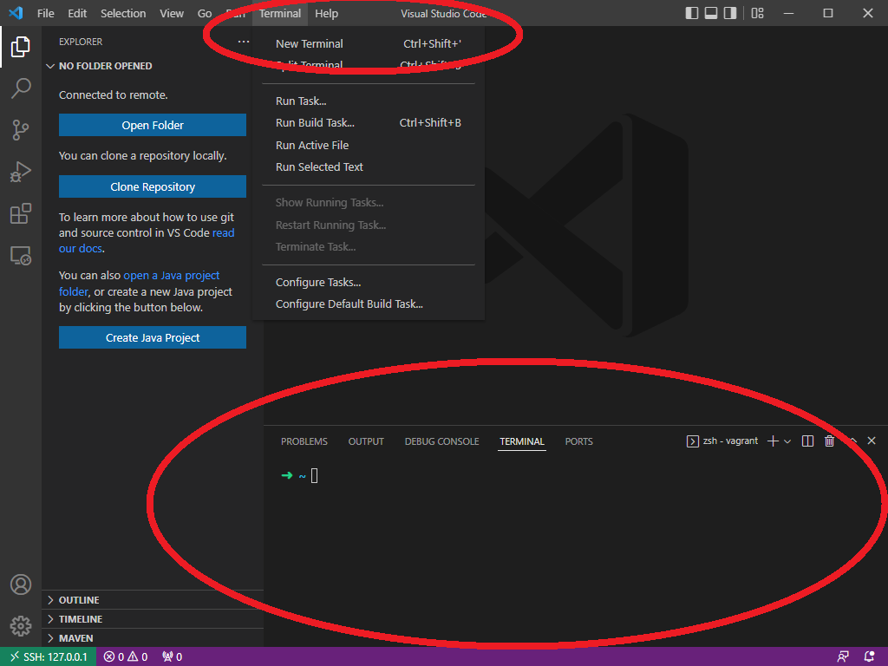

## 5.5 - Mudança na versão do Java e Maven

A imagem Linux que estamos utilizando está configurada com duas versões do Java e duas versões do Maven. 

Caso você vá utilizar o mesmo ambiente também para desenvolvimento para a Plataforma BB, utilize os comandos abaixo em um terminal no sistema remoto para selecionar as versões em uso.

5.5.1 Utilizar Java 11

```bash
sudo useJDK11.sh
```

5.5.2 Utilizar Java 8

```bash
sudo useJDK8.sh
```

5.5.3 Utilizar Maven 3.6.3

```bash
sudo useMaven363.sh
```

5.5.4 Utilizar Maven 3.0.5

```bash
sudo useMaven305.sh
```

## 5.6 - Desligar o seu ambiente virtual

Para que sua máquina virtual seja desligada corretamente, após fechar o VSCode execute os comandos abaixo no terminal do Windows:

```cmd
cd c:\kdimv [ENTER]

vagrant halt [ENTER]
```

Para inicializar novamente o sistema, com o VirtualBox rodando execute os comandos abaixo no terminal do Windows:

```cmd
cd c:\kdimv [ENTER]

vagrant up [ENTER]
```

# 6 - Configurações adicionais
## 6.1 - Interação com o cluster Kubernetes no ambiente virtual

A interação com o cluster Kubernetes pode ser feita utilizando o utilitário **kubectl**. 

Para a configuração dos parâmetros dos clusters e seus tokens de acesso siga [esse roteiro](https://fontes.intranet.bb.com.br/psc/publico/atendimento/-/blob/master/roteiros/geracao-kubeconfig.md).

Porém, a instalação indicada no roteiro, seguindo a documentação oficial do Kubernetes, não vai funcionar dentro da rede do Banco.

Instale utilizando os comandos abaixo, dentro de um terminal na máquina remota (ver passo 5.4 acima):

```cmd
wget -q --show-progress --progress=bar:force 'http://atf.intranet.bb.com.br/artifactory/bb-binarios-local/gaw/kubectl-linux-1.20.15' -P /tmp --show-progress

sudo install -o root -g root -m 0755 /tmp/kubectl-linux-1.20.15 /usr/local/bin/kubectl

rm -rf /tmp/kubectl-linux-1.20.15
```
---
[^1]: [👍👎](http://feedback.dev.intranet.bb.com.br/?origem=roteiros&url_origem=fontes.intranet.bb.com.br/dev/publico/roteiros/-/blob/master/EnxovalBB/roteiro-config-dell3410.md&internalidade=EnxovalBB/roteiro-config-dell3410)
