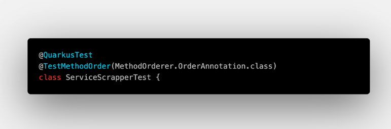
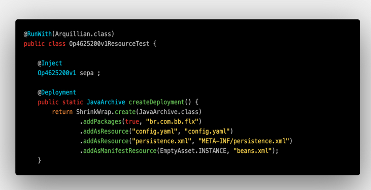

> :exclamation: Dê um feedback para esse documento no rodapé.[^1]

> :exclamation: Dê um feedback para esse documento no rodapé.[^1]
MicroProfile 

O MicroProfile é um conjunto de especificações mantidas pela fundação Eclipe que busca otimizar o desenvolvimento de microserviços agregando diversas tecnologias, inclusive algumas do Java EE/Jakarta EE. 

Diversos fornecedores provêm soluções com as tecnologias especificadas no MicroProfile, permitindo que uma aplicação que utilize essas tecnologias não fique presa em nenhum fornecedor específico, podendo ser facilmente portada para outra solução que siga a mesma especificação. 

Para termos maior flexibilidade numa eventual mudança de framework e um melhor compartilhamento de conhecimento, a equipe de DX definiu que o projeto base Java deveria usar um framework que implementa o MicroProfile. 

Entre as soluções que implementam o MicroProfile, a versão inicial do projeto base de Java foi desenvolvida utilizando o KumuluzEE, framework mantido pela empresa Kumuluz. Apesar deste ser o framework padrão, o uso do Quarkus, framework mantido pela empresa RedHat, está presente em 1/3 dos projetos Java com código fonte no fontes.intranet.bb.com.br. 

Ambos frameworks atualmente suportam o MicroProfile 3.2, mas o Quarkus tem demonstrado algumas vantagens em relação ao KumuluzEE. Entre elas, a funcionalidade Live Coding, que melhora o processo de desenvolvimento e a experiência do desenvolvedor. 

 

Algumas características básicas do Quarkus: 

 

Quarkus 1.2.0 

 

    Empresa RedHat 

    207 contribuidores 

    MicroProfile 3.2 

    Uptime de 4 segundos 

    Imagem de 122MB 

    Live Coding 

    Suporte a build nativo 

    Uso de memória de 60MB 

    Suporte fácil a FatJar permitindo o uso de uma imagem base com apenas JRE 

    Possiblidade de contratação de suporte (RedHat) 

 

 

 

KumuluzEE 3.6.0 

 

    Empresa KumuluzEE 

    14 contribuidores 

    MicroProfile 3.2 

    Uptime de 17 segundos 

    Imagem de 234MB 

    Uso de memória de 251MB 

    Suporte fácil a FatJar permitindo o uso de uma imagem base com apenas JRE 

 

 

 

Live Coding 

 

Quarkus tem a funcionalidade de Live Coding que permite a atualização do código enquanto o servidor está em execução, sem a necessidade de recompilar todo o projeto. No KumuluzEE, o desenvolvedor precisa parar o processo e recompilar o projeto para ter as alterações sensibilizadas. Este processo leva aproximadamente 2 minutos no nosso blank project atual, diminuindo a produtividade.  

 

Testes 

 

A implementação de JUnit5 no Quarkus permite a fácil execução do Quarkus como container no momento da execução dos testes, permitindo o uso do contexto de injeção na fase de testes e a escrita de testes de contrato. Outra facilidade, é uso de mock dos managed beans do CDI apenas com o uso de uma anotação.  

Declaração de classe de teste do Quarkus 

No Kumuluzee, para obter as mesmas funcionalidades durante os testes, é necessário o uso e configuração do Arquillian e do Mockito. 

Declaração de classe de teste do KumuluzEE 

 

 

Rest Client com Proxy 

 

Os projetos que precisam consumir um serviço REST externo não podem utilizar a implementação de RestClient do KumuluzEE, pois este não suporta configurar proxy. O desenvolvedor é obrigado a utilizar uma solução mais declarativa, ou utilizar o Quarkus utiliza uma implementação do RestClient que suporta proxy. 

Em Setembro de 2019 foi enviado um merge request para adicionar o suporte ao KumuluzEE, mas até o momento não foi feito o merge pela equipe responsável pelo KumuluzEE. 

 

Transaction 

 

KumuluzEE não suporta atualmente controle de transação através de Annotation de queries nativas (https://github.com/kumuluz/kumuluzee/issues/128) que são utilizadas nos projetos que fazem conexão com o DB2. Para controlar transação, o desenvolvedor tem que fazer o controle todo manualmente. Enquanto isso, o Quarkus suporta os dois modos de controle de transação. 

 ---
[^1]: [👍👎](http://feedback.dev.intranet.bb.com.br/?origem=roteiros&url_origem=fontes.intranet.bb.com.br/dev/publico/roteiros/-/blob/master/frameworks/texto-quarkus.md&internalidade=frameworks/texto-quarkus)
