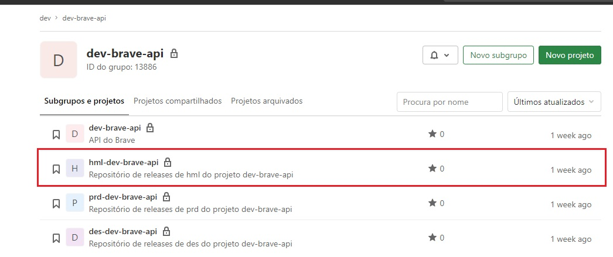
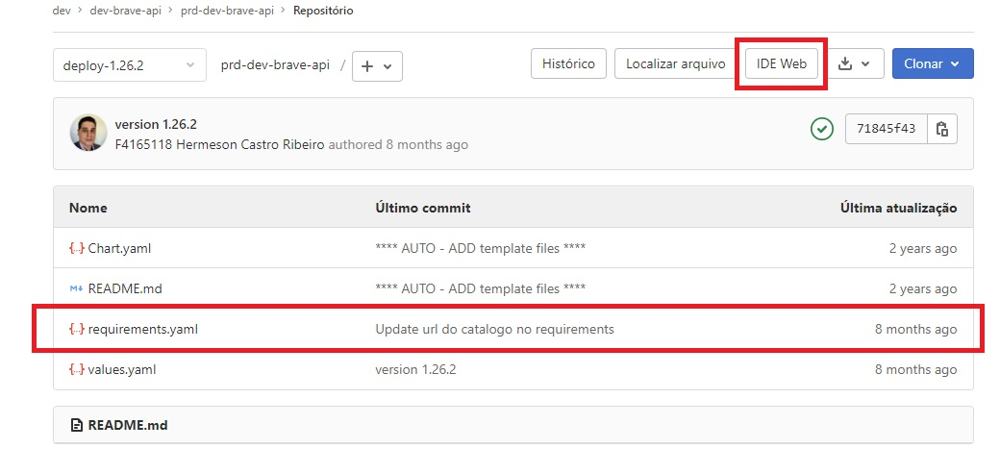
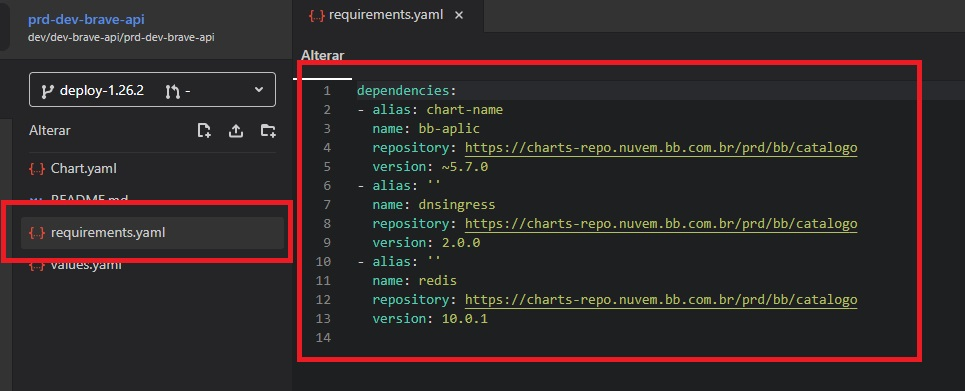
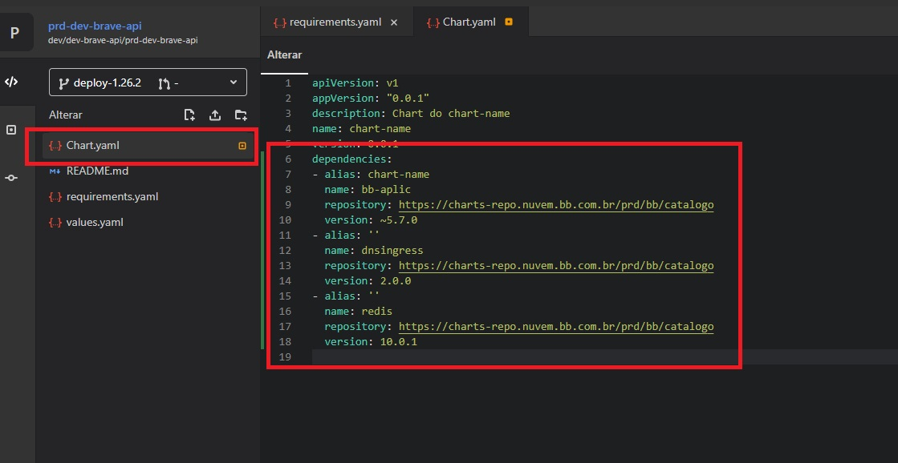
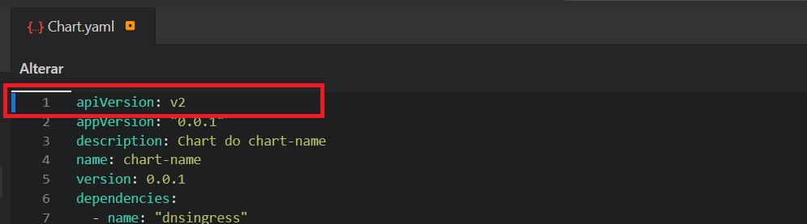

> :exclamation: Dê um feedback para esse documento no rodapé.[^1]

# Migração de configuração de release para o Helm Charts V3

Com a atualização em breve do [Helm Chart](https://helm.sh/docs/topics/v2_v3_migration/#helm) para a versão 3 a configuração de release sofrerá mudanças e o arquivo `requirements.yaml` não será mais utilizado, dessa forma será necessário migrar seu conteúdo para o arquivo `Chart.yaml`, caso você utilize o release do portal [Brave](https://brave.dev.intranet.bb.com.br) para efetuar implantações esses ajustes serão efetivados com sua anuência, mas caso deseje fazer manualmente siga os passos descritos a seguir.

## Configurando dependencies no Chart.yaml

> :warning: Em caso de ambiente de **produção** o procedimento deve ser feito em *branch* diferente da master e seguindo procedimento para geração de bilhete de liberação.

1. Acesse o repositório de release do ambiente desejado do grupo de repositórios de fontes do projeto, por exemplo o de homologação que inicia-se com **hml**.

2. Observe se existe o arquivo `requirements.yaml`, caso não exista provavelmente ja ocorreu a migração do projeto e ambiente escolhido. Utilize o botão **IDE Web** para iniciar o editor online do GitLab.

3. Na tela de edição abra o arquivo `requirements.yaml` e copie o seu conteúdo.

4. Na tela de edição abra o arquivo `Chart.yaml` e o adicione o conteúdo copiado do requirements.

5. Ainda no arquivo `Chart.yaml` altere o atributo **apiVersion** para **v2**.

6. Remova o arquivo `requirements.yaml`.

7. Faça o commit e acompanhe o release com o Argo do respectivo projeto e ambiente. Caso não utilize a master faça o merge request para a mesma.

8. Certifique-se que a sincronização no Argo ocorreu com sucesso.

---
[^1]: [👍👎](http://feedback.dev.intranet.bb.com.br/?origem=roteiros&url_origem=fontes.intranet.bb.com.br/dev/publico/roteiros/-/blob/master/implantando-sua-solucao-na-nuvem/migrando-helm-charts-v3.md&internalidade=implantando-sua-solucao-na-nuvem/migrando-helm-charts-v3)
