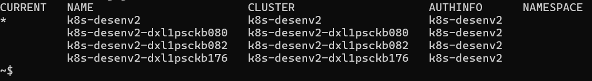

> :speech_balloon: Deixe o seu feedback sobre este roteiro no rodapé.[^1]

# Como configurar o Kubectl para rodar localmente
Este roteiro ensina como configurar o Kubectl por meio do arquivo **kubeconfig** para posterior uso em clusters Kubernetes via linhas de comando. 

> :bulb: **Dica** 
> 
> As configurações que você verá aqui são aplicáveis ao Kubernetes. Iremos  dar um exemplo utilizando o Vagrant (Linux). Para WSL/PengWin e Windows serão necessários ajustes no path do arquivo de configuração **.kube/config**. Por padrão, esse arquivo  está localizado na pasta **home** do usuário.

## Requisitos
- [Vagrant e VSCode](https://fontes.intranet.bb.com.br/dev/publico/roteiros/-/blob/master/enxovalBB/Como_configurar_ambiente_virtual_dev.md) instalados.
- [Kubectl](https://kubernetes.io/docs/tasks/tools/) instalado.

## Passo 1: Localizar o arquivo kubeconfig
O arquivo que você precisa configurar está na pasta oculta **.kube** de sua máquina virtual em **/home/vagrant.**. Para localizá-lo:
1. No Prompt de Comando da sua máquina, digite `cd /home/vagrant/.kube/` e tecle **Enter** para navegar até o arquivo. Entre os arquivos listados, estará o **config** 
2. Acione o comando `sudo chmod 777 config`, para alterar a permissão de edição das configurações do Kubectl.

>:bulb: **Dica** 
> 
> Se você utiliza o sistema Linux, leia o artigo [Entendendo as permissões no Linux](https://www.alura.com.br/artigos/entendendo-as-permissoes-no-linux) para saber mais sobre permissões de arquivos e diretórios.

3. Execute o comando `code config` para abrir e editar o arquivo no **VSCode**.   

Agora, você precisará de novas informações para configurar o Kubectl no ambiente de **Desenvolvimento**.

## Passo 2: Gerar informações no Rancher para acessar o ambiente de desenvolvimento 
1. Acesse o [Rancher](https://caas.apps.nuvem.bb.com.br/login), o gerenciador de Kubernetes. 
2. Selecione o cluster **ks8-desenv2**.
3. No canto direito superior, clique na opção **Kubeconfig File**.
4. Copie todo o conteúdo deste arquivo. 
Com as informações em mãos, partimos para a edição do arquivo **config**.

## Passo 3: Alterar o arquivo
1. No  arquivo **config** aberto no **VSCode**, apague todo o conteúdo.
2. Cole as informações copiadas no **Rancher**.

> :warning: **Atenção** 
> 
> Ao substituir o conteúdo, certifique-se de que está utilizando as informações geradas para o cluster correto, devido ao ambiente em que será feita a configuração. Neste caso, estamos utilizando o **k8s-desenv2**, pois a configuração será realizada para o ambiente de **Desenvolvimento**.  

3. Salve o arquivo.
4. Feche a aba do **VSCode**. 

> :information_source: **Observação** 
> 
> Para configurar o Kubectl para os ambientes de **Homologação** e **Produção**, basta seguir os mesmos passos alterando apenas os tipos de cluster para **k8s-hm** e **k8s-servicos**, respectivamente.

## Passo 4: Utilizar o Kubectl configurado
1. No seu Prompt de Comando, digite `kubectl config get-contexts` para que sejam exibidos os ambientes/clusters disponíveis. O resultado será semelhante à lista da imagem a seguir:

 

2. Execute o comando `sudo kubectl config use-context k8s-desenv2` para selecionar o context **k8s-desenv2**.

Ao final desse roteiro você terá configurado seu Kubectl e interagido com o cluster escolhido.

## Saiba mais
* Leia o roteiro [Geração Kubeconfig](https://fontes.intranet.bb.com.br/psc/publico/atendimento/-/wikis/Roteiros/geracao-kubeconfig) para outras informações sobre como configurar o arquivo **config**.

## Precisa de ajuda?
Em caso de problemas na execução de qualquer roteiro, abra uma [nova issue](https://fontes.intranet.bb.com.br/dev/publico/atendimento/-/issues) e relate a situação. O time de atendimento da devCloud está disponível para auxiliar!  

## Este roteiro foi útil?
[^1]: [👍👎](http://feedback.dev.intranet.bb.com.br/?origem=roteiros&url_origem=fontes.intranet.bb.com.br/dev/publico/roteiros/-/blob/master/kubernetes/Como_configurar_kubectl.md&internalidade=ofertas/Como_)
