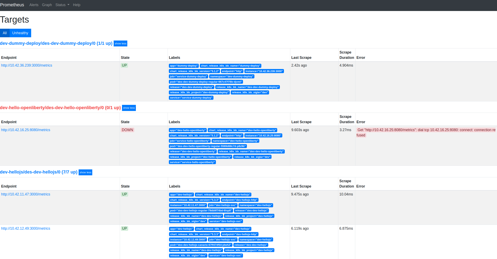
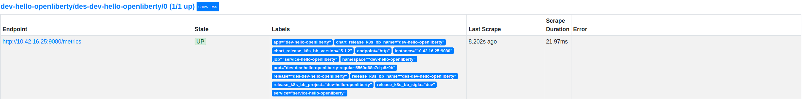

> :exclamation: Dê um feedback para esse documento no rodapé.[^1]

## Objetivo


Este roteiro mostra como identificar e corrigir os principais problemas referentes a stack de monitoração.

## Sumário

[[_TOC_]]

## Pré-Requisitos

* kubectl instalado e configurado na máquina: Roteiro https://fontes.intranet.bb.com.br/psc/publico/atendimento/-/blob/master/cheatSheetDev.md
* Aplicação expondo métricas no endpoint /metrics
* Namespace com stack de monitoração criado e configurado. Roteiro para criação: https://fontes.intranet.bb.com.br/sgs/publico/roteiros/-/blob/master/Roteiro%20Cria%C3%A7%C3%A3o%20Stack%20de%20Monitoracao.md

## 1. Métricas não capturadas / Target não listado no prometheus

Para resolução deste problema, verifique os itens abaixo no `values.yaml` de sua aplicação e também do prometheus.
### 1.1 Service Monitor

Para que as métricas expostas pela sua aplicação sejam capturadas pelo prometheus, é necessário que no `values.yaml` da sua aplicação ([Chart BBAplic > 5.1.2](https://charts.nuvem.bb.com.br/charts/bb-cloud/bb-aplic)) o item `serviceMonitor` esteja configurado corretamente. 

### 1.1.1 Exemplo de configuração correta

Abaixo exemplo de um `serviceMonitor` configurado corretamente:

``` yaml
  serviceMonitor:
    enable: true # se estiver FALSE não vai funcionar!
    monitorNamespace: dev-monitor
    labels:
      sigla: abc  # onde abc é a sigla do seu sistema
      projeto: abc-monitor
    endpoints:
      - port: http
        interval: 10s
        path: /metrics
```
### 1.1.2 Principais Campos/Parâmetros

* Campo `monitorNamespace`: Este campo vai criar uma autorização no kubernetes para permitir que o Prometheus acesse informações do namespace da aplicação. Caso não seja informado, as métricas não serão capturadas. Portanto, é necessário informar seu namespace de monitoração - geralmente nomeado como <sigla-monitor>.

* Campo `endpoints`: Verifique se o *path* e *port* estão corretos. Observação: A porta refere-se a porta `service` do `values.yaml`. No caso do exemplo, o recurso `service` está configurado desta forma:

``` yaml

  service:
    enable: true
    type: ClusterIP
    ports:
    - name: http #nome da porta do service, que aponta para a porta do container da aplicação.
      port: 80 #porta do service
      targetPort: 8080 #porta configurada na aplicação para receber requisições
```

Observe o nome da porta está como **http**, além disso está apontando para a porta **8080** que a aplicação está preparada para receber requisições.

* Campo `labels` : Este campo é o que mais confunde e o motivo da maioria das issues reportadas. As labels servem para identificar o `serviceMonitor` e permitir a busca de aplicações que serão monitoradas pelo prometheus. **ATENÇÃO!: As labels definidas aqui devem ser as mesmas configuradas no values.yaml do prometheus!** . Abaixo a configuração de labels no `values.yaml` do prometheus deployado no namespace **dev-monitor** usado como exemplo:

``` yaml
prometheus:
  enabled: true
  commonLabels:
    sigla: abc  # onde abc é a sigla do seu sistema
    projeto: abc-monitor  # onde abc é a sigla do seu sistema
    
  [...]
  prometheusSpec:
  
    serviceMonitorSelector:
      matchLabels:
        sigla: abc  # onde abc é a sigla do seu sistema
        projeto: abc-monitor  # onde abc é a sigla do seu sistema
        
  [...]
```
Note que a label `tier: dev` se repete em todas as configurações - prometheus e serviceMonitor. Você pode usar qualquer `chave: valor` na configuração/definição da label, desde que seja a mesma em todos os itens acima.

### 1.2 Targets

A visão de targets na interface do prometheus permite visualizar quais aplicações estão sendo monitoradas e métricas capturadas. para consultar acesse o endpoint `/targets` do seu prometheus - Exemplo: http://prometheus.dev.desenv.bb.com.br/targets . Irá retornar uma tela parecida com esta:



### 1.2.1 Status dos targets

Note na iamgem acima que três aplicações são monitoradas (dev-dummy-deploy, dev-hellojs e dev-hello-openliberty). Os endpoints são os containers:porta que o prometheus está coletando as métricas. **O status deve estar UP para que as métricas sejam capturadas!!!** . 
Observe que um dos targets está **DOWN**, isto pode ocorrer por diversos motivos, por exemplo:

* Aplicação não está respondendo - Verifique se sua aplicação subiu corretamente e o status do Pod/Container é *Running*

* Configuração incorreta de portas no `values.yaml` da aplicação a ser monitorada, principalmente no item `service.ports.targetPort`

* Configuração incorreta do `ServiceMonitor` - Endpoint incorreto e/ou porta inválida.

No exemplo acima, a aplicação `dev-hello-openliberty` funciona na porta *9080* (config padrão do framework *openliberty*) e o `service` no `values.yaml` está configurado desta forma: 

``` yaml
  service:
    enable: true
    type: "ClusterIP"
    ports:
      - name: "http"
        port: 80
        targetPort: 8080 #porta incorreta
```

O targetPort está apontando para uma porta que a aplicação não está preparada para responder requisições. Por isso o erro *Get "http://10.42.16.25:8080/metrics": dial tcp 10.42.16.25:8080: connect: connection refused* 

Para corrigir, vamos alterar o item `service.ports.targetPort` para *9080* e realizar o deploy:

``` yaml
  service:
    enable: true
    type: "ClusterIP"
    ports:
      - name: "http"
        port: 80
        targetPort: 9080 #correção da porta no values.yaml da app monitorada
```

Após commit no repositório release e sincronização/deploy no kubernetes o target funcionou corretamente:




# 2. Não consigo logar no Grafana

## 2.1. Sua chave está cadastrada no DESENV ?

A sua chave está cadastrada no DESENV? Alguns testes para confirmar isso:

Acessar o aplicativo DESENV via menu MAI do SISBB;

Fazer login em servidores linux do ambiente de DESENV;

Fazer login em https://login.desenv.bb.com.br;

Caso não consiga fazer algum destes testes, provavelmente há algum problema no cadastro da chave no ACESSO de PRODUÇÃO, ou a senha da chave foi revogada em DESENV, em ambos os casos, precisa primeiro corrigir o cadastro de chave técnica e forçar uma nova senha em PRODUÇÃO para atualizar o DESENV. 
Neste caso, pode ser necessário abrir issue para o time ATC em: https://fontes.intranet.bb.com.br/atc/publico/atendimento/-/issues

## 2.2. Checklist para desenvolvedores com problemas de acesso ao ldap em DESENV

Verificar as regras de acesso ao papel no ambiente de desenvolvimento:

DESENV - 13 ACE - 11 - 1 para dar acesso

DESENV - 13 ACE - 21 - 3 para regras de acesso

Passo a passo: https://fontes.intranet.bb.com.br/sgs/publico/atendimento/-/issues/105#note_167611

# 2. Não tenho acesso de admin no Grafana

*Em construção* 


# 3. O volume persistente do Prometheus está corrompido

Será necessário deletar o volume persistente.

Passo a passo: https://fontes.intranet.bb.com.br/dev/publico/roteiros/-/blob/master/monitoracao/DeletePVC.md

# 4. O Prometheus está aumentando o consumo de memória rapidamente e entrando em crash (Prometheus pod crashes OOMKilled)

Se o seu prometheus entra nessa situação muito provavelmente é por conta da granularidade das métricas geradas pela aplicação 
que devem estar gerando um volume muito grande para que o prometheus consiga tratar.

Um exemplo disso é abordado nessa issue: https://fontes.intranet.bb.com.br/sgs/publico/atendimento/-/issues/456


---
[^1]: [👍👎](http://feedback.dev.intranet.bb.com.br/?origem=roteiros&url_origem=fontes.intranet.bb.com.br/dev/publico/roteiros/-/blob/master/monitoracao/Troubleshooting.md&internalidade=monitoracao/Troubleshooting)
