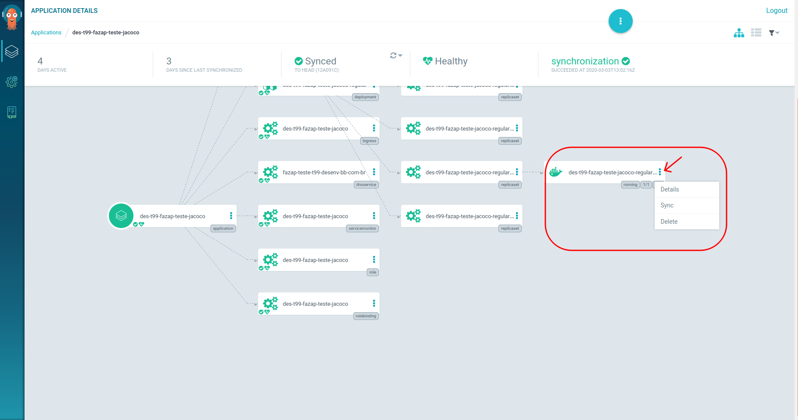
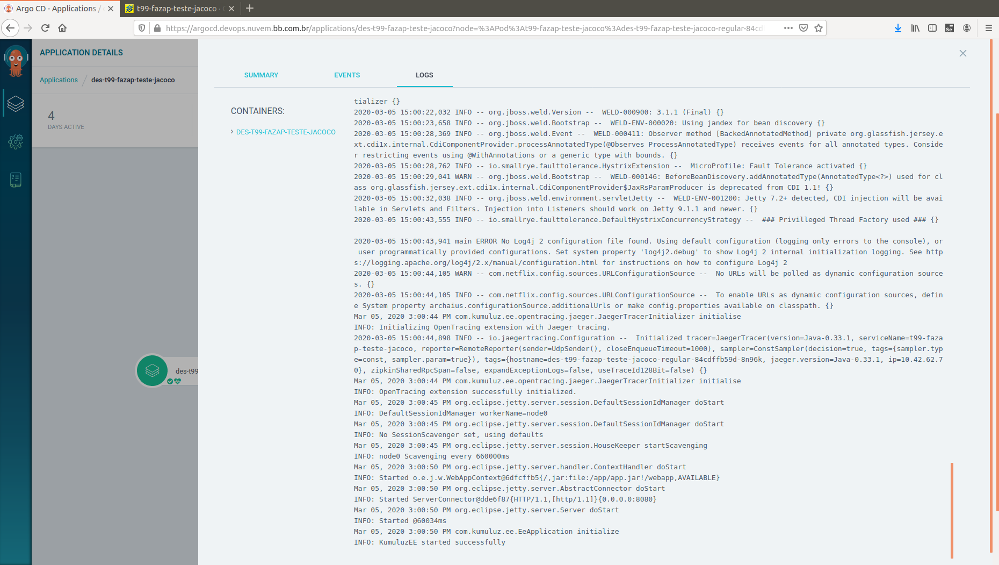

> :exclamation: Dê um feedback para esse documento no rodapé.[^1]

## Visualizando Logs  

A ferramenta primária para a consulta de logs pelo usuário é o Kibana. Ela armazena os logs dos diversos pods da aplicação por vários dias, permitindo a pesquisa inclusive de pods que encerraram sua execução.  

Para os pods que estão em execução, o usuário também pode conferi-los pelo ArgoCD e pelo Rancher/Kubectl.

## Consulta pelo Kibana

> A consulta de logs pelo Kibana foi descontinuada. 

<!--Há um Kibana disponível para cada ambiente. Abaixo segue os links: -->

<!--Desenvolvimento: (https://log.nuvem.desenv.bb.com.br)-->

<!--Homologação: (https://log.nuvem.hm.bb.com.br)-->

<!--Produção: (https://log.svc.nuvem.bb.com.br)-->

<!--Após acessar o painel do seu ambiente, escolha a opção Discover no menu lateral. -->

<!---->

<!--Serão os ultimos logs de todos os aplicativos do Banco. -->

<!---->

<!--Para filtrar apenas as aplicações que você deseja visualizar, escolha a opção `Add filter` na parte superior. Um bom filtro pode ser pelo campo `kubernetes.namespace_name`, onde você poderá colocar o nome do seu namespace, conforme exemplo abaixo: -->

<!---->

## Consulta pelo ArgoCD 

Acesse a sua aplicação no [ArgoCD](https://argocd.devops.nuvem.bb.com.br) e localize o pod do qual você quer o log. Clique no botão com três pontos e escolha Details, conforme abaixo:



Na janela que abrirá, escolha a opção Logs no menu superior. Caso o pod contenha vários containers executando (exemplo: o Curió executando como sidecar), no painel direito você consegue selecionar de qual container você quer visualizar os logs.



Campos interessantes para fazer a pesquisa:

* kubernetes.namespace_name
* kubernetes.pod_name

Na barra de pesquisa ainda é possível selecionar o intervalo de tempo desejado na pesquisa. 

> Conforme [Issue #611](https://fontes.intranet.bb.com.br/dev/publico/atendimento/issues/611) atualmente está ocorrendo à perda de alguns logs no Kibana. A equipe do PSC está estudando uma solução. 

## Consulta pelo Rancher e pelo Kubectl 

Você pode conferir o log da sua aplicação diretamente do Kubernetes utilizando o [Rancher](https://caas.nuvem.bb.com.br/) ou o Kubectl. As instruções abaixo são para consulta via kubectl. 

### Como configurar para uso local

1. Faça o login no Rancher.
2. Clique no cluster que quer configurar, aparecerão duas opções: 
* O **Launch kubectl** abre um prompt para executar o kubectl diretamente do Rancher;
* O **Kubeconfig File** exibe a configuração a ser realizada no seu arquivo *$HOME/.kube/config* para execução do kubectl localmente.

### Comandos kubectl

Consultar o log de um container: 

```
kubectl -n <nome-namespace> logs <nome-pod> <nome-container>
```
Para descobrir nome do pod: 

```
kubectl -n <nome-namespace> get pods 
```
Describe no namespace para verificar recursos disponíveis e aprovisionados:
```
kubectl describe namespace <namespace>
```
Listagem de pods do namespace:
```
kubectl get pods -o wide -n <namespace>
```
Eventos do namespace:
```
kubectl get events --sort-by='.lastTimestamp' -n <namespace>
```
Scale na aplicação:
```
kubectl scale --replicas=10 deployment des-dev-hellojs-regular
```
Verificar o log de um container (use -f para não ganhar o prompt):
```
kubectl logs -f <container>
```
Acessar via prompt um container:
```
kubectl exec -it <container> /bin/sh
```
Executar port forward em um container:
```
kubectl port-forward <container> <porta local>:<porta remota>
```
> :bulb: **Dica** 
> 
> Veja mais comandos úteis em: [Cheatsheet oficial](https://kubernetes.io/docs/reference/kubectl/cheatsheet/)

---
[^1]: [👍👎](http://feedback.dev.intranet.bb.com.br/?origem=roteiros&url_origem=fontes.intranet.bb.com.br/dev/publico/roteiros/-/blob/master/monitoracao/VisualizandoLogs.md&internalidade=monitoracao/VisualizandoLogs)


