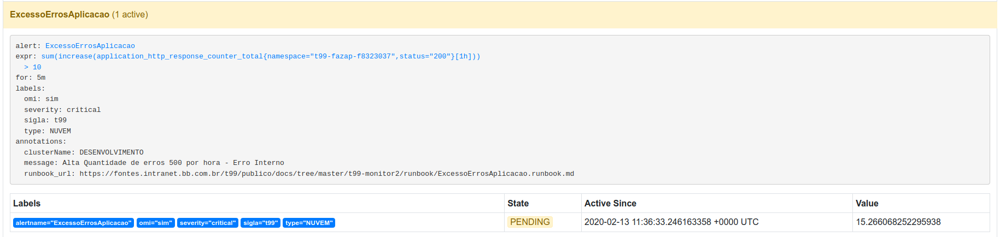
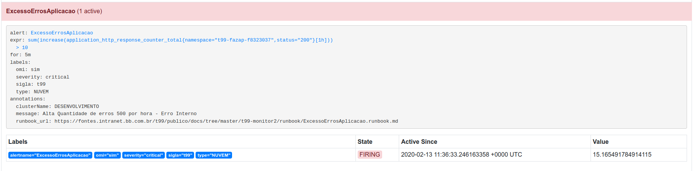
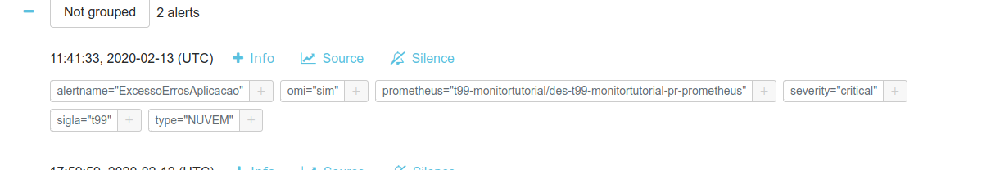
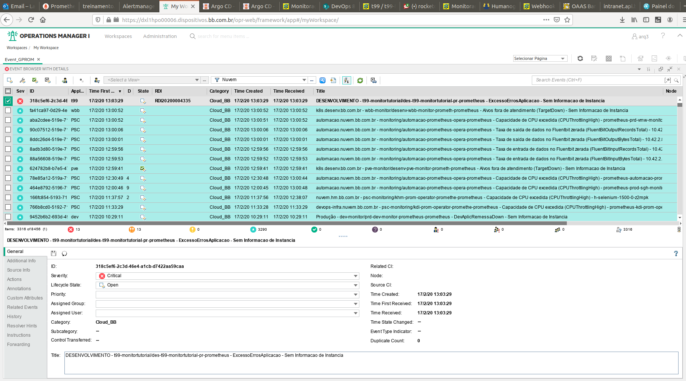
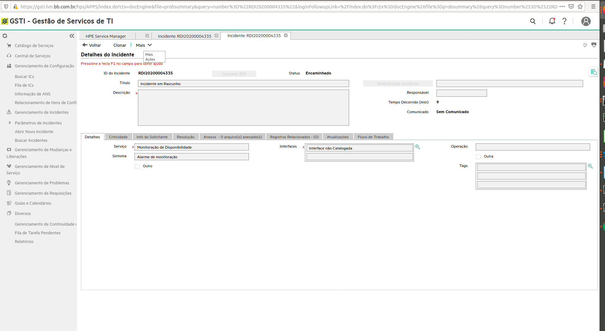

> :exclamation: Dê um feedback para esse documento no rodapé.[^1]

# Criando Alertas


Este tutorial explica como criar alertas em um projeto Arq3. Para segui-lo, seu projeto deverá ter um namespace de monitoração, por exemplo `[`sigla`]`-monitor, com as imagens do Prometheus, Alertmanager e Grafana.

Leia a [documentação do chart Prometheus](https://charts.nuvem.bb.com.br/charts/bb-cloud/prometheus) e a [documentação do chart Alertmanager](https://charts.nuvem.bb.com.br/charts/bb-cloud/alertmanager) para mais detalhes de configurações.

Este tutorial foi feito considerando as seguintes versões dos charts:

| Chart | Versão |
| ------ | ------ |
| Prometheus | 8.1.x |
| Alertmanager | 0.1.x |
| Grafana | 6.0.x |
| Dns-service | 0.1.1 |

**Catálogo de Charts:** https://charts.nuvem.bb.com.br/

Caso deseje baixar um template do values baseado neste tutorial, você pode encontrá-lo [neste link](<https://fontes.intranet.bb.com.br/dev/publico/roteiros/blob/master/monitoracao/values-monitoracao.yaml>).

## Passo 1: Preparando sua aplicação

<!-- Para este tutorial desenvolvemos uma aplicação chamada t99-f6102738-teste, na sigla t99. Ela é uma aplicação Java Kumuluzee gerada como o BBDev. Quanto ao namespace de monitoração, o ideal é que ele se chame ```<sigla>-monitor```. Para este tutorial, criamos um t99-monitortutorial como exemplo, para deixar disponível. -->

No values de deploy da sua aplicação deverão ser passadas labels que deverão ser **exatamente iguais** as informadas na sessão "serviceMonitorSelector" do Prometheus (instruções no Passo 2), pois é este campo que define quais labels ele irá procurar para monitorar.

Também é necessário informar no values de seu deploy em qual namespace está o Prometheus (via parâmetro "monitorNamespace"). Caso siga o padrão, este namespace será `[`sigla`]`-monitor.

O exemplo abaixo mostra a configuração quando utiliza-se o chart [BB-APLIC](https://charts.nuvem.bb.com.br/charts/bb-cloud/bb-aplic)

```yaml
      serviceMonitor:
        enable: true
        monitorNamespace: t99-monitortutorial
        labels:
          sigla: t99
          projeto: monitortutorial
        endpoints: []
        # - port: http
        #   interval: 10s
        #   path: /metrics
```

Estas configurações são obrigatórias para que o Prometheus identifique e monitore corretamente as aplicações desejadas.

<!-- Criamos na nossa aplicação um endpoint get ```v1/erroprogramado```, que sempre retorna status code 500. -->

## Passo 2: Configurando seu Prometheus

Para que seu Prometheus identifique e monitore sua aplicação, além das configurações na aplicação informadas no Passo 1, é necessário configurar o Service Monitor no values do chart. Para detalhes, verifique a seção "Service Monitor: identificando as aplicações via label" na [documentação do chart Prometheus](https://charts.nuvem.bb.com.br/charts/bb-cloud/prometheus).

### Habilitar Alertas Padrões

A oferta do Prometheus em nosso catálogo possui regras básicas de monitoração para o próprio Prometheus, já definidas e incluídas no chart. Para ativá-las, deve-se configurar o parâmetro "defaultRules" para "true", conforme abaixo:

```yaml
  defaultRules:
    prometheus: true
    ## As rulesAnnotations e rulesLabels são incluidas como identificação nos alarmes que serão gerados
    rulesAnnotations: {}
     # clusterName: "desenv.bb.com.br" #Identificação do cluster
    rulesLabels: {}
     # sigla: xyz
     # omi: sim
     # type: nuvem
```

Os campos "rulesAnnotations" e "rulesLabels" são utilizados para marcar as regras padrão habilitadas com informações específicas de qual Prometheus elas estão associadas. As regras, se gerarem alarmes, serão repassadas para o Alertmanager e estas informações facilitam a identificação do alarme nas ferramentas. Para preenchimento das labels, veja a [tabela de labels do Passo 2](https://fontes.intranet.bb.com.br/dev/publico/roteiros/-/blob/master/monitoracao/CriandoAlertas.md#regras-adicionais-espec%C3%ADficas-das-m%C3%A9tricas-de-aplica%C3%A7%C3%A3o), mais abaixo nesse mesmo roteiro.

A figura abaixo ilustra estes alertas via URL do seu Prometheus (menu "Alerts"). Como pode ser visto, todos eles estão relacionados ao desempenho do próprio Prometheus.


### Regras Adicionais Específicas das Métricas de Aplicação

As regras para a geração dos alertas baseadas em métricas exportadas pela aplicação (/metrics) podem ser configuradas via values na seção `additionalPrometheusRules`.

Recomenda-se que a aplicação tenha um alerta que identifique quando a quantidade de erros estiver muito alta. O exemplo a seguir lança um alerta quando a quantidade de erros 500 ultrapassa a quantidade de 10 ocorrências na última hora. Para tal, utilizamos a métrica ```application_http_response_counter_total```, disponível para projetos gerados pelo BBDev.

```yaml
  additionalPrometheusRules:
    - name: aplicacaot99
      groups:
        - name: t99-alerta-erro #Nome do agrupamento de regras
          rules:
          - alert: ExcessoErrosAplicacao
            expr: sum(increase(application_http_response_counter_total{namespace="t99-f6102738-teste", status="500"}[1h])) > 10
            for: 5m
            labels:
              severity: critical
              omi: sim
              sigla: t99
              type: NUVEM
            annotations:
              message: 'Alta Quantidade de erros 500 por hora - Erro Interno'
              runbook_url: 'https://fontes.intranet.bb.com.br/t99/publico/docs/tree/master/t99-monitor2/runbook/ExcessoErrosAplicacao.runbook.md'
              clusterName: 'DESENVOLVIMENTO'
```
O grupo (`groups`) categoriza alertas de natureza similar em uma simples notificação. Isto é especialmente útil durante grandes quedas em múltiplos sistemas falhando ao mesmo tempo, o que poderia ocasionar centenas de milhares de alertas disparando simultaneamente.

O campo `expr` contém a expressão que será avaliada para disparar o alerta. Geralmente se baseia em métricas exportadas pela aplicação (em seu /metrics). Quando a expressão do alerta retornar um ou mais elementos em um dado tempo, o alerta ficará ativo. Você pode testar as expressões no próprio Prometheus. Para entender o formato de queries, sugerimos ler a [documentação oficial](https://prometheus.io/docs/prometheus/latest/querying/basics).

O alerta é disparado (ou seja, enviado para o Alertmanager) se a condição da `expr` permanacer atendida durante o tempo definido no campo `for`. No exemplo acima, o alerta só será disparado após a condição  estar satisfeita por 5 minutos. Durante estes 5 minutos, o alerta fica em status "Pendente" no Prometheus, conforme ilustrado abaixo.



Após os 5 minutos ele passa para status "Ativo" e é enviado para o Alertmanager, conforme ilustrado abaixo.



O campos `labels` e `annotations` são utilizados para marcar as regras de monitoração com informações que serão repassadas para o Alertmanager. Elas facilitam a identificação do alarme, **e nas configurações que utilizamos elas são particularmente importantes pois também são utilizadas como critérios no Alertmanager para encaminhamento para as consoles de monitoração**, como o HP OMI (ferramenta da GPROM) e MSTeams

<!-- The labels clause allows specifying a set of additional labels to be attached to the alert. Any existing conflicting labels will be overwritten. The label values can be templated.

The annotations clause specifies a set of informational labels that can be used to store longer additional information such as alert descriptions or runbook links. The annotation values can be templated. -->

**`Labels`**

| Label | Descrição | Valores possíveis | Obrigatoriedade |
| ------ | ------ | ------ | ------ |
| sigla | Sigla da aplicação que está gerando alarme | Sua sigla com três caracteres. Exemplo: `t99`, `sgs` | SIM |
| severity | Nível de severidade do problema. É aberto RDI apenas quando o severiry for `CRITICAL`. | CRITICAL, MAJOR ou WARNING | SIM |
| type | Tipo de incidente. Refere-se a alarmes da nuvem, negocio, banco de dados ou sistema operacional | NUVEM, NEGOCIO, BD ou SO | SIM |
| omi | Se preenchida com valor "sim", irá gerar alarme na ferramenta HP OMI da GPROM. Para isto, as configurações de receiver omi deverão ser realizadas no values do chart do Alertmanager | sim | NAO |
| msteams | Se preenchida com valor "sim", irá gerar alarme na ferramenta MSTeams. Para isto, as configurações de receiver msteams deverão ser realizadas no values do chart do Alertmanager | sim | NAO |

**`Annotations`**

| Annotation | Descrição | Valores possíveis | Obrigatoriedade |
| ------ | ------ | ------ | ------ |
| message | Titulo do alerta. Aparecerá também como título do RDI | Texto livre | NAO |
| clusterName | Nome do cluster ou ambiente gerador do alarme | desenvolvimento, homologacao ou producao | SIM |
| runbook_url | Página contendo instruções para solução ou encaminhamento do alerta, confome o [template](https://fontes.intranet.bb.com.br/sgs/publico/roteiros/-/blob/master/procedimentos/template-alerta.md) | URL válida, como https://fontes.intranet.bb.com.br/<SIGLA>/publico/docs/procedimento-do-alerta.md onde "docs" é um projeto com permissão interno dentro do sub grupo "publico" de sua <SILGA> | SIM |

Após o Prometheus lançar o alerta (quando a regra for atendida), se o Alertmanager estiver configurado (Passo 3) ele fará o gerenciamento deste, enviando para os canais definidos em seu chart. Você pode conferir o alerta pelo DNS (ingress) do Alertmanager configurado em seu deploy. A figura abaixo mostra o alerta definido.



### Regras Adicionais Específicas das Métricas de Infraestrutura

A criação das regras (prometheusRules) do passo anterior leva em consideração métricas exportadas pela própria aplicação, em que seu Prometheus já possui acesso. Para acesso a métricas relacionadas a infraestrutura, foi criada um chart específico que já é pré configurado para disponbilizá-las.

As regras para a geração dos alertas baseadas em métricas de infraestrutura podem ser configuradas via chart do [Infra Ruler](https://charts.nuvem.bb.com.br/charts/bb-cloud/infra-ruler). Estas configurações são análogas ao explicado na seção anterior.

## Passo 3: Configurando seu Alertmanager

Quanto as ações tomadas pelo Alertmanager, no nosso exemplo enviaremos uma mensagem no MS Teams e abriremos um RDI.

Ative o Alertmanager e defina suas labels para que o Prometheus também o monitore. Elas devem ser as mesmas especificadas no matchLabels do chart do Prometheus, conforme explicado anteriormente.

```yaml
alertmanager:
  enabled: true

  commonLabels:
    sigla: t99
    projeto: monitortutorial
```
No values do Alertmanager, a seção `config` é a que está relacionada a configuração de gerencimento de alertas. É nela que definimos os intervalos e para onde deverão ser enviados cada tipo de alerta.

Quanto a definição das rotas (`route`), caso tenhamos um alerta que não case com nenhum dos nossos matches, ele será tratado no nível raiz. Neste caso, será encaminhado para o receiver nulo (`null`). O casamento é feito no atributo `match`, onde deveremos definir qual label a regra deve ter para ser enviada como alarme para um receiver específico.

O `route` é uma árvore de avaliação, onde podemos definir vários filhos para cada elemento route. Se `continue` estiver setado como "false", a avaliação terminará assim que o primeiro match ocorrer. Caso `continue` esteja setado como "true", o alerta irá continuar sendo batido com os elementos do mesmo nível da árvore.

<!-- Quanto as configurações de tempo temos:

```group_wait```: How long to initially wait to send a notification for a group of alerts. Allows to wait for an inhibiting alert to arrive or collect more initial alerts for the same group. (Usually ~0s to few minutes.)

```group_interval```: How long to wait before sending a notification about new alerts that are added to a group of alerts for which an initial notification has already been sent. (Usually ~5m or more.)

```repeat_interval```: How long to wait before sending a notification again if it has already been sent successfully for an alert -->

```yaml
  config:
    global:
      resolve_timeout: 5m
    route:
      group_by: ['job']
      group_wait: 30s
      group_interval: 5m
      repeat_interval: 2h
      receiver: 'null' #Receiver padrão
```

- ROUTES: esta configuração dentro de `route` serve para informar qual alarme deverá ser encaminhado para qual receiver. Ou seja, as regras que possuirem a label informada no "match" serão encaminhadas para o "receiver" indicado.

```yaml
      routes:
      - receiver: 'null'
        match:
          alertname: Watchdog
        continue: true
      - receiver: omi
        match:
          omi: "sim"
        continue: true
      - receiver: msteams
        match:
          msteams: "sim"
        continue: true
```

Passamos `null` como o receiver padrão e abaixo definimos os demais receivers possíveis. Colocamos para enviar para o receiver nulo o alerta do Watchdog. Este alerta fica ligado durante todo o tempo indicando apenas que o sistema de alertas está funcionando.

Mandamos para o OMI os alertas que tiverem na definição da regra (prometheusRules) a label `omi: "sim"` e para o msteams os que casarem com `msteams: "sim"`. É importante frisar que a manipulação dos alertas pelo Alertmanager está diretamente atrelada ao que é informado nas definições de labels e annotations das regras (prometheusRules) configuradas no Prometheus e/ou Infra Ruler.

Os parâmetros `continue: true` de cada bloco garantem que mesmo após enviar o alerta para o primeiro receiver da lista (neste caso, o omi) ele prosseguirá e enviará também para os seguintes (msteams).

- RECEIVERS: esta configuração serve para informar a integração de cada receiver. Ou seja, o nome dos receivers da seção "routes" deve ter equivalência na seção "receivers", pois é nela que será informada a(s) integração(ões) para a(s) qual(is) o alarme será enviado

```yaml
    receivers:
    - name: 'null'
    #Habilitar OMI/monitoracao GPROM como receiver
    - name: 'omi'
      webhook_configs:
        - url: http://webhook-snmp.psc-proxy.svc.cluster.local #Nao alterar esta URL
    - name: 'msteams'
      webhook_configs:
    ## Essa é a URL local do receiver. a URI "msteams" deve ser substituída
    ## pelo valor que for declarado no deploy do receiver, em "connectors"
        - url: http://alertmanager-receiver-msteams/msteams
```


Para enviar alarmes para o HP OMI, basta incluir corretamente as labels na criação da regras (prometheusRules) e deixar a URL padrão http://webhook-snmp.psc-proxy.svc.cluster.local .

Para enviar alertas para o MSTeams é necessário, além de manter a URL informada no values do alertmanager, subir a integração e criar o canal na ferramenta. Veja a [documentação do chart alertmanager-receiver-msteams](https://charts.nuvem.bb.com.br/charts/bb-cloud/alertmanager-receiver-msteams).

É possível configurar quantos receivers desejar.


## Abertura de RDI

Se o alarme for marcado como as **labels omi: "sim" e severity: "critical"** o HP OMI abrirá um incidente automático para a equipe "GSTI - DITEC/UOS/GPROM - 1° NIVEL - PLATAF.DISTRIB / HIGH-END". Por isso a necessidade do campo "runbook_url" com o procedimento para resolução.

Você precisará definir um RunBook contendo as instruções a serem seguidas pela equipe do GPROM. Não se esqueça de colocar em uma pasta publica da sua sigla (no fontes) para que o analista de suporte tenha acesso. Recomendamos que seja criado uma página de runbook diferente para cada alerta lançado, facilitando o tratamento pela equipe de suporte. 

Exemplo de RunBook: https://fontes.intranet.bb.com.br/dev/publico/padroes/blob/master/ExemploRunBook.md.

**ATENÇAO: A integração da Stack de Monitoração (Prometheus / Alertmanager) nos ambientes de Desenvolvimento e Homologação  com o OMI/GSTI está em manutenção conforme [issue HPO](https://fontes.intranet.bb.com.br/hpo/publico/atendimento/-/issues/190).**
### Desenvolvimento

Utilizando o OMI de desenvolvimento, o RDI está sendo aberto em homologação. O OMI de desenvolvimento pode ser consultado no endereço http://go.b/omi-desenv.

Foi implementado LDAP no HP OMI (http://go.b/omi-desenv. Para visualização dos eventos na console é necessário ir na Plataforma > Negócios > Segurança > Acesso Fácil > Painel e pedir acesso ao papel HPO04 - (Consulta). Se não houver regra criada para sua UOR, enviar e-mail para ditec.gesit.monit@bb.com.br com o Assunto "ARQ3 - Regra de acesso - UOR XXXXXX"

<!---Para logar, utilize usuário arq3, senha 12345678. A tela abaixo mostra o evento relativo ao incidente recebido pelo RDI. Observe que nesta tela já contém o número do RDI aberto.--->



### Homologação

O GSTI de homologação pode ser acessado pelo endereço https://hps.hm.bb.com.br/ (usuário e senha SISBB). O OMI de homologação pode ser consultado no endereço https://omi.hm.bb.com.br/. A figura abaixo mostra o RDI Aberto.


> ATENCAO: Temporariamente, os alertas criados em Homologação serão enviado para o OMI de DESENVOLVIMENTO http://go.b/omi-desenv. Os RDIs poderão ser consultado no GSTI de HOMOLOGACAO




### Produção

O OMI de produção pode ser consultado no endereço http://go.b/omi

Foi implementado LDAP no HP OMI. Para visualização dos eventos na console é necessário ir na Plataforma > Negócios > Segurança > Acesso Fácil > Painel e pedir acesso ao papel HPO04 - (Consulta). Se não houver regra criada para sua UOR, enviar e-mail para ditec.gesit.monit@bb.com.br com o Assunto "ARQ3 - Regra de acesso - UOR XXXXXX"


# Leituras recomendadas

Boas práticas para alertas: https://prometheus.io/docs/practices/alerting/
---
[^1]: [👍👎](http://feedback.dev.intranet.bb.com.br/?origem=roteiros&url_origem=fontes.intranet.bb.com.br/dev/publico/roteiros/-/blob/master/monitoracao/CriandoAlertas.md&internalidade=monitoracao/CriandoAlertas)
