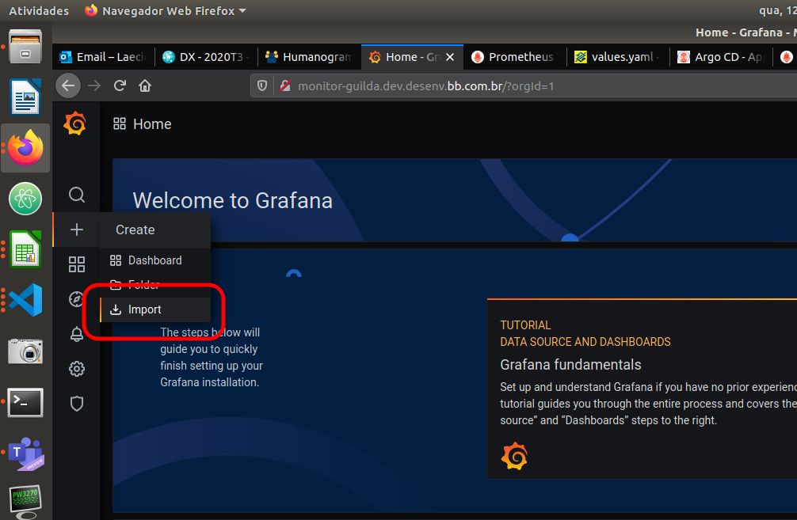
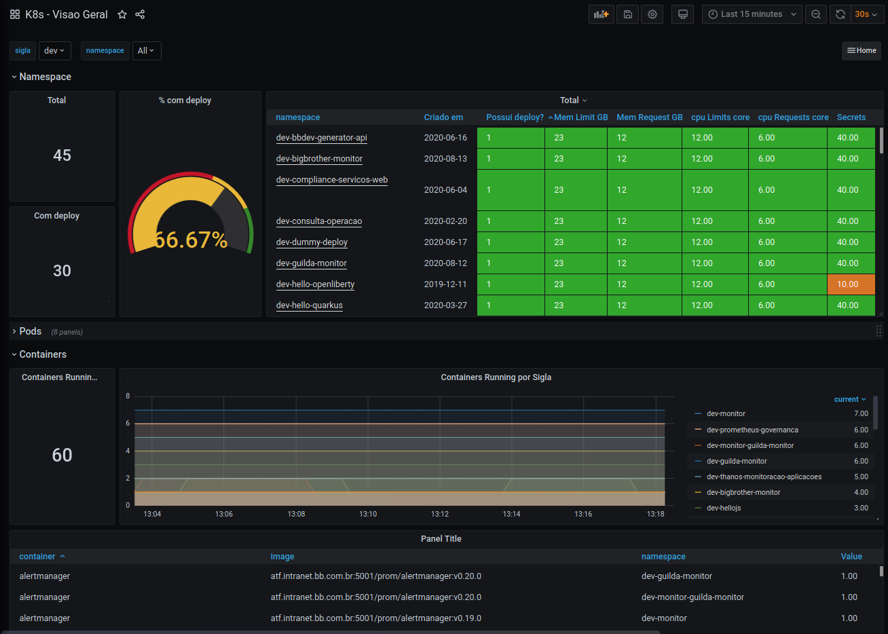
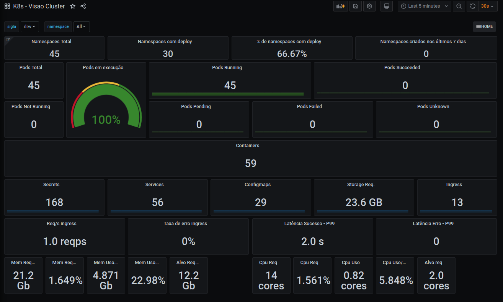
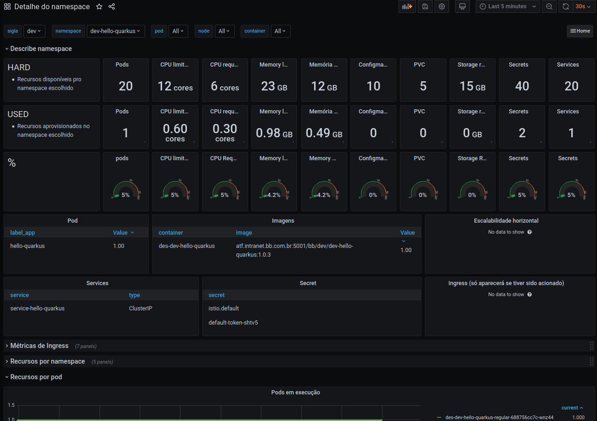
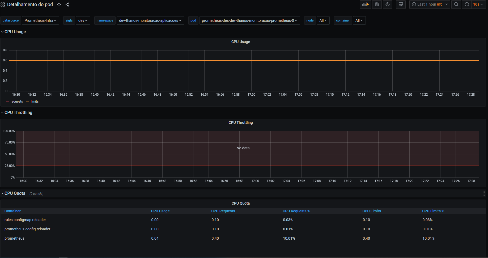
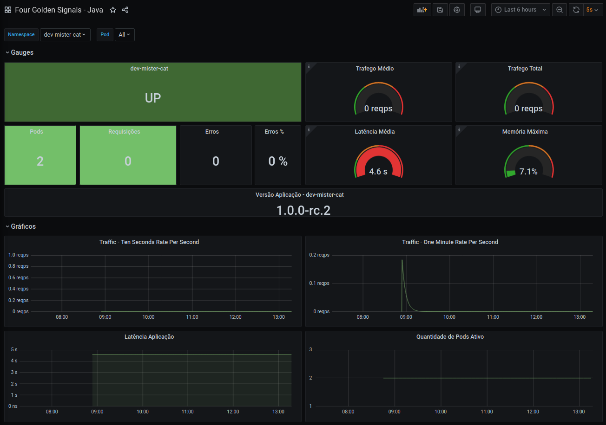

> :exclamation: Dê um feedback para esse documento no rodapé.[^1]

# Paineis de monitoração básicos Arq3

Este roteiro contém alguns paineis de monitoração básicos que podem ser adicionados ao namespaces de monitoração da sua sigla. 

Para importar um dos paineis, selecione a opção `Import` a patir do botão `+`, conforme abaixo, e em seguida cole o JSON no campo `Import via panel json`

Segue os paineis: 

## K8s 

* [K8s - Visão Geral](./k8s-visao-geral.json) 

* [K8s - Visão Cluster](./k8s-visao-cluster.json)

* [K8s - Detalhes namespaces](./detalhe-namespace.json)

* [K8s - Detalhes pod](./k8s-resources-pod.json)

## Aplicação 

* [Curió](./curio.json)

* [Four Golden Signals - Java](./four-golden-signals-java.json)

* [Four Golden Signals - Typescript](./four-golden-signals-typescript.json)

---
[^1]: [👍👎](http://feedback.dev.intranet.bb.com.br/?origem=roteiros&url_origem=fontes.intranet.bb.com.br/dev/publico/roteiros/-/blob/master/monitoracao/PaineisBasicos.md&internalidade=monitoracao/PaineisBasicos)
