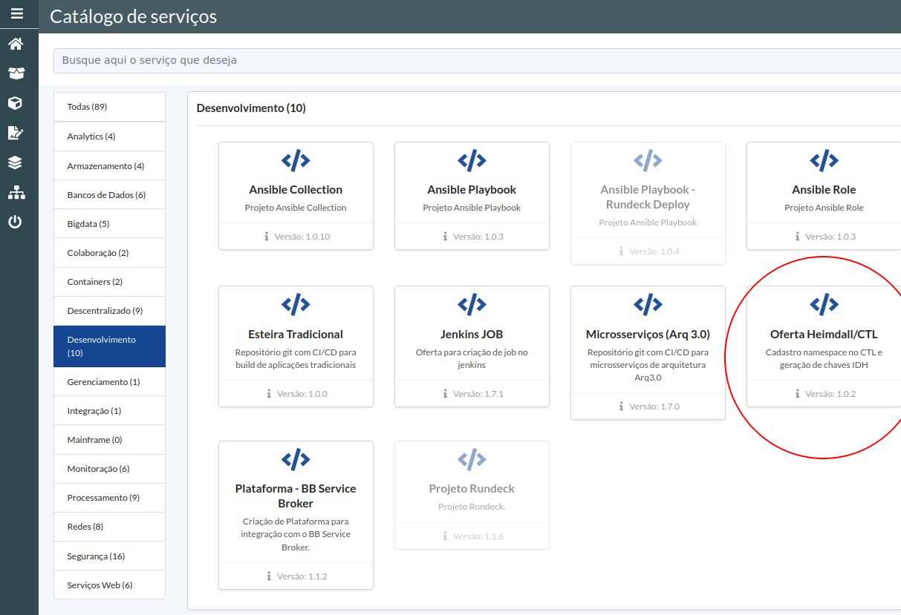
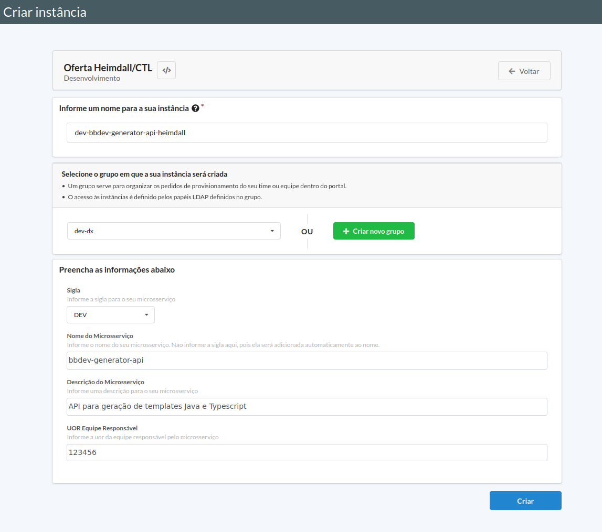
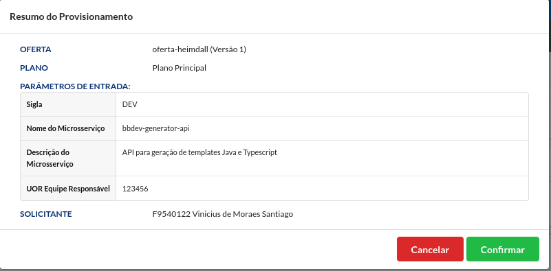
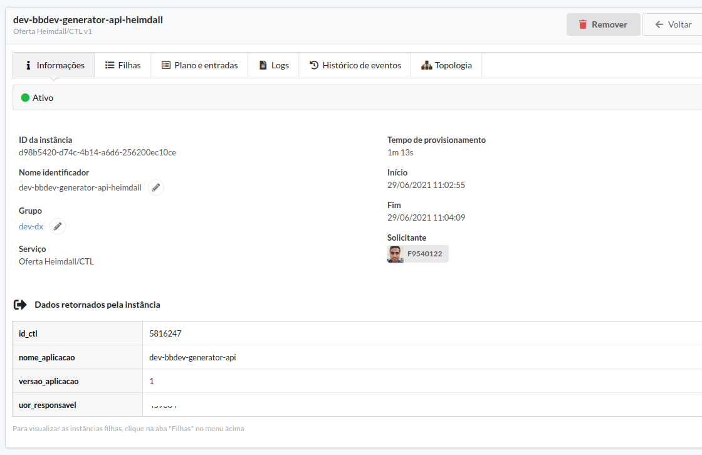
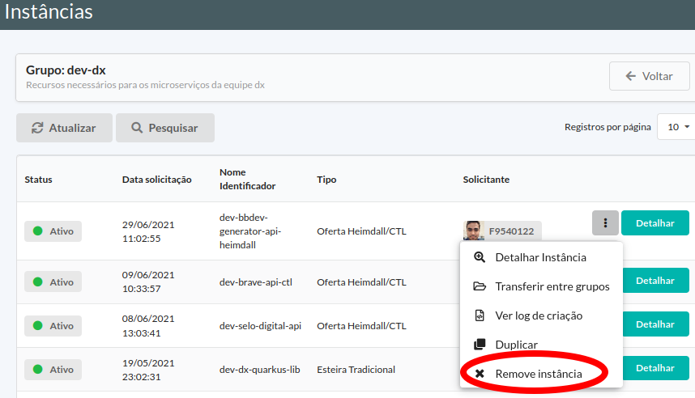
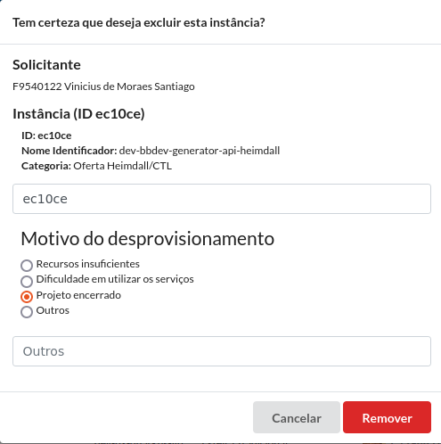

> :exclamation: Dê um feedback para esse documento no rodapé.[^1]

# Registro de namespace no Catálogo de Aplicações

## Introdução

Este roteiro descreve como registrar um namespace/microsserviço no Catálogo de Aplicações. Após acionamento desta oferta, será possível gerar as chaves IDH via SISBB. Esta oferta visa simplificar o processo de cadastro de aplicações no CTL/IDH, e visa atender serviços legados da Cloud BB - Em breve os novos serão cadastrados automaticamente pela oferta principal de `Microsserviços (Arq 3.0)` .

:x: :warning:  **Esta oferta não deve ser utilizada para projetos na sigla T99 e/ou outros projetos de treinamento! . Também está restrita à aplicações que estão atualmente na Cloud BB.**

## Registro Catálogo de Aplicações

Siga os passos a seguir:

* Acesse o [portal de ofertas da nuvem](https://portal.nuvem.bb.com.br/). Caso não consiga acessar a página por conta de certificado, instale os certificados do banco disponíveis em https://wiki.nuvem.bb.com.br/portal-oaas/instalando-certificado-bb.
* O portal de ofertas da nuvem usa grupos para organizar os pedidos de provisionamento do seu time/equipe dentro do portal. Você precisará de um grupo para criar o seu microserviço. Através do menu `Instâncias` é possível listar os grupos aos quais você tem acesso. Verifique se o seu microserviço se encaixa em um dos grupos listados. Caso seja necessário criar um grupo, clique em "Criar Novo Grupo" e preencha os campos.

* Para registrar o microserviço no CTL (Catálogo de Aplicações), no menu lateral esquerdo escolha a opção `Catálogo de Serviços` e a seguir a opção `Desenvolvimento`. Das opções disponibilizadas, escolha `Oferta Heimdall/CTL`, conforme abaixo:

   

* Preencha o formulário conforme instruções e exemplo abaixo:

  * **Nome para a instância**: nome da instância no portal nuvem.
  * **Grupo**: escolha o grupo onde ficará esta instância no portal nuvem
  * **Sigla**: sigla do microserviço
  * **Nome do Microserviço**:  nome do microserviço, **sem sigla** :bangbang:.
  * **Descrição do Microserviço**: texto livre descrevendo o microserviço.
  * **Uor Equipe Responsável**: Informe uma UOR que será responsável pelo microsserviço. :warning: **Importante!** Esta informação poderá ser utilizada em processos da ditec(Exemplo: Equipe Responsável para resolução de RDI). Portanto, preencha-a com atenção.
Acredito que não
   

* Confira os dados na tela seguinte e confime a solicitação.

   

  * Aguarde o processamento (aproximadamente 2 minutos). Após concluído será apresentada a tela à seguir, confirmando que o namespace/microsserviço foi cadastrado no Catálogo de Aplicações, retornando o ID relacionado.

   
   

* Agora você pode consultar seu namespace/microsserviço no Catálogo de Aplicações em `Plataforma BB -> Tecnologia -> Construção -> Catálogo -> Aplicações` . Devido à automação, a aplicação já virá com status `Estado 500 - Disponível no Ambiente de Produção`, no entanto alguns campos poderão ser editados a qualquer momento - além do vínculo/desvinculo de operações.

* Próximos passos (manuais):
  - Vincular Provimento/Consumo de Operações no CTL. 
  - Gerar chaves IDH nos respectivos ambientes. Roteiro: https://fontes.intranet.bb.com.br/idh/publico/roteiros/-/wikis/Criando-uma-credencial-para-a-aplica%C3%A7%C3%A3o#criando-credencial-da-aplica%C3%A7%C3%A3o-no-idh
  - Vincular chave IDH na variável de ambiente do Curió. Roteiro: https://fontes.intranet.bb.com.br/idh/publico/roteiros/-/wikis/Configura%C3%A7%C3%A3o-da-credencial-de-aplica%C3%A7%C3%A3o#aplica%C3%A7%C3%A3o-arq-30

* Dúvidas? Abra uma issue em https://fontes.intranet.bb.com.br/dev/publico/atendimento .

## Desprovisionando o projeto

:warning: :warning: ** O desprovisionamento de uma aplicação no Catálogo de Aplicações pode afetar Consumo/Provimento de operações IIB. Tenha certeza que o microsserviço que está desprovisionando está de fato em desuso. **

Caso o registro tenha sido feito errado, ou caso tenha sido descontinuado, é possível solicitar o desprovisionamento do namespace/microsserviço no CTL. Esta remoção: 

* Altera o status no Catálogo de Aplicações para `arquivado`.
* Arquiva o microsserviço no IDH, consequentemente revogando chaves IDH que foram geradas.

Para fazer o desprovisionamento, siga os passos abaixo:

* Acesse o [portal de ofertas da nuvem](https://portal.nuvem.bb.com.br/).
* No menu lateral esquerdo, escolha a opção "Instâncias". Serão listados os grupos nos quais você tem acesso. Entre no grupo onde se encontra o microsserviço à ser desprovisionado (clicando no nome do grupo).
* No seu projeto (que deve estar como ativo), clique no botão "Opções" e em "Remove Instâncias", conforme figura abaixo:

* Será apresentada a tela de confirmação abaixo. Prencha o id da sua instância e o motivo da exclusão conforme abaixo e clique em remover.

* O processo de exclusão se iniciará. Ao final exibirá uma tela com os dados da remoção.
---
[^1]: [👍👎](http://feedback.dev.intranet.bb.com.br/?origem=roteiros&url_origem=fontes.intranet.bb.com.br/dev/publico/roteiros/-/blob/master/ofertas/CadastroCTL_IDH.md&internalidade=ofertas/CadastroCTL_IDH)
