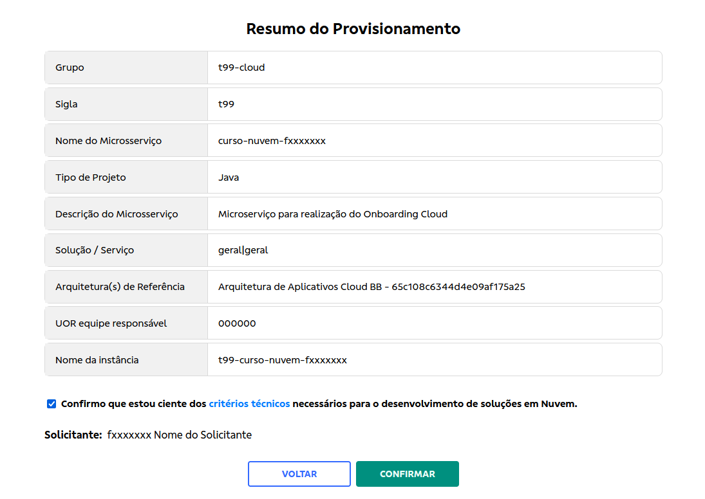

> :speech_balloon: Deixe o seu feedback sobre este roteiro no rodapé.[^1]

# Como gerenciar microsserviços *cloud*

Este roteiro ensina como gerenciar microsserviços *cloud*. A solicitação de provisionamento será realizada por meio do Brave e o desprovisionamento pelo Portal OaaS.

Microsserviços são componentes isolados que realizam tarefas específicas e comunicam-se com outros microsserviços via APIs. Em ambientes *cloud*, os microsserviços servem para que os grupos trabalhem de forma independente.

## Requisitos

* Acesso **ALMFD** na sigla onde será criado o projeto.
* Sigla com o status **Em Produção** no DPR (Sisbb -> DPR 02.71).
* Verificar  os critérios técnicos na página [Devo ir para a nuvem](https://cloud.dev.intranet.bb.com.br/devo-ir-para-nuvem).
* [Certificados instalados](https://fontes.intranet.bb.com.br/sgh/publico/atendimento/-/wikis/Portal-OaaS/01-Primeiros%20Passos#acesso-ao-portal-de-ofertas) para acesso ao Portal OaaS.
* Configuração de [Grupo de acesso](https://fontes.intranet.bb.com.br/sgh/publico/atendimento/-/wikis/Portal-OaaS/03-Inst%C3%A2ncias) dentro do Portal OaaS.

> :bulb: **Dica** 
> 
> Consulte o roteiro de [referência das entradas e saídas](./ofertas/referencias/tabela_input_output.md) relacionadas aos Microsserviços, caso tenha dúvidas sobre como preencher os campos.

## Solicitar provisionamento de microsserviço pelo Brave 

1. Acesse o [Brave](https://brave.dev.intranet.bb.com.br).
2. No menu lateral esquerdo, clique em **Novo Projeto**, identificado pelo ícone **+**.
3. Escolha entre as opções **Microsserviço + Código Base** ou **Microsserviço**. Caso tenha escolhido **Microsserviço + Código Base**, execute os passos adicionais:  
    3.1 Selecione a *stack* e a versão que deseja utilizar.  
    3.2 Clique em **Próximo**.
4. Preencha o formulário de acordo com os campos disponíveis:

    * **Sigla:** selecione a sigla em que o projeto será criado.
    * **Nome do Microsserviço:** escreva o nome do microsserviço, sem a sigla.
    > :warning: **Atenção** 
    > 
    > Projetos terminados com o sufixo **-piloto** serão tratados como pilotos pela esteira.
    * **Tipo de Projeto:** selecione a linguagem ou esteira que será utilizada no projeto.
    * **Descrição do Microsserviço:** campo de texto livre para descrição do microsserviço.
    * **Solução / Serviço:** selecione em que tipo de cluster sua aplicação deve ser hospedada. Se a sua aplicação não precisa rodar num dos clusters especializados disponíveis, selecione a opção **Geral/Geral**.
    * **[Arquitetura(s) de Referência:](https://arquitetura.intranet.bb.com.br/docs/category/arquiteturas-de-referencia/)**
        * **Arquitetura de Aplicativos Cloud BB** - opção utilizada no Onboarding Cloud;
        * **Arquitetura de Segurança para BB Cloud**;
        * **Segurança de aplicativos BB Cloud**. 
    * **Opções avançadas:** permite personalizar a **UOR da equipe responsável** e o **nome da instância**. Os valores são preenchidos automaticamente por *default*.

    > :grey_exclamation: **Importante** 
    > 
    > A informação da equipe poderá ser utilizada em processos da Ditec, por exemplo, para estabelecer a equipe responsável pela resolução de RDIs.

5.  Em **Opções adicionais**, configuração disponível SOMENTE para quem selecionou a opção **Microsserviço + Código Base**, é possível escolher gerar o código com **Banco de Dados** e/ou **Prover** e/ou **Consumir Operações com IIB/Curió**.

6. Clique em **Próximo**; a janela **Resumo do Provisionamento** abrirá. 

7. Após revisar todas as informações, marque a caixa de seleção localizada acima de **Solicitante**.

8. Clique em  **Confirmar**; será exibida a mensagem de ‘Solicitação de provimento criada com sucesso’.

Agora, **deve solicitar e aguardar a aprovação do Arquiteto Responsável** para concluir a criação do seu microsserviço. 

> :grey_exclamation: **Importante**  
> 
> O **Arquiteto Responsável** precisa do papel **DEVARQAP** vinculado ao seu perfil para autorizar a solicitação. Além de aprovar a criação, o arquiteto ficará vinculado como o responsável pelo microsserviço, portanto peça a aprovação para um arquiteto da equipe encarregada pelo microsserviço em questão.

## Verificar status da aplicação

Após a aprovação, aguarde cerca de 10 minutos e verifique se a aplicação foi provisionada com sucesso. 

1. Acesse [Minhas instâncias](https://portal.nuvem.bb.com.br/view-instances/all).

2. Habilite a opção **Visualizar apenas as minhas**.

3. Localize o seu microsserviço e clique em **Detalhar**.

4. Na aba **Informações**, verifique se o status da aplicação é **Ativo** e se todos os objetos necessários foram criados. 

5. Confira também as URLs para acessar cada um deles (repositórios no fontes, *job* no Jenkins, *namespace* no Kubernetes, etc).

> :bulb: **Dica** 
>
> Ao passar o mouse pelo ícone azul de informação, serão exibidas mais informações sobre o significado de cada um desses atributos.

Caso sua aplicação não apareça como **Ativo**, acesse a aba [Minhas solicitações](https://portal.nuvem.bb.com.br/requests/user) para verificar o status do seu pedido. Provavelmente sua solicitação estará **Aguardando aprovação**, o que significa que ela ainda não foi aprovada por um arquiteto.

## Desprovisionar o projeto

> :grey_exclamation: **Importante**  
> 
> O processo é feito pelo portal OaaS.

Faça essa solicitação se o projeto contiver erros ou se foi descontinuado. O processo de remoção inclui as seguintes etapas: 

* Remoção dos *namespaces* do Kubernetes nos três ambientes. 
* Remoção do *job* no Jenkins. 
* Remoção dos repositórios de *release*. 
* Arquivamento do *namespace* no Catálogo de Aplicações (aplica-se a ofertas criadas após 06-07-2021). 
* Se o projeto estiver associado à sigla T99, remoção do repositório de código. 
* Se o projeto estiver associado a outra sigla, ele será apenas arquivado, permitindo a consulta do código. Se necessário, é possível solicitar o desarquivamento.

1. Acesse o [Portal OAAS](https://portal.nuvem.bb.com.br/).

2. No menu lateral esquerdo, vá para **Instâncias**, identificado pelo ícone do cubo.

3. No lado direito da tela, clique em **Minhas instâncias**. Serão listadas todas as instâncias que você tem acesso.

4. Localize o microsserviço (status Ativo) que deseja desprovisionar. 

5. Clique em **Opções**.

6. Clique em **Remove Instância**. 

7. Na tela de confirmação de confirmação da exclusão da instância, escreva o **ID** da sua instância e selecione o **Motivo do desprovisionamento**. 

8. Clique em **Remover**; o processo de exclusão será iniciado.

Ao final do processo, o status do microsserviço será atualizado para **Removido**. 

**Tags:** #microsserviço # criar #desprovisionar #portaloaas

## A seguir

* Acesse [este link](https://web.microsoftstream.com/video/b7c41998-7e54-494c-a468-688b2cc37fde) caso queira aprender sobre esse assunto em vídeo. É preciso solicitar acesso ao Office 365.
* Leia o roteiro [Criação e desprovisionamento de microsserviços por API](/ofertas/arquivados/ofertas_CriandoMicroservico.md#cria%C3%A7%C3%A3o-e-desprovisionamento-de-microsservi%C3%A7os-por-api) para configurar um microsserviço via API.

## Precisa de ajuda?
Em caso de problemas na execução de qualquer roteiro, abra uma [nova issue](https://fontes.intranet.bb.com.br/dev/publico/atendimento/-/issues) e relate a situação. O time de atendimento da devCloud está disponível para auxiliar!  

## Este roteiro foi útil?
[^1]: [👍👎](http://feedback.dev.intranet.bb.com.br/?origem=roteiros&url_origem=fontes.intranet.bb.com.br/dev/publico/roteiros/-/blob/master/ofertas/Como_gerenciar_microsservicos.md&internalidade=ofertas/Como_gerenciar_microsservicos)
