> :exclamation: Dê um feedback para esse documento no rodapé.[^1]


- [Criação e desprovisionamento de microsserviços pelo Portal Nuvem](#criação-e-desprovisionamento-de-microsserviços-pelo-portal-nuvem)
  - [Introdução](#introdução)
    - [Pré-Requisitos](#pré-requisitos)
    - [Inputs](#inputs)
    - [Outputs](#outputs)
  - [Criação do microsserviço pela interface](#criação-do-microsserviço-pela-interface)
  - [Aprovação do Arquiteto Responsável](#aprovação-do-arquiteto-responsável)
  - [Desprovisionando o projeto](#desprovisionando-o-projeto)
  - [Criação e desprovisionamento de microsserviços por API](#criação-e-desprovisionamento-de-microsserviços-por-api)
    - [Obtenção do snippet de código](#obtenção-do-snippet-de-código)
      - [Portal OaaS](#portal-oaas)
      - [oaas-cli](#oaas-cli)
      - [Provision](#provision)
        - [Autenticação e origem da chamada](#autenticação-e-origem-da-chamada)
        - [Geração do uuid](#geração-do-uuid)
        - [Obtenção do group\_id](#obtenção-do-group_id)
        - [Chamada](#chamada)
      - [Deprovision](#deprovision)
      - [Acompanhamento das chamadas](#acompanhamento-das-chamadas)
    - [Templates](#templates)

# Criação e desprovisionamento de microsserviços pelo Portal Nuvem


## Introdução

Este roteiro descreve como criar e desprovisionar microsserviços através do Portal Nuvem (Novo Ofertas).

Caso prefira, o conteúdo também está disponível em video, através [deste link](https://web.microsoftstream.com/video/b7c41998-7e54-494c-a468-688b2cc37fde) (Necessário acesso ao Office 365).

### Pré-Requisitos

- Para acessar o Portal OaaS pela primeira vez é necessário instalar os certificados do Banco, conforme [roteiro](https://fontes.intranet.bb.com.br/sgh/publico/atendimento/-/wikis/Portal-OaaS/01-Primeiros%20Passos#acesso-ao-portal-de-ofertas).
- Possuir o acesso `ALMFD` na sigla onde será criado o projeto. `Ex: ALMFDT99`
- Aprovação necessita de Arquiteto Responsável com acesso ao papel `DEVARQAP`
- A sigla deve estar com status de **Em Produção** no DPR (Sisbb -> DPR 02.71)

### Inputs

|parâmetro|tipo|opções|regex|notas|
|-----|-----|-----|-----|-----|
|sigla|string|-|^([A-Z0-9]){3}$|-|
|project_name|string|-|^[a-z0-9-]{1,30}$|-|
|descricao_projeto|string|-|-|-|
|uor_responsavel|integer|-|^[1-9][0-9]*$|-|
|arquiteruras_referencia|list-object|<ul><li>arquiterura_referencia</li></ul>|N/A|https://arquitetura.intranet.bb.com.br/docs/category/arquiteturas-de-referencia/|
|tipo_projeto|string|<ul><li>DockerImages</li><li>Gradle</li><li>Java</li><li>Javascript</li><li>Python</li></ul>|N/A|-|
|solution_service|string|<ul><li>geral\|geral</li><li>produtos_terceiros\|api_mgt</li></ul>|N/A|-|
|generate_project|boolean|-|N/A|Somente se tipo_projeto Java ou Javascript|
|archetype_version_java|string|<ul><li>17.276.7</li><li>11.276.4</li></ul>|N/A|Somente se generate_project e tipo_projeto Java|
|training_mode|boolean|-|N/A|Somente se generate_project e tipo_projeto Java|
|database|string|<ul><li>none</li><li>oracle</li><li>db2</li></ul>|N/A|Somente se generate_project|
|operations_provider|list_object|<ul><li>operation_id: string</li><li>operation_version: string</li></ul>|^[1-9][0-9]*$|Somente se generate_project|
|operations_consumer|list_object|<ul><li>operation_id: string</li><li>operation_version: string</li></ul>|^[1-9][0-9]*$|Somente se generate_project|

### Outputs

|parâmetro|tipo|descrição|
|-----|-----|-----|
|git_codebase_url|string|Repositório Git com o código da aplicação|
|git_des_release_url|string|Repositório Git de releases do ambiente de desenvolvimento|
|git_hml_release_url|string|Repositório Git de releases do ambiente de homologação|
|git_prd_release_url|string|Repositório Git de releases do ambiente de produção|
|jenkins_job_url|string|Url do job no jenkins para o projeto codebase|
|jenkins_job_webhook_url|string|Url do webhook do job no jenkins para o projeto codebase|
|jenkins_job_webhook_token|string|Token do webhook do job no jenkins para o projeto codebase|
|argocd_des_url|string|Url do projeto no Argocd do repositório de release do ambiente de desenvolvimento|
|argocd_hml_url|string|Url do projeto no Argocd do repositório de release do ambiente de homologação|
|argocd_prd_url|string|Url do projeto no Argocd do repositório de release do ambiente de produção|
|deprovision_msg|string|Data quando essa instância será removida automaticamente. Aplicável SOMENTE para projetos da sigla T99|
|id_ctl|integer|ID da aplicação registrada no Catalogo de Aplicações CTL. Não será gerado quando a sigla for T99|
|versao_aplicacao|string|Versao da aplicação registrada no Catalogo de Aplicações CTL. Não será gerado quando a sigla for T99|
|sincronizar_ctl|boolean|Indicador para controle interno. Não será gerado quando a sigla for T99|


## Criação do microsserviço pela interface

Siga os passos a seguir:

- Acesse o [portal de ofertas da nuvem](https://portal.nuvem.bb.com.br/). Caso não consiga acessar a página por conta de certificado, instale os certificados do banco disponíveis em <https://fontes.intranet.bb.com.br/sgh/publico/atendimento/-/wikis/Portal-OaaS/01-Primeiros%20Passos>.
- O portal de ofertas da nuvem usa grupos para organizar os pedidos de provisionamento do seu time/equipe dentro do portal. Você precisará de um grupo para criar o seu microsserviço. Através do menu `Instâncias` é possível listar os grupos ao qual você tem acesso. Verifique se o seu microsserviço se encaixa em um dos grupos listados. Caso não se encaixe você pode criar um novo grupo clicando no botão, conforme abaixo:

  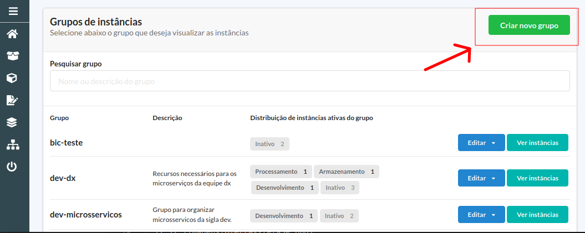
<br>

- Para criar o grupo preencha o formulário conforme instruções e exemplo abaixo:

  - **Nome do grupo**: recomendamos usar como padrão `<sigla>-<projeto>`, ou `<sigla>-microservicos`, ou `<sigla>-<equipe>`. Ao escolher o nome, lembre-se que dentro de um grupo poderão ficar vários microsserviços e objetos relacionados.
  - **Papel para um usuário acessar o grupo**: papel do SISBB que o usuário deve ter para conseguir acessar o grupo. Sugestão: use `ALMFD<sigla>`.
  - **Papel para admnistrar o grupo**: papel do SISBB que o usuário deve ter para admnistrar o grupo. Sugestão: use `ALMFE<sigla>`.
  - **Descrição**: texto livre descrevendo o grupo.
  <br>
  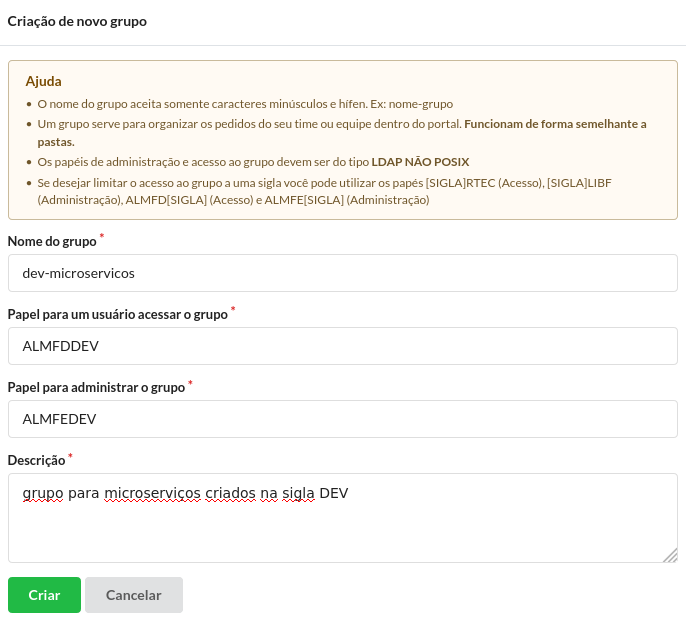
  <br>
- Para criar o microsserviço, no menu lateral esquerdo escolha a opção `Catálogo de Serviços` e a seguir a opção `Desenvolvimento`. Das opções disponibilizadas, escolha `microsserviço (Arq 3.0)`, conforme abaixo:

  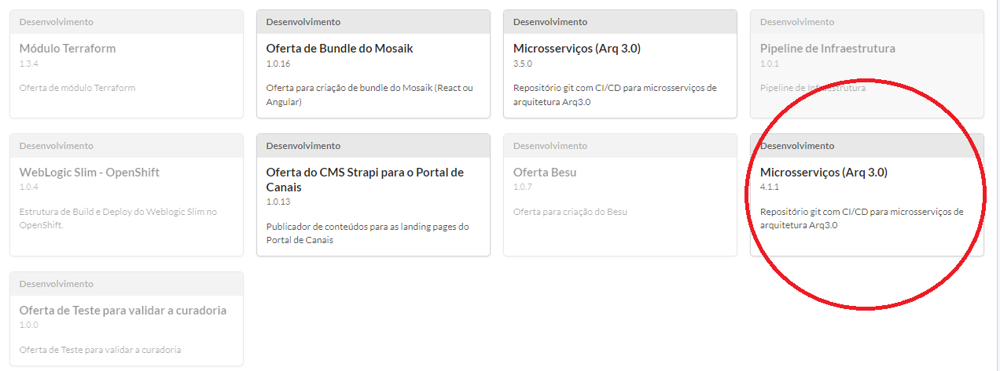
  <br>
- Preencha o formulário conforme instruções e exemplo abaixo:

  - **Nome para a instância**: nome da instância no portal nuvem. :warning: **Importante!** Projetos terminados com o sufixo <code>-piloto</code> serão tratados como piloto pela esteira.
  - **Grupo**: escolha o grupo onde ficará o microsserviço no portal nuvem
  - **Sigla**: sigla do microsserviço
  - **Nome do microsserviço**:  nome do microsserviço, sem sigla.
  - **Descrição do microsserviço**: texto livre descrevendo o microsserviço.
  - **Tipo do Projeto**: escolha a linguagem que será utilizada no projeto.
  - **Uor Equipe Responsável**: Informe uma UOR, obrigatoriamente de Equipe ou Divisão, que será responsável pelo microsserviço. :warning:   **Importante!** Esta informação poderá ser utilizada em processos da ditec(Exemplo: Equipe Responsável para resolução de RDI). Portanto, preencha-a com atenção.
  - **Arquitetura de Referência**: Escolha as arquiteturas de referência disponíveis que atendam a necessidade da solução.
  - **Solução / Serviço** Indique em que tipo de cluster sua aplicação deve ser hospedada. Caso sua aplicação não precise rodar em um dos clusters especializados disponíveis, escolha a opção Geral.

  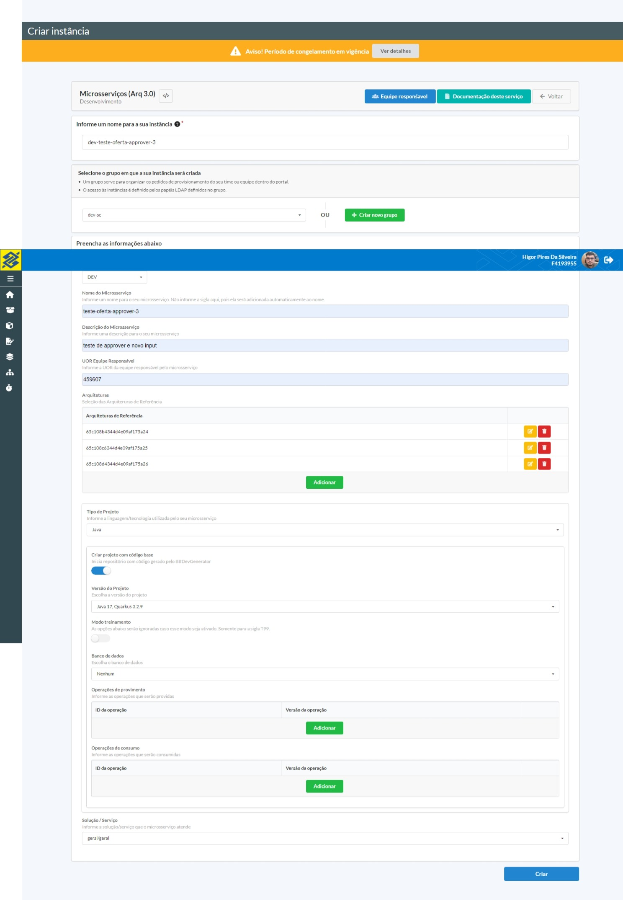<br>

  - Confira os dados na tela seguinte e confime a solicitação.

  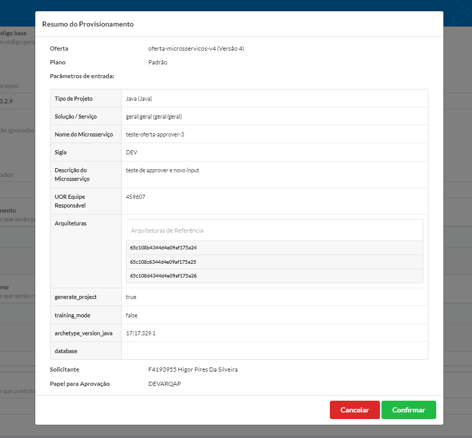<br>

## Aprovação do Arquiteto Responsável

  :warning: **Atenção** o Arquiteto Responsável deve possuir acesso ao papel `DEVARQAP` para aprovar a o provisionamento.

  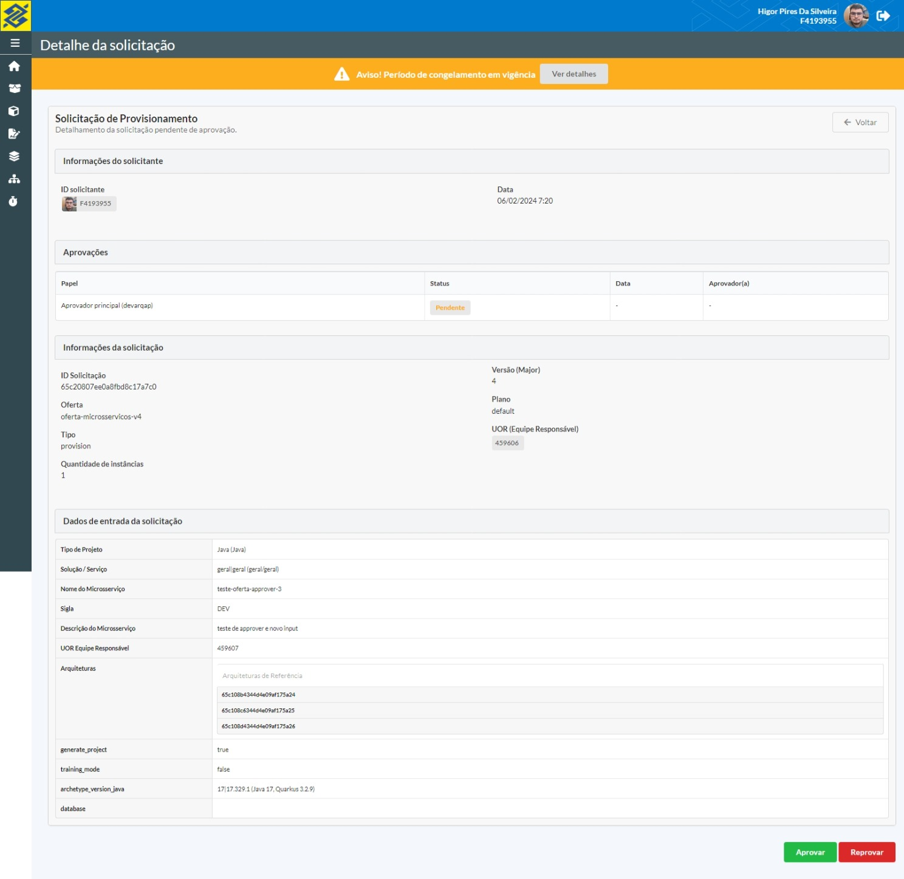<br>

  - Aguarde o processamento (aproximadamente 5 minutos). Após concluído será apresentada a tela à seguir, confirmando que todos os objetos necessários foram criados, e as urls para acessar cada um deles (repositórios no fontes, job no Jenkins, namespace no Kubernetes, etc)

  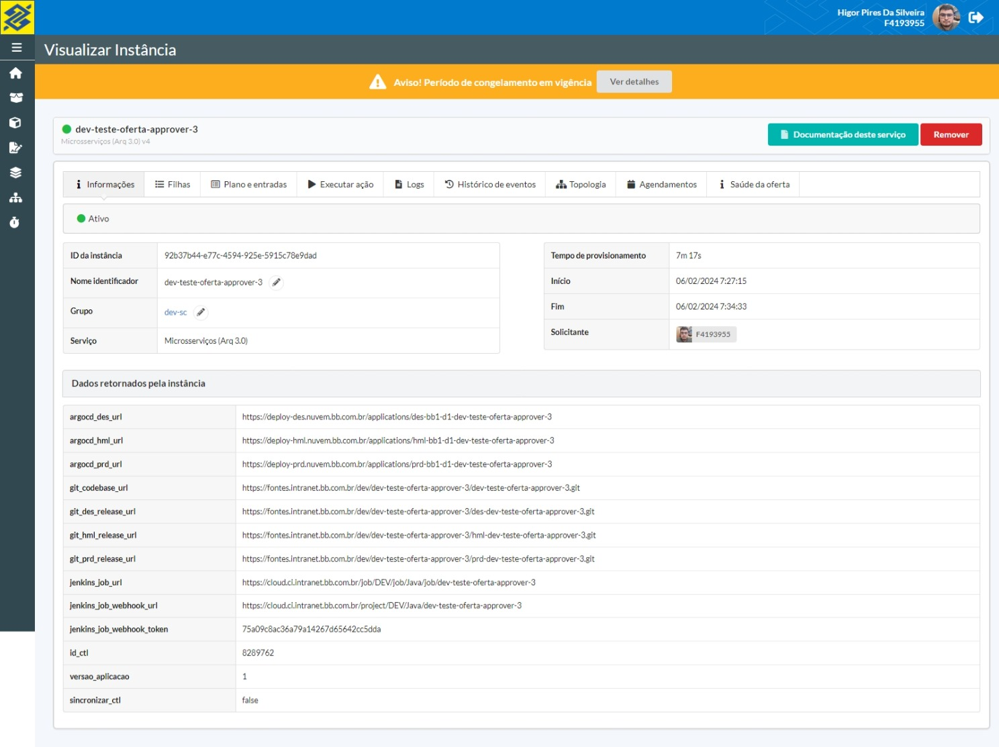
  <br>

## Geração de código base

Para projetos Java e Javascript, é possível inicializar o repositório com código base gerado pelo BBDevGenerator. Para isso, basta selecionar a opção "Criar projeto com código base" após selecionar o tipo de projeto apropriado, selecionar a versão em "Versão do Projeto", e preencher os dados opcionais do gerador de código caso necessário.

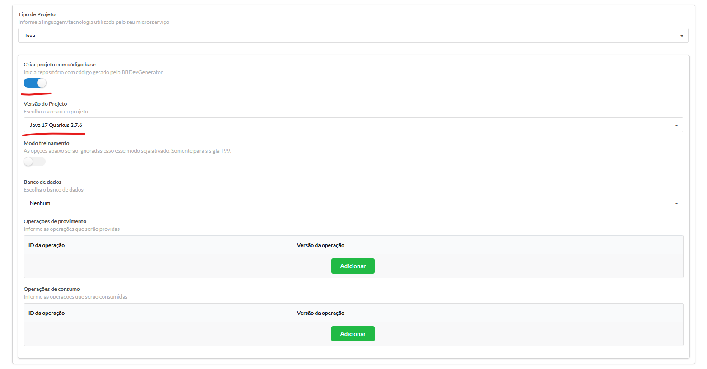

## Desprovisionando o projeto

Caso o projeto tenha sido criado errado, ou caso tenha sido descontinuado, é possível solicitar o desprovisionamento do microsserviço. Esta remoção:

- Remove os namespaces do Kubernetes dos três ambientes
- Remove o job do Jenkins
- Remove os repositórios de release
- Arquiva o namespace no Catálogo de Aplicações. (Ofertas criadas apóes 06-07-2021)
- Caso o projeto seja da sigla T99, remove o repositório de código; Caso seja de outra sigla, apenas o arquiva, permitindo que o código seja consultado. Neste caso, se necessário, é possível solicitar o desarquivamento.

Para fazer o desprovisionamento, siga os passos abaixo:

- Acesse o [portal de ofertas da nuvem](https://portal.nuvem.bb.com.br/).
- No menu lateral esquerdo, escolha a opção "Instâncias". Serão listados os grupos nos quais você tem acesso. Entre no grupo onde se encontra o projeto à ser desprovisionado (clicando no nome do grupo).
- No seu projeto (que deve estar como ativo), clique no botão "Opções" e em "Remove Instâncias", conforme figura abaixo:

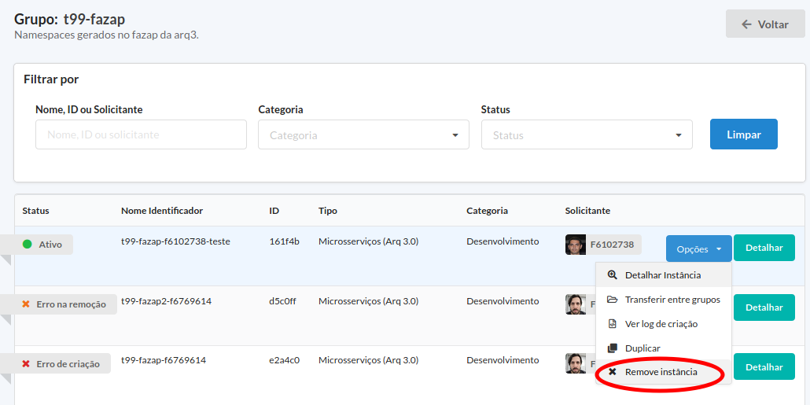

- Será apresentada a tela de confirmação abaixo. Prencha o id da sua instância e o motivo da exclusão conforme abaixo e clique em remover.

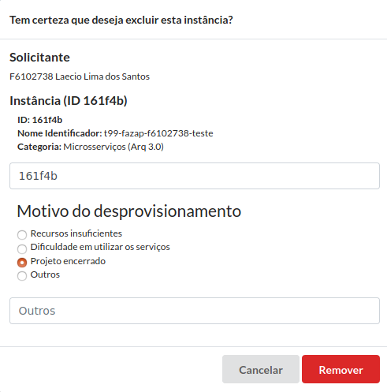

- O processo de exclusão se iniciará, conforme abaixo:

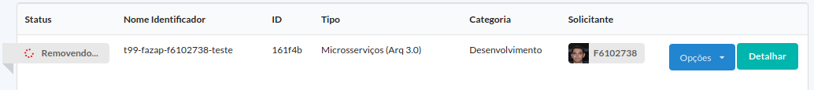

- Clique no botão "Detalhar" para acompanhar a exclusão de cada um dos elementos da sua instância. Ao final do processo, o microsserviço será atualizado para "Removido", conforme abaixo:

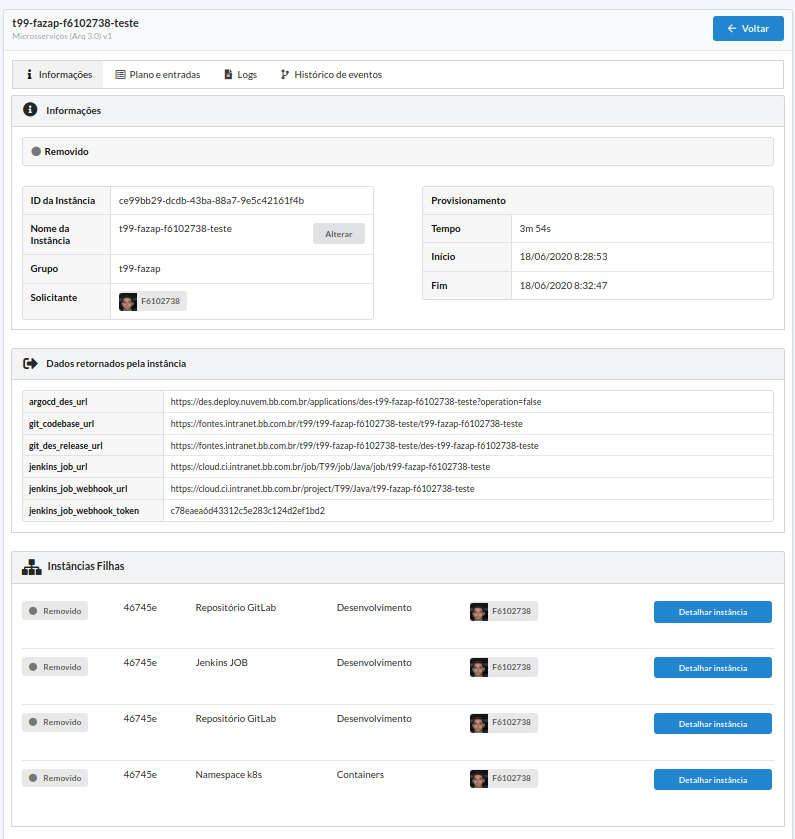---

## Criação e desprovisionamento de microsserviços por API

O consumo de oferta por API possui procedimentos adicionais, que passam pela solicitação de um usuário de plataforma e regras de [RBAC](https://www.gocache.com.br/en/dicas/o-que-e-rbac-role-based-access-control/) da oferta em questão.

Recomendo estudar esses tópicos com mais detalhes, através desses links:

1. [Solicitação do usuário](https://fontes.intranet.bb.com.br/sgh/publico/atendimento/-/wikis/construcao-ofertas/recursos/integracao/solicitar-usuario-de-plataformas)
2. [Endpoints](https://fontes.intranet.bb.com.br/sgh/publico/atendimento/-/wikis/construcao-ofertas/recursos/integracao/integracao-de-plataformas-externas-e-endpoints)
3. [RBAC](https://fontes.intranet.bb.com.br/sgh/publico/atendimento/-/wikis/construcao-ofertas/recursos/integracao/restringir-acesso-de-plataformas)

### Obtenção do snippet de código

Após a obtenção do usuário, é necessário obter o snippet de código da oferta e montar a chamada.

#### Portal OaaS

Pelo Portal OaaS, na tela de consumo da oferta existe um botão que gera um snippet para consumo via módulo bb-service-broker.

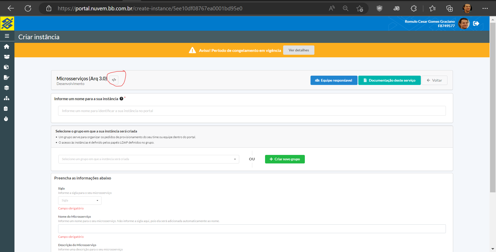
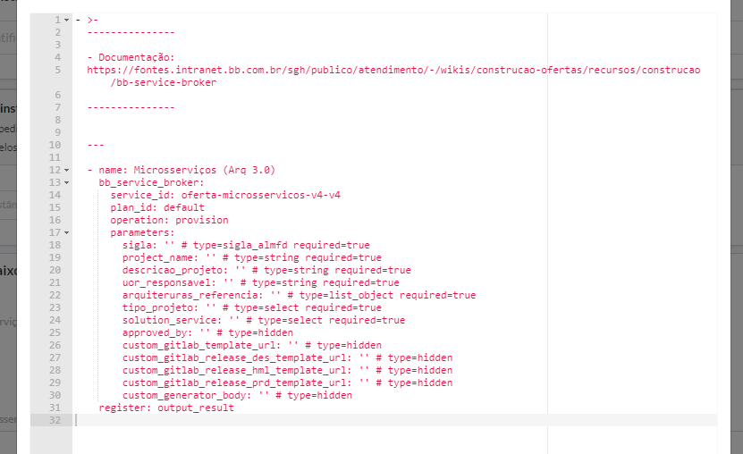

#### oaas-cli

Através do commando `oaas-cli snippet <nome-da-oferta>-<major> -o provision` também é possível obter o snippet de código para provisionamento.
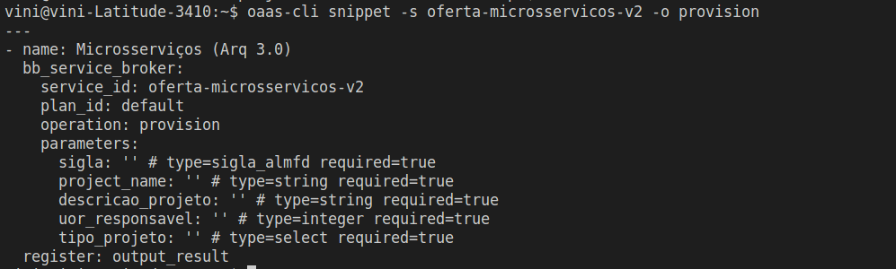

#### Provision

##### Autenticação e origem da chamada

A obtenção dos dados de de origem da chamada e autenticação são indispensáveis para a realização da chamada de API. Para saber mais sobre isso, clique [aqui](https://fontes.intranet.bb.com.br/sgh/publico/atendimento/-/wikis/construcao-ofertas/recursos/integracao/integracao-de-plataformas-externas-e-endpoints#headers).

##### Geração do uuid

Antes de realizar o provisionamento, é necessário a criação de um [uuid](https://medium.com/trainingcenter/o-que-%C3%A9-uuid-porque-us%C3%A1-lo-ad7a66644a2b), que é o identificador único da instância.
É possível gerar um uuid através da execução de um comando, e para isso, basta instalar o pacote de nome correspondente.
Para o Ubuntu, o comando de instalação é o seguinte: `sudo apt install uuid`. Para outras familias de Linux, [pesquise](https://www.google.com.br/search?q=how+to+install+uuid+on+linux&sxsrf=AJOqlzVas9AucZydI3o8AClr0FoB9Vcqug%3A1676052859382&ei=e4nmY5r7FpHo1sQPwuWQ-A0&ved=0ahUKEwjapLu6x4v9AhURtJUCHcIyBN8Q4dUDCA8&uact=5&oq=how+to+install+uuid+on+linux&gs_lcp=Cgxnd3Mtd2l6LXNlcnAQAzIGCAAQFhAeMgkIABAWEB4Q8QQyBggAEBYQHjIFCAAQhgMyBQgAEIYDMgUIABCGAzoKCAAQRxDWBBCwAzoECCMQJzoFCAAQkQI6BQgAEIAEOgUILhCABDoICC4QgAQQ1AI6CAguEIAEEMsBOggIABCABBDLAToKCAAQgAQQFBCHAjoLCC4QgAQQ1AIQywE6CAgAEBYQHhAKOgoIABAWEB4QDxAKOgsIABAWEB4QDxDxBEoECEEYAEoECEYYAFCIEFiFNWCrNmgHcAF4AYABiAKIAZ8mkgEGMC4yNy4xmAEAoAEByAEIwAEB&sclient=gws-wiz-serp) qual é o comando adequado.

```sh
uuid
```

Ex de retorno: `7d6c738c-a8ab-11ed-92a0-00155d7b7c96`

##### Obtenção do group_id

Para obter o group_id, faça o seguinte:

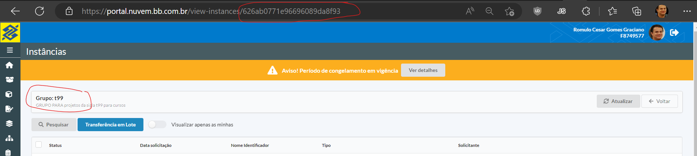

##### Chamada

```sh
curl --request PUT \
  --url 'https://oaas-broker.nuvem.bb.com.br/osb/v2/service_instances/<uuid>?accepts_incomplete=true' \
  --header 'Accept: application/json' \
  --header 'Cache-Control: no-cache' \
  --header 'Content-Type: application/json' \
  --header 'Authorization: <token>' \
  --header 'X-Broker-API-Version: 2.13' \
  --header 'X-Broker-Api-Originating-Identity: <origem>' \
  --data '{
    "service_id": "oferta-microsservicos-v2",
    "plan_id": "default",
    "organization_guid": "001",
    "space_guid": "001",
    "parameters": {
        "sigla": "T99",
        "project_name": "teste-oferta-api",
        "uor_responsavel": 123456
        "descricao_projeto": "Projeto criado via chamada por api",
        "tipo_projeto": "Java",
        "solution_service": "geral|geral"
    },
    "context": {
      "user_id": "f9540122", //solicitante da instancia
      "group_id": "626ab0771e96696089da8f93", //id do grupo onde a instancia sera armazenada
      "tag_name": "t99-teste-oferta-api" //nome da instancia
    }
}'
```

#### Deprovision

```sh
curl --request DELETE \
  --url 'https://oaas-broker.nuvem.bb.com.br/osb/v2/service_instances/<uuid>?accepts_incomplete=true&plan_id=default&service_id=oferta-microsservicos-v2' \
  --header 'Accept: application/json' \
  --header 'Authorization: <token>' \
  --header 'Cache-Control: no-cache' \
  --header 'X-Broker-API-Version: 2.13' \
  --header 'X-Broker-Api-Originating-Identity: <origem>'
```

#### Acompanhamento das chamadas

Após o envio das chamadas de provision e/ou deprovision, a api retornará um `operation_id`, tendo em vista que a execução dessas operações é **assincrona**.
O log de execução pode ser recuperado via UI pela url <https://oaas-notifier.nuvem.bb.com.br/data/log/<operation_id> ou [api](https://fontes.intranet.bb.com.br/sgh/publico/atendimento/-/wikis/construcao-ofertas/recursos/integracao/integracao-de-plataformas-externas-e-endpoints#log).

### Templates

O repositório codebase dos projetos são criados baseados em repositórios GIT que possuem um template para o tipo de projeto selecionado;

|tipo projeto|template|
|-----|-----|
|DockerImages|<https://fontes.intranet.bb.com.br/dev/templates/dev-template-docker>|
|Gradle|<https://fontes.intranet.bb.com.br/dev/templates/dev-template-generic>|
|Java|<https://fontes.intranet.bb.com.br/dev/templates/dev-template-generic>|
|Javascript|<https://fontes.intranet.bb.com.br/dev/templates/dev-template-generic>|
|Python|<https://fontes.intranet.bb.com.br/dev/templates/dev-template-python>|

Para os repositórios de deploy, os templates são outros

|ambiente|template|
|-----|-----|
|des e hml|<https://fontes.intranet.bb.com.br/dev/templates/dev-template-bb-aplic>|
|prd|<https://fontes.intranet.bb.com.br/dev/templates/dev-template-bb-aplic-prd>|

Esses repositórios possuem arquivos com a extensão `.templatebb` que possuem variáveis que são substituidas em tempo de execução pela [Oferta Repositório Gitlab](https://portal.nuvem.bb.com.br/create-instance/6048f56ae0d31d000104f00b).

  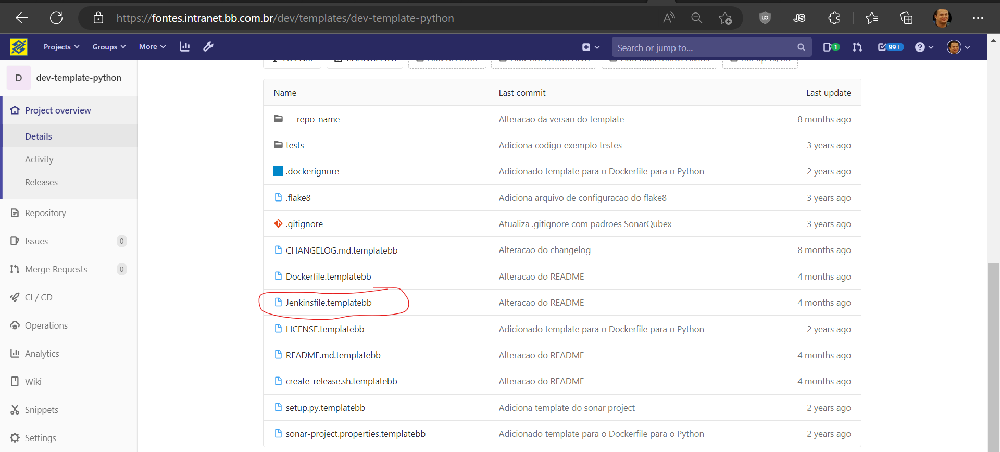
  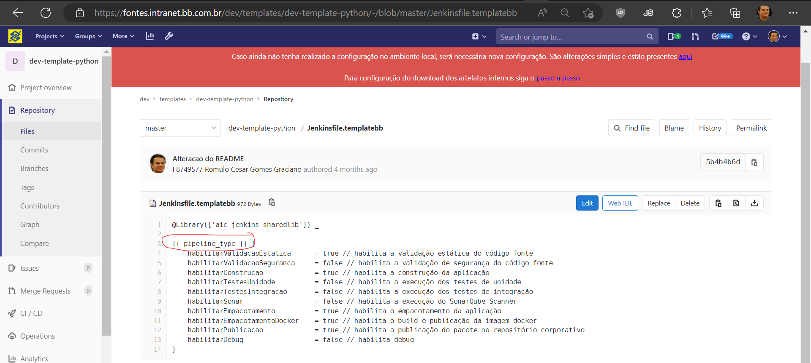

É possível customizar o template da oferta, dentro dos tipos de projeto existentes. Um projeto do tipo Javascript pode ter um template para ReactNative, Angular, etc.
Para isso, é necessário informar um parâmetro adicional na oferta, o `gitlab_template_url`, além das variáveis que esse template necessita.

Exemplo de provisionamento com [oaas-cli](https://fontes.intranet.bb.com.br/sgh/publico/atendimento/-/wikis/construcao-ofertas/desenvolvimento-oferta/05-teste-local):

```yaml
- name: Microsserviços (Arq 3.0)
  bb_service_broker:
    service_id: oferta-microsservicos-v2
    plan_id: default
    operation: provision
    parameters:
      sigla: T99
      project_name: teste-template-customizado
      descricao_projeto: Teste de projeto com template customizado' # type=string required=true
      tipo_projeto: 'Javascript'
      uor_responsavel: 123456
      solution_service: 'geral|geral'
      ##Inicio Variaveis do template customizado
      gitlab_template_url: https://fontes.intranet.bb.com.br/t99/templates/template-angular.git
      pipeline_type: jsBuildPipeline
      variavel_x: valor
      variavel_y: valor
      ##Fim Variaveis do template customizado
  register: saida_provision
```

[^1]: [👍👎](http://feedback.dev.intranet.bb.com.br/?origem=roteiros&url_origem=fontes.intranet.bb.com.br/dev/publico/roteiros/-/blob/master/ofertas/CriandoMicroservico.md&internalidade=ofertas/CriandoMicroservico)
