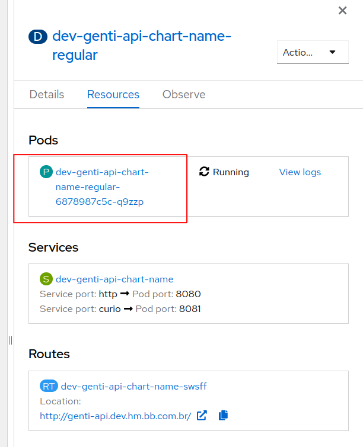
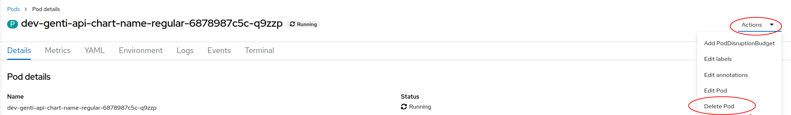
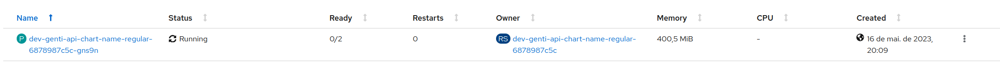

# Como deletar pods no OpenShift usando a interface

> :exclamation: Dê um feedback para esse documento no rodapé.[^1]

Neste guia, vamos aprender como deletar Pods de um projeto/namespace no OpenShift usando a interface web. Os Pods são as unidades básicas de execução no OpenShift, onde os contêineres são executados.

## Pré-requisitos

:warning: Procedimento executável nos ambientes de Desenvolvimento e Homologação.

Antes de começar, verifique se você possui acesso ao papel `ALMFDXXX` de sua Sigla.

Além disso, certifique-se de revisar o [Roteiro de Pods](pods.md) para detalhar os pods.

## Passo 1: Selecione o Pod que deseja deletar

1. Na tela de detalhamento do Deployment, clique no pod que deseja deletar:

2. Carregará uma tela com Detalhes do Pod, com Labels, Containers, data de criação entre outras informações.

## Passo 2: Deletar o Pod

1. No canto superior direito da tela, clique em **Actions** 

2. Na lista que aparecer, clique em **Delete Pod**

3. Irá aparecer uma mensagem de confirmação. Clique em **Delete**

4. O pod será deletado e um novo será criado. 

## Passo 4: Detalhe o novo Pod e visualize seu Status

1. Clique no link do novo Pod para acessar seus detalhes

2. Na aba `Details` verifique o status dos Containers

3. Na aba `Logs` verifique os logs do container da aplicação e/ou demais containers.

## Conclusão

Parabéns! Agora você sabe como deletar os Pods de um projeto no OpenShift usando a interface web. 

[^1]: [👍👎](http://feedback.dev.intranet.bb.com.br/?origem=roteiros&url_origem=fontes.intranet.bb.com.br/dev/publico/roteiros/-/blob/master/openshift/delete_pods.md&internalidade=openshift/delete_pods)
