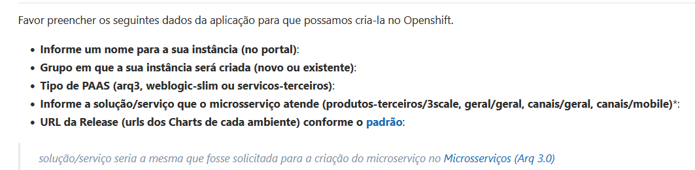
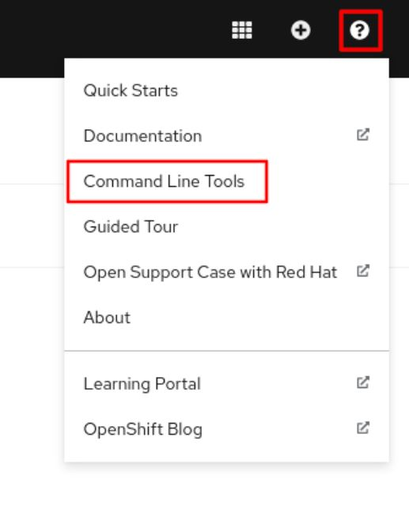
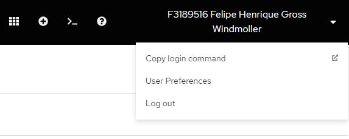

> :exclamation: Dê um feedback para esse documento no rodapé.[^1]


# OpenShift

O OpenShift é uma distribuição do Kubernetes feito pela Red Hat.

# Migrando seu namespace do Kubernetes BB para o OpenShift

Para realizar a migração do namespace do Rancher para o Openshift, é necessário abrir uma [issue](https://fontes.intranet.bb.com.br/psc/publico/atendimento/-/issues) para sigla psc e fornecer os seguintes dados:



Esta solicitação será atendida e executada manualmente pela [equipe do PSC - DITEC/GESIT/G3/E5 PAAS CLOUD](https://humanograma.intranet.bb.com.br/uor/341455).

# Painel Web do OpenShift - Red Hat OpenShift Container Platform (RHOCP)
- [Desenvolvimento](https://console.apps.k8sdesbb111.nuvem.bb.com.br/)
- [Homologação](https://console.apps.k8shmlbb111.nuvem.bb.com.br/)
- [Produção](https://console.apps.k8sprdbb111.nuvem.bb.com.br/)

# ArgoCD

- https://deploy-des.nuvem.bb.com.br
- https://deploy-hml.nuvem.bb.com.br
- https://deploy-prd.nuvem.bb.com.br

# Links

[Roteiro do PSC sobre OpenShift](https://fontes.intranet.bb.com.br/psc/publico/atendimento/-/wikis/PaaS/openshift-para-o-dev#nova-infra-openshift)

[Red Hat OpenShift CLI developer command reference - OC](https://docs.openshift.com/container-platform/4.10/cli_reference/openshift_cli/developer-cli-commands.html)


# Red Hat OpenShift Container Platform (RHOCP) command line interface (CLI)

No caso do OpenShift, ao invés de usarmos o Kubectl, usamos o OC (OpenShift Command Line Interface (CLI)).

## Compatibilidade com sintaxe do Kubectl no OC

**Os comandos do Kubectl podem ser usados no OC**.

Portanto você pode usar [este guia sobre kubectl](../kubernetes/kubectl-cheat-sheet.md) para fazer o básico (listar pods, ver logs, etc.).

Dica, primeiro selecione o namespace:
```
$ oc project gpf-kafka-red-hat
Now using project "gpf-kafka-red-hat" on server "https://api.k8sdesbb111.nuvem.bb.com.br:6443".
```

Após o `oc project <namespace>` todos os comandos que você der estarão no contexto deste namespace.

Exemplo para listar pods do namespace, usando um comando no padrão `kubectl`:
```
$ oc get pods
NAME                 READY   STATUS    RESTARTS   AGE
broker-zookeeper-0   1/1     Running   0          16h
broker-zookeeper-1   1/1     Running   0          16h
broker-zookeeper-2   1/1     Running   0          16h
```

## Instalar o OC na sua máquina
Acessar o [Red Hat OpenShift Container Platform (RHOCP) ](https://console.apps.k8sdesbb111.nuvem.bb.com.br/)

Clique no "?" no canto direito superior e depois em "Command Line Tools":



Escolha o arquivo equivalente ao seu sistema operacional.

Descompacte o arquivo.

Coloque o arquivo no PATH do seu sistema operacional.

Para Linux e macOS:
```
$ sudo cp oc /usr/local/bin/
$ sudo chmod +x /usr/local/bin/oc
```

Para Windows, coloque no PATH das suas variáveis de ambiente.

Teste para ver se funcionou:
```
$ oc version --client
Client Version: 4.11.0-202212070335.p0.g1928ac4.assembly.stream-1928ac4
Kustomize Version: v4.5.4
```

Seu computador pode não reconhecer o host. É necessário utilizar o proxy corporativo para acessá-lo. O `oc` lê as informações de proxy do terminal. Uma solução simples é criar um alias no arquivo `.bashrc` ou `.zshrc`, localizados na pasta do usuário (~). No exemplo abaixo, foi utilizado o endereço de proxy da IBM. Adapte caso você seja funcionário de outra empresa:

```
alias oc="http_proxy=http://170.66.49.180:3128 https_proxy=http://170.66.49.180:3128 \oc"
```

## Fazer login pelo OC

Você tem que fazer o login para o ambiente desejado.

No canto direito superior do [Red Hat OpenShift Container Platform (RHOCP) Desenvolvimento](https://console.apps.k8sdesbb111.nuvem.bb.com.br/), (caso queira homologação ou produção, acessar a plataforma deste ambiente) clique em no nome do seu usuário e depois em 



Faça o login por LDAP.

Clique em "Display Token"

Copie o comando `Log in with this token`

Exemplo:
```
$ oc login --token=sha256~aaasdfasdfasdf --server=https://api.k8sdesbb111.nuvem.bb.com.br:6443
The server uses a certificate signed by an unknown authority.
You can bypass the certificate check, but any data you send to the server could be intercepted by others.
Use insecure connections? (y/n): y

Logged into "https://api.k8sdesbb111.nuvem.bb.com.br:6443" as "f3189516" using the token provided.

You have access to 391 projects, the list has been suppressed. You can list all projects with 'oc projects'

Using project "cdc-acolhimento-api".
```

## Comandos para usar com o OC

[Red Hat OpenShift CLI developer command reference](https://docs.openshift.com/container-platform/4.10/cli_reference/openshift_cli/developer-cli-commands.html)

Em primeiro lugar, é preciso setar o contexto do projeto (namespace), após fazer isto, todos os comandos já entram implicitamente neste namespace. 

Mudar o projeto (setando o namespace):
```
# Switch to the 'myapp' project
$ oc project myapp

# Display the project currently in use
$ oc project

$ oc project gpf-demo-kafka-red-hat
Now using project "gpf-demo-kafka-red-hat" on server "https://api.k8sdesbb111.nuvem.bb.com.br:6443".

# Listar os pods do namespace (comando padrão kubectl)
$ oc get pods
NAME                 READY   STATUS    RESTARTS   AGE
broker-zookeeper-0   1/1     Running   0          16h
broker-zookeeper-1   1/1     Running   0          16h
broker-zookeeper-2   1/1     Running   0          16h
```


Estamos à disposição para eventuais dúvidas. Se precisar, abra uma issue em https://fontes.intranet.bb.com.br/dev/publico/atendimento.

Sugestões, criticas, melhorias e colaborações são bem-vindas! Obrigado!
---
[^1]: [👍👎](http://feedback.dev.intranet.bb.com.br/?origem=roteiros&url_origem=fontes.intranet.bb.com.br/dev/publico/roteiros/-/blob/master/openshift/openshift.md&internalidade=openshift/openshift)
