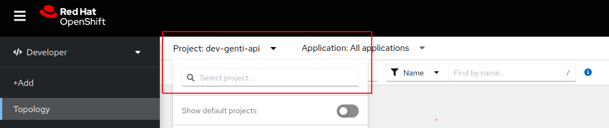
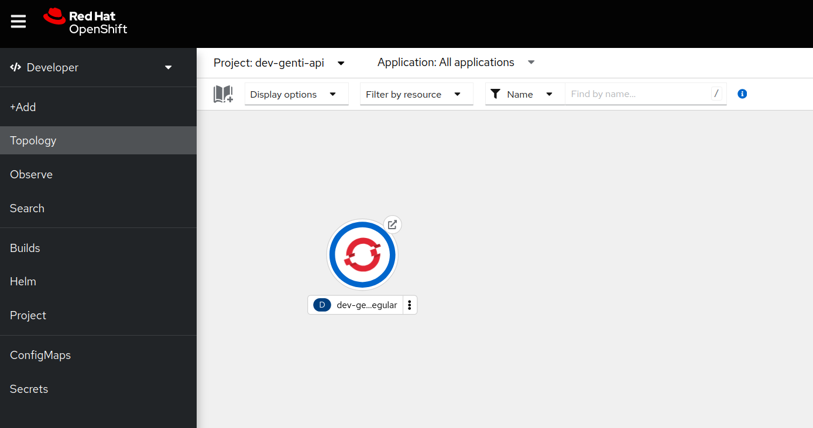
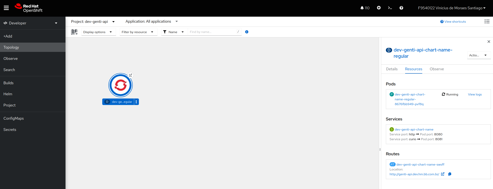
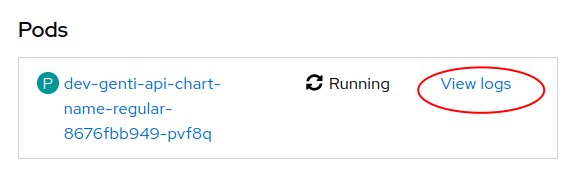
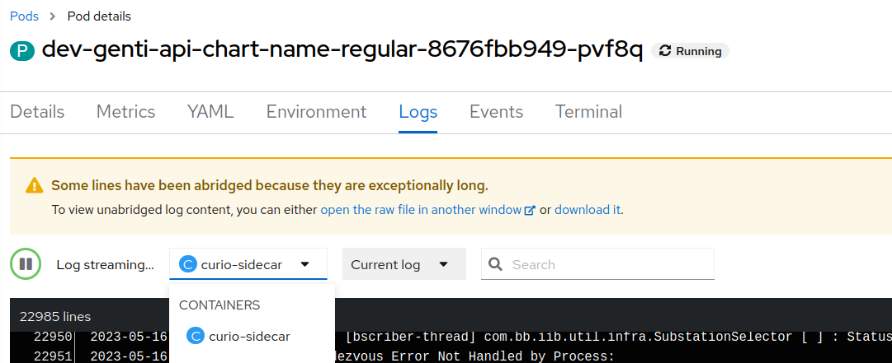
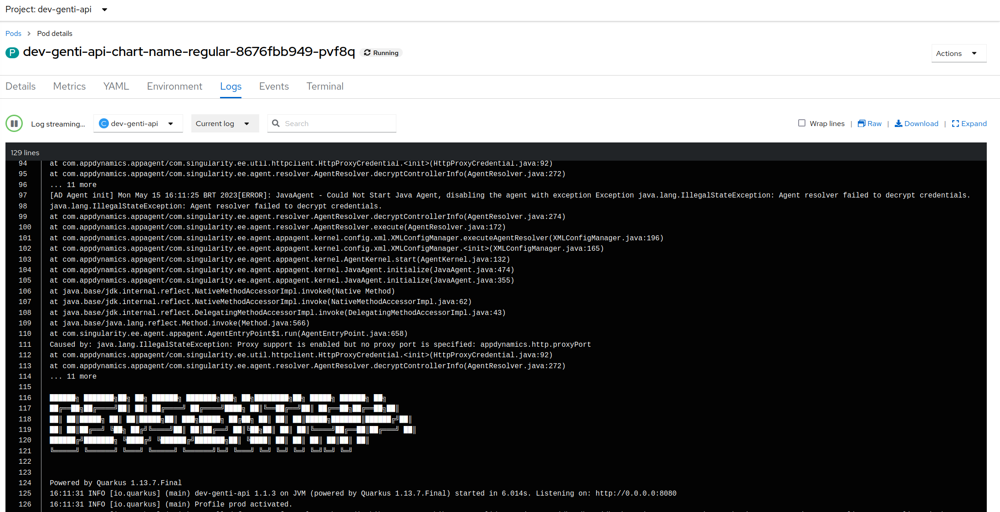

# Como visualizar os Pods e seus Logs de um projeto no OpenShift usando a interface

> :exclamation: Dê um feedback para esse documento no rodapé.[^1]

Neste guia, vamos aprender como visualizar os Pods de um projeto no OpenShift usando a interface web. Os Pods são as unidades básicas de execução no OpenShift, onde os contêineres são executados.

## Pré-requisitos

Antes de começar, verifique se você possui acesso ao papel `ALMFDXXX` de sua Sigla.

## Passo 1: Acessar a interface web do OpenShift

1. Abra um navegador da web e acesse a URL do console web do OpenShift. Exemplo: https://console.apps.k8sdesbb111.nuvem.bb.com.br/

Obs: A URL do console openshift pode ser verificada no ArgoCD do respectivo ambiente. Por exemplo, 
https://deploy-des.nuvem.bb.com.br/applications/<sua-application> -> Clicar na primeira caixa à esquerda e conferir o campo url:

2. Caso apareça uma tela de login no Openshift, selecione **ldap** 

3. Faça login com suas credenciais de acesso: **CHAVE/SENHA SISBB**

## Passo 2: Navegar para o projeto desejado

1. Na página inicial do console web, no menu lateral esquerdo, Clique em **Topology**.

    Obs: Certifique-se que está na visualização de "Developer". Conforme imagem acima.

2. Selecione o projeto

## Passo 3: Visualizar o Deployment e os Pods

1. Ao selecionar o projeto carregará o ícone representando o Deployment, como na imagem abaixo:

2. Clique em no icone do circulo, representando o Deployment, para mais detalhes:

3. Nos detalhes do Deployment poderá ver lista de Pods, Rotas (Ingress), link para logs, status e até métricas de CPU/Memória.

## Passo 4: Visualizar logs de um Pod

1. No detalhamento do Deployment do passo anterior, no respectivo Pod clique em **View Logs**

2. Abrirá uma página com Logs dos containers, caso venha o do curió por default, você pode mudar para sua aplicação clicando no campo:

3. Deverá aparecer o Log do container da aplicação:

4. É possível ainda fazer download dos logs, pesquisar, abrir em uma nova janela usando a interface Openshift. Sinta-se a vontade para explorar.

## Conclusão

Parabéns! Agora você sabe como visualizar os Pods de um projeto no OpenShift usando a interface web. Você pode usar essas informações para monitorar o estado dos Pods e analisar os logs para depuração e solução de problemas.

[^1]: [👍👎](http://feedback.dev.intranet.bb.com.br/?origem=roteiros&url_origem=fontes.intranet.bb.com.br/dev/publico/roteiros/-/blob/master/openshift/pods.md&internalidade=openshift/pods)
