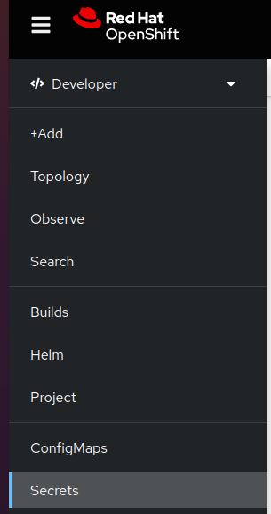
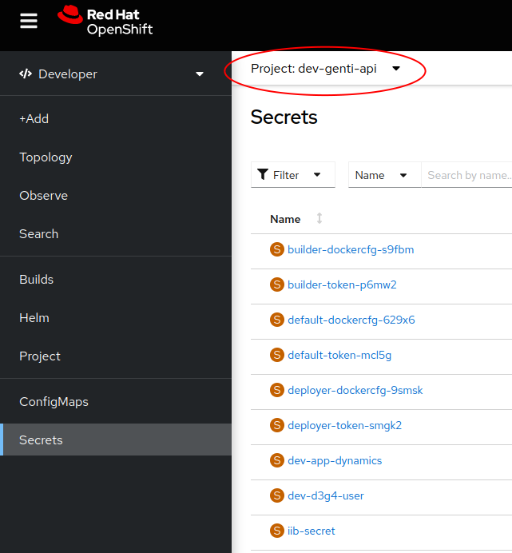
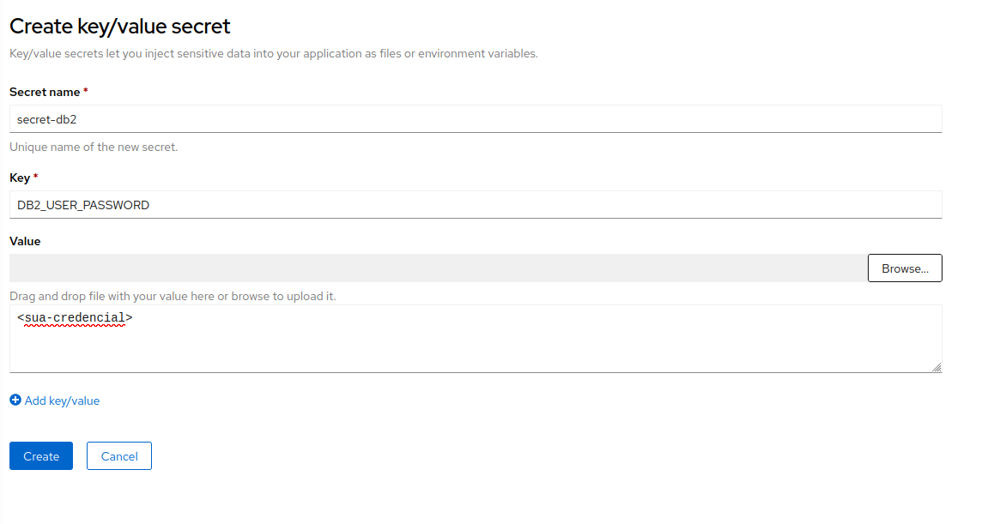

# Como criar Secret no OpenShift usando a interface

> :exclamation: Dê um feedback para esse documento no rodapé.[^1]

Neste guia, vamos aprender como criar um Secret no OpenShift usando a interface web. O Secret é usado para armazenar informações sensíveis, como senhas, chaves de API ou certificados TLS, de forma segura dentro de um cluster do OpenShift.

## Pré-requisitos

**Somente gestores podem criar secrets EM PRODUÇÃO**

Antes de começar, verifique se você possui acesso ao papel para criar e visualizar secrets: 

Tipo de Papel: **K8S-SCRT** 

Papel: **Sigla#SCRT**

Após a atribuição dos papéis, é possivel que os acessos não sejam sincronizados automaticamente. É interessante faze-lo manualmente. Para isso, acesse o [Portal AIC](https://portal.aic.intranet.bb.com.br/#/home), clique em "Meus acessos", depois "Sincronizar meus acessos".

## Passo 1: Acessar a interface web do OpenShift

1. Abra um navegador da web e acesse a URL do console web do OpenShift. Exemplo: https://console.apps.k8sdesbb111.nuvem.bb.com.br/

Obs: A URL do console openshift pode ser verificada no ArgoCD do respectivo ambiente. Por exemplo, 
https://deploy-des.nuvem.bb.com.br/applications/<sua-application> -> Clicar na primeira caixa à esquerda e conferir o campo url:

2. Caso apareça uma tela de login no Openshift, selecione **ldap** 

3. Faça login com suas credenciais de acesso: **CHAVE/SENHA SISBB**

## Passo 2: Navegar para o projeto desejado

1. Na página inicial do console web, no menu lateral esquerdo, Clique em **Secrets**.

2. Selecione o projeto

## Passo 3: Criar um Secret

1. No projeto selecionado, clique em **Create** para abrir o box dpara selecionar tipo de Secret.

2. Selecione a opção `Key/Value Secret`.

3. Na página de criação do Secret, preencha os detalhes conforme necessário:

   - **Secret name**: Digite um nome para o Secret. Exemplo: `secret-db2`
   - **key**: Informe um valor da chave para o primeiro registro da secret. Exemplo: `DB2_USER_PASSWORD`
   - **Value**: Informe o valor para aquela chave. Exemplo: `password_db2_des`
   
4. Caso queira adicionar mais pares de chave/valor, clique em **Add Key/Value** e informe os valores conforme passo anterior.

5. Ao final, clique em `Create` para criar a Secret.

## Passo 4: Verificar Secret criada

1. Após a criação bem-sucedida, a Secret será exibida na lista de secrets do projeto.

2. Para visualizar os detalhes da Secret, clique no nome da Secret na lista.

## Conclusão

Parabéns! Você aprendeu como criar uma Secret no OpenShift  usando o console web. Agora você pode usar esse Secret para armazenar informações sensíveis de forma segura dentro do seu cluster do OpenShift.

[^1]: [👍👎](http://feedback.dev.intranet.bb.com.br/?origem=roteiros&url_origem=fontes.intranet.bb.com.br/dev/publico/roteiros/-/blob/master/openshift/secrets.md&internalidade=openshift/secrets)
