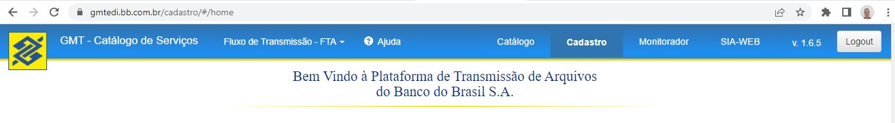
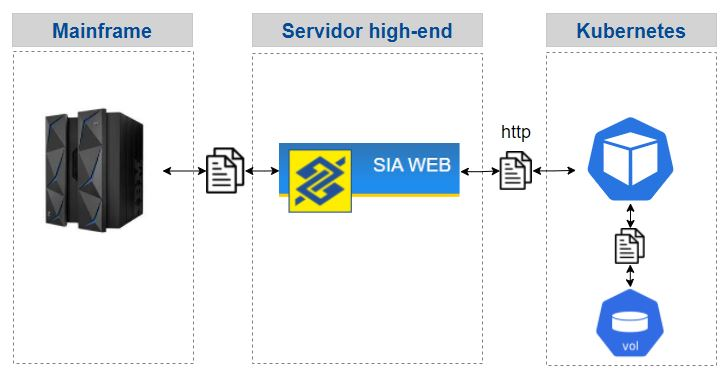
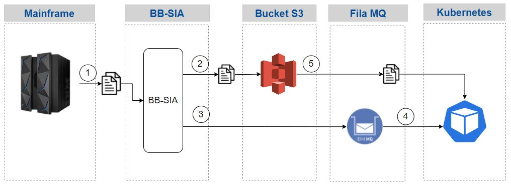

> :speech_balloon: Deixe o seu feedback sobre este roteiro no rodapé. [^1]   
 

# BB SIA

O BB-SIA é a solução de transferência de arquivos do Banco do Brasil, seja para transferência de arquivos internos (entre Mainframe, servidores, estações de trabalho, etc) ou externos (troca de arquivos com clientes, parceiros e sistemas externos). É uma camada de gerenciamento aplicada sobre todo File Transfer do BB, sendo capaz de fazer uso de qualquer ferramenta ou protocolo suportada pelo BB. 

Ele está disponível como *self-service*, para qualquer cliente da DITEC que necessite de transmissão de arquivos e prevê o acompanhamento do ciclo de vida do arquivo, desde a sua geração até a entrega ao destinatário final. O acompanhamento é realizado através de um número de protocolo único. Cada ciclo de vida cadastrado no BB SIA é chamado de FTA - Fluxo de Transmissão de Arquivos.

Com o BB-SIA conseguimos fazer integração via arquivos com os microsserviços rodando na cloud.

* [Desenvolvimento](https://gmtedi.desenv.bb.com.br/cadastro/)
* [Homologação](https://gmtedi.hm.bb.com.br/cadastro/)
* [Produção](https://gmtedi.bb.com.br/cadastro/)

> :warning: **Atenção** 
> 
> Na versão atual do site do gmtedi (14/06/2023), quando acessamos o SIA WEB, o menu superior "desparece". Para fazer ele voltar, é preciso incluir manualmente **/cadastro** na url. Ex.: https://gmtedi.desenv.bb.com.br/cadastro/.

Menu superior:



## Requisitos
- Cadastrar um **FTA** (Fluxo de Transmissão de Arquivos) no BB SIA informando as características da transmissão (exemplo Mainframe para a cloud ou cloud para o Mainframe).
- Do ponto de vista do microsserviço, será preciso:
  - **Interagir com um servidor do BB SIA via HTTP para fazer download ou upload dos arquivos**.
  - Ou receber os arquivos vi Bucket S3
- Se o tamanho do arquivo for muito grande, é recomendado alocar alguma mídia externa ao microsserviço para armazenar o arquivo, como um **volume** no Kubernetes.

## Integração usando o servidor WebService do BB SIA



## Integração usando o Bucket S3



Sequência:
1. Mainframe envia arquivo para BB-SIA por meio de um FTA cadastrado
2. BB-SIA envia arquivo para Bucket S3
3. BB-SIA envia mensagem para fila MQ informando nome do Arquivo enviado ao Bucket S3
4. Microsserviço lê mensagem do MQ com o nome do arquivo (não dá commit no MQ por enquanto)
5. Microsserviço lê arquivo do Bucket S3 e dá commit no MQ

## Exemplo de fluxo Mainframe -> Cloud

### Transmissão do Mainframe para o BB SIA

No final da PROCEDURE incluímos um **step** como o abaixo para startar uma transmissão para o BB SIA por meio do programa **GMTPSEND**:

```
//BBSIA    EXEC PGM=GMTPSEND,                                       
//         PARM='01&HLQ..RCP.RCPFCASH.D&DTMOV..SS000101           ' 
//SYSIN    DD DUMMY    
```

### Recepção do BB SIA

O servidor do BB SIA recebe este arquivo e o mantém disponível por 6 dias (importante confirmar com equipe do BB SIA).

### Download do arquivo pelo Microsserviço via BB SIA WebService

É preciso definir alguma estratégia para "ativar" o microsserviço para que ele faça o download, algumas ideias:
- Criar uma schedule e fazer polling no servidor do BB SIA verificando se o arquivo já está disponível.
- Criar uma operação IIB para estimular o processo.

O microsserviço acessa via HTTP o servidor do BB SIA e faz download do arquivo, o salvando dentro de um volume do Kubernetes.

### Download do arquivo pelo Microsserviço via Bucket S3

O microsserviço permanece escutando mensagens de uma fila MQ. Quando chegar uma mensagem, ela terá o nome do arquivo enviado pelo BB-SIA. Bastará neste momento tratar este arquivo que estará no Bucket S3.

Importante dar COMMIT no MQ somente após confirmar a existência do arquivo no Bucket S3.

## Exemplo de fluxo Cloud -> Mainframe

### Upload de arquivo pelo Microsserviço

Microsserviço lê arquivo de volume e, via HTTP, faz upload do arquivo no servidor BB SIA.

### Recepção do BB SIA

O servidor do BB SIA recebe este arquivo e o mantém disponível por 6 dias (importante confirmar com equipe do BB SIA).

### Envio do arquivo para o mainframe

Uma procedure do Mainframe é startada automaticamente para receber o arquivo.

Outra opção é o arquivo ser simplesmente disponibilizado no mainframe e uma procedure cíclica agrupar os arquivos pendentes e os processar.

## Servidor BB SIA

O servidor BB SIA possui algumas APIs onde é possível fazer download ou upload dos arquivos. Consulte o [Manual do BB-SIA para visualizar os Endpoints](https://fontes.intranet.bb.com.br/dev/publico/roteiros/-/blob/master/processamento-arquivos/referencias/Manual_Sistema_Integracao_via_Arquivos_BB_SIA_v2021001.pdf).

Também é possível listar os arquivos existentes para o seu FTA e consultar os metadados dos arquivos, por exemplo: a data da última leitura feita no arquivo.

## A Seguir
* Consulte o [Sharepoint Integração via Arquivos](https://banco365.sharepoint.com.mcas.ms/sites/IntegraoviaArquivos39/SitePages/BB-SIA.aspx?ga=1) para mais informações sobre o BB-SIA.
* Acesse o repositório [quarkus-bb-sia](https://fontes.intranet.bb.com.br/dev/publico/exemplos/quarkus-bb-sia) para ver um  exemplo de projeto Java Quarkus com integração com o BB-SIA.
* Veja que faz parte da [equipe responsável pelo BB SIA](https://humanograma.intranet.bb.com.br/uor/288349).

## Precisa de ajuda?
Em caso de problemas na execução de qualquer roteiro, abra uma [nova issue](https://fontes.intranet.bb.com.br/dev/publico/atendimento/-/issues) e relate a situação. O time de atendimento da devCloud está disponível para auxiliar!  

## Este roteiro foi útil?
[^1]: [👍👎](http://feedback.dev.intranet.bb.com.br/?origem=roteiros&url_origem=fontes.intranet.bb.com.br/dev/publico/roteiros/-/blob/master/processamento-arquivos/bb-sia.md&internalidade=processamento-arquivos/bb-sia)

