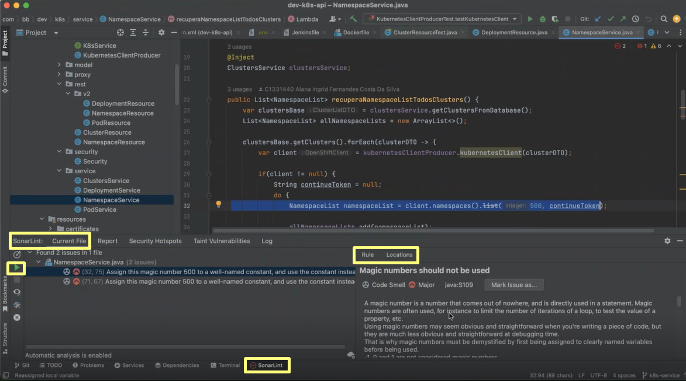

> :speech_balloon: Deixe o seu feedback sobre este roteiro no rodapé. [^1] 

# Como configurar o SonarLint 

Este roteiro ensina a configurar o SonarLint, uma ferramenta de análise estática de código. Com ele, você recebe feedback instantâneo na sua IDE sobre possíveis bugs, vulnerabilidades, padrões de codificação e outros problemas de qualidade enquanto codifica.

O SonarLint funciona com diversas IDEs, sendo as 4 principais:
* IntelliJ
* Visual Studio
* VS Code
* Eclipse

## SonarLint x SonarQube 

| Aspecto|SonarLint| SonarQube|
|---|---|---|
|**Escopo**| Para desenvolvedores individuais, oferece análise em tempo real dentro do IDE. | Solução centralizada para toda a equipe ou organização.|
|**Feedback**| Fornece feedback instantâneo durante a codificação.| Fornece análises mais profundas e relatórios agregados sobre a qualidade do código ao longo do tempo.|
|**Integração**| Funciona dentro do IDE e pode operar sozinho ou sincronizar com SonarQube/SonarCloud. |Integra-se com sistemas de CI/CD e oferece um dashboard centralizado para monitoramento contínuo. |

## Suporte de linguagens pelo SonarLint nas IDEs 

| Linguagem | IntelliJ | Visual Studio | VS Code | Eclipse |
|---|---|---|---|---|
| Azure Resource Manager | | | ✓ | |
| C# || ✓ | ✓                      |                        |
| C/C++             |                        | ✓             | ✓                      | ✓ (Connected Mode)     |
| CloudFormation    |✓|               | ✓                      |                        |
| CSS               | ✓                      | ✓             | ✓                      | ✓                      |
| Docker            |✓|               | ✓                      |                        |
| Go                | ✓ (Go extension)       |               | ✓                      |                        |
| HTML              | ✓                      |               | ✓                      | ✓                      |
| Java              | ✓                      |               | ✓                      | ✓                      |
| JavaScript        | ✓                      | ✓             | ✓                      | ✓                      |
| JCL               |                        |               |                        | ✓ (Connected Mode)     |
| Kotlin            | ✓                      |               |                        | ✓ (Connected Mode)     |
| Kubernetes        |✓|               | ✓                      |                        |
| PHP               | ✓                      |               | ✓                      | ✓                      |
| PL/I              |                        |               |                        | ✓ (Connected Mode)     |
| PL/SQL            | ✓ (Database Tools extension) |        | ✓ (Connected Mode)     | ✓ (Connected Mode)     |
| Python            | ✓                      |               | ✓ (IPython included)   | ✓                      |
| Ruby              |✓|               |                        | ✓ (Connected Mode)     |
| RPG               |                        |               |                        | ✓ (Connected Mode)     |
| Scala             |✓ (Connected Mode) |               |                        | ✓ (Connected Mode)     |
| Secrets           |✓| ✓             | ✓                      | ✓                      |
| Swift             |✓ (Connected Mode)|               |                        |                        |
| Terraform         |✓|               | ✓                      |                        |
| TypeScript        | ✓                      | ✓             | ✓                      | ✓                      |
| XML               | ✓                      |               |                        | ✓                      |
| VB NET            |                        | ✓             |                        |                        |
| Abap              |                        |               |                        | ✓ (Connected Mode)     |
| Apex              |                        |               | ✓ (Connected Mode)     | ✓ (Connected Mode)     |
| COBOL             |                        |               | ✓ (Connected Mode)     | ✓ (Connected Mode)     |
| T-SQL             |                        |               | ✓ (Connected Mode)     | ✓ (Connected Mode)     |

## Requisitos
* Executar a IDE com uma versão do Java Virtual Machine (JVM) igual ou superior à versão 17.

> :information_source: **Observação** 
> 
> Este roteiro explica como instalar e utilizar o SonarLint no IntelliJ. Em geral, as configurações são similares em todas as IDEs. Para obter ajuda adicional, consulte a documentação oficial (em inglês) específica da sua IDE.
> * [IntelliJ](https://docs.sonarsource.com/sonarlint/intellij/)
> * [Visual Studio](https://docs.sonarsource.com/sonarlint/visual-studio/)
> * [VS Code](https://docs.sonarsource.com/sonarlint/vs-code/)
> * [Eclipse](https://docs.sonarsource.com/sonarlint/eclipse/)

## Configurar o SonarLint no IntelliJ

### Passo 1: Gerar token de usuário

1. Acesse https://qsonar.intranet.bb.com.br/.
2. No canto superior direito, clique no ícone do seu avatar.
3. No menu suspenso, clique em **My Account**.
4. Clique em **Security**; a seção **Generate Tokens** aparecerá.
5. Em **Name**, escreva um nome de fácil identificação do seu projeto.
6. Em **Type**, selecione **User Token**.
7. Em **Expires in**, selecione o prazo mais adequado para o seu projeto.
8. Clique em **Generate**; o token aparecerá na tela, destacado na cor verde.
9. Clique em **Copy** para copiar o token e salve a informação para uso posterior.

### Passo 2: Instalar SonarLint no IntelliJ

1. No menu principal do IntelliJ, vá para **File > Settings**.
2. Em **Settings**, selecione **Plugins** na lista à esquerda.
3. Na aba **Marketplace**, pesquise por **SonarLint**.
4. Localize o SonarLint na lista de resultados e clique em **Install** para iniciar o processo de instalação.
5. Quando solicitado, selecione **Restart IDE** para reiniciar o IntelliJ IDEA e confirmar a ativação do plugin.

Após reiniciar, verifique se o SonarLint está ativado corretamente. Você pode verificar isso nas configurações do plugin ou observar se ele aparece nos menus e barras de ferramentas relevantes.

### Passo 3: Adicionar conexão SonarQube

1. Vá para **Settings > Tools > SonarLint**.
2. Na aba **Settings**, abaixo de **SonarQube/SonarCloud connections**, clique em **Add** (ícone de +).
3. Em **Connection Name**, dê um nome para a sua conexão.
4. Em **SonarQube URL**, inclua a URL do Sonar - https://qsonar.intranet.bb.com.br/.
5. Clique em **Proxy Settings**.
6. Clique em **Check connection**, inclua a URL que deseja conferir a conectividade e clique em **OK**. 
7. Aguarde o término da análise. Em caso de sucesso, uma mensagem aparecerá na tela.
8. Clique em **Next**.
9. Em **Authentication type**, selecione **Token**.
10. Em **Token**, cole o token gerado no [Passo 1](https://fontes.intranet.bb.com.br/dev/publico/roteiros/-/blob/roteiro-sonar/sonar/Como_configurar_SonarLint.md#passo-1-gerar-token-de-usu%C3%A1rio).
11. Clique em **Next**.
12. Clique em **Finish**.
    
### Passo 4: Vincular projeto

1. Vá para **Settings > Tools > SonarLint > Project Settings**.
2. Marque a opção **Bind project to SonarQube/SonarCloud**.
3. Em **Project key**, insira sua chave de projeto ou clique em **Search in list...** para abrir a lista de projetos na sua organização e selecionar a chave desejada.
4. Após a seleção, aguarde o download do projeto e clique em **OK**.

Você receberá uma notificação informando que a vinculação foi realizada com sucesso.

### Passo 5: Localizar problemas

1. Com o projeto aberto, confirme na parte inferior da tela que o editor de texto do IntelliJ está com o SonarLint integrado.
2. Selecione um arquivo do projeto e veja se na aba **Current File** será apontado algum problema. 
   i. Se por algum motivo a análise automática não estiver configurada, você pode clicar no ícone identificado por uma seta verde, no lado esquerdo da tela, para analisar o arquivo atual.

Após a conclusão da análise, selecione um problema da lista e revise a descrição da regra violada no painel direito. Na aba **Locations**, você encontrará uma lista de locais onde este problema se repete dentro do arquivo atual. 

**Tags:** #sonarlint #sonarqube 

## Precisa de ajuda?
Em caso de problemas na execução de qualquer roteiro, abra uma [nova issue](https://fontes.intranet.bb.com.br/dev/publico/atendimento/-/issues) e relate a situação. O time de atendimento da devCloud está disponível para auxiliar!  

## Este roteiro foi útil?
[^1]: [👍👎](http://feedback.dev.intranet.bb.com.br/?origem=roteiros&url_origem=fontes.intranet.bb.com.br/dev/publico/roteiros/-/blob/sonar/Como_configurar_SonarLint.md&internalidade=sonar/Como_configurar_SonarLint)
