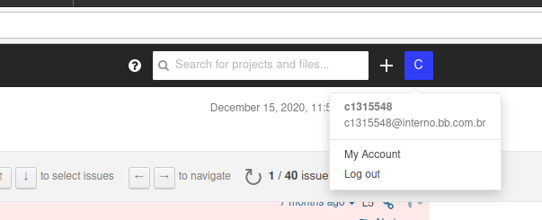
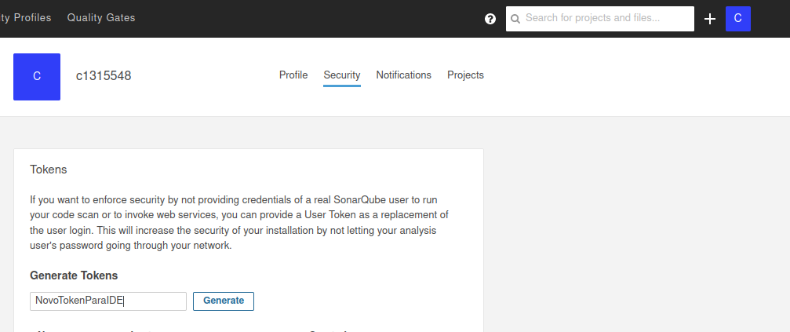
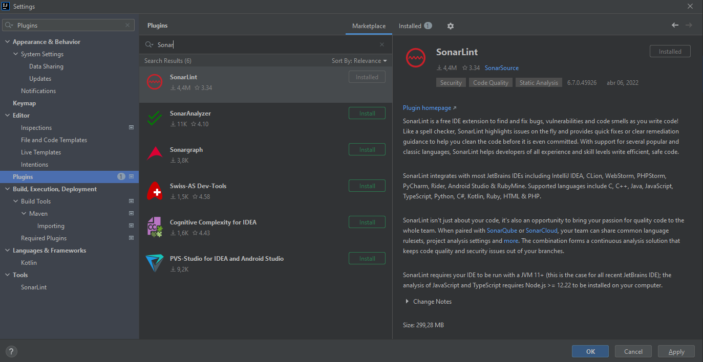
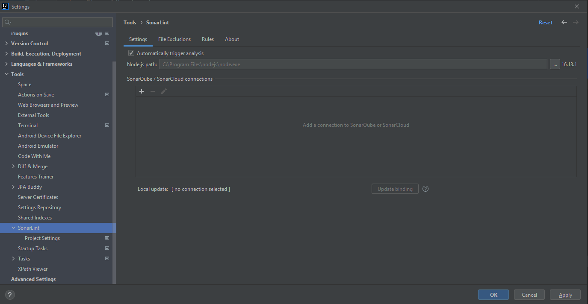
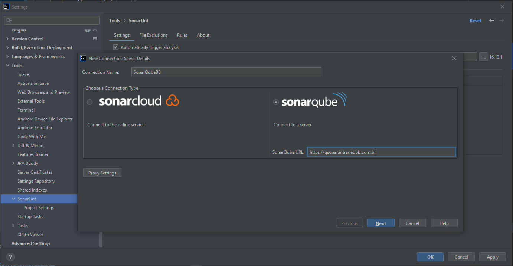
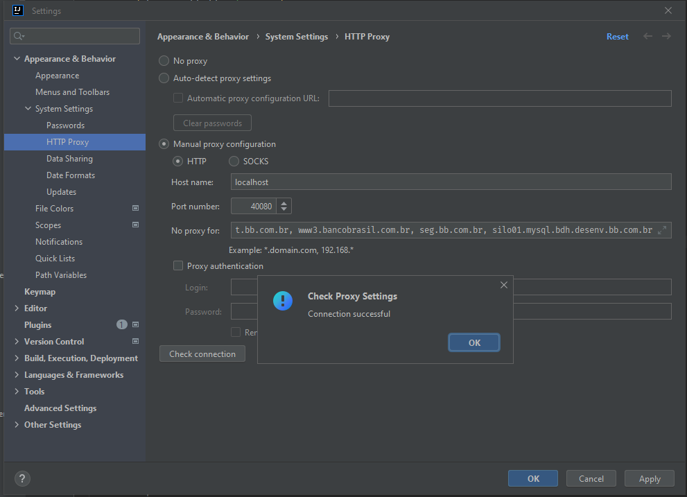
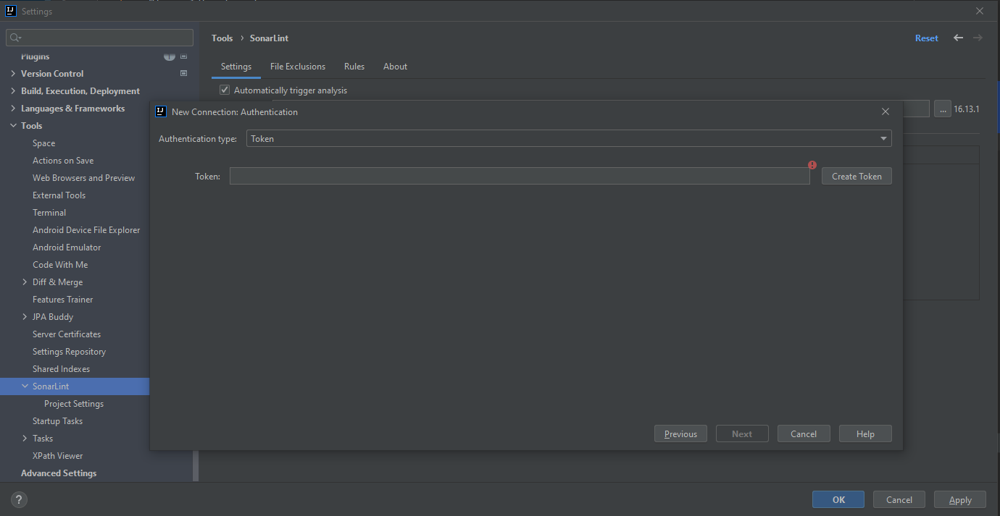
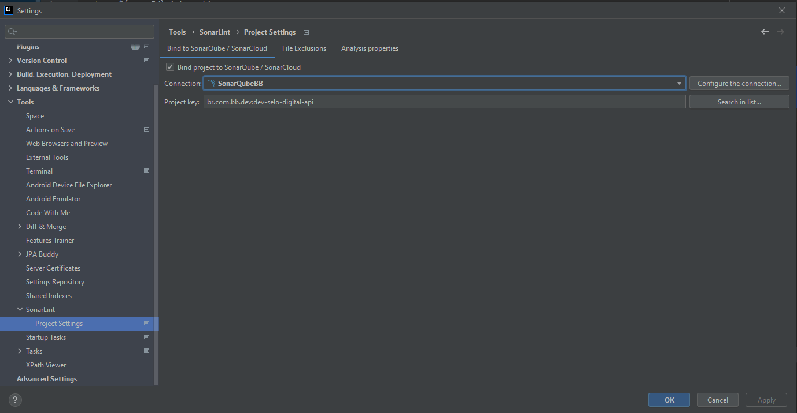

> :exclamation: Dê um feedback para esse documento no rodapé.[^1]

# Configuração do SonarLint

## Pré requisito: Token

- Acesse https://qsonar.intranet.bb.com.br/ , clique no seu avatar e selecione "My Account":

- Clique em "Security" e gere um novo token:

- Guarde o token, para que ele seja utilizado nos passos a seguir

## IDEs

### IntelliJ

- Instale o plugin do SonarLint via menu: Settings > Plugins

- Acesse Settings -> Tools -> SonarLint 

- Na tela apresentada, adicione uma conexão "SonarQube/SonarCloud"
- Dê um nome para a conexão e informe a URL do Sonar:https://qsonar.intranet.bb.com.br/

- Faça o teste de conectividade na opção proxy settings, teste com a opção Auto-detect.
- Se não funcionar configure o proxy como a imagem e no campo no-proxy informe `localhost, 127.0.0.1, *.labbs.com.br, *.bb.com.br, www3.bancobrasil.com.br`

- Clique em "Next"
- Em "Authentication type" informe "Token"

- Copie o token gerado anteriormente e insira nesta tela:
- Clique em "Next" e "Finish"

- Acesse Settings -> Tools -> SonarLint > Project Settings
- Selecione "Bing project to SonarQuebe / SonarCloud
- Em "Project" informe o nome do seu projeto:

---
[^1]: [👍👎](http://feedback.dev.intranet.bb.com.br/?origem=roteiros&url_origem=fontes.intranet.bb.com.br/dev/publico/roteiros/-/blob/master/sonar/sonar-lint.md&internalidade=sonar/sonar-lint)
