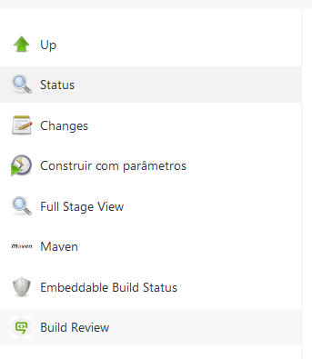
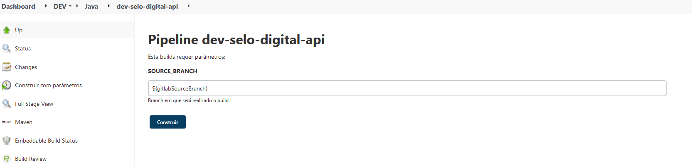

> :exclamation: Dê um feedback para esse documento no rodapé.[^1]

# Rodando o Sonar em versões abertas

Para solicitar a analise do sonar antes de fechar uma versão na master, podemos realizar a analise usando o sonar-snapshot em versoes abertas.

Para isso siga os seguintes passos:

1. Ir na opção `Construir com parametros` do jenkins do sua aplicação 

2. Informar a branch que sera realizada a analise, lembrando que a versão deve ser aberta, e clicar em `Construir`.

3. Depois de realizar o build da versão ir em [http://qsonar-snapshot.intranet.bb.com.br:9000/](https://qsonar-snapshot.intranet.bb.com.br:9000/) logar e ir para seu projeto para ver o resultado.
---
[^1]: [👍👎](http://feedback.dev.intranet.bb.com.br/?origem=roteiros&url_origem=fontes.intranet.bb.com.br/dev/publico/roteiros/-/blob/master/sonar/sonar-snapshot.md&internalidade=sonar/sonar-snapshot)
