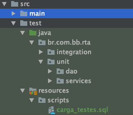

> :exclamation: Dê um feedback para esse documento no rodapé.[^1]

# Testes com Quarkus


A realização dos testes nas aplicações Java, utilizando o framework Quarkus podem ser realizados como testes unitários e testes de integração. No caso dos testes unitários o foco é testar as possibilidade de execução de uma única funcionalidade e realizar o mock, ação de simular o comportamento de objetos reais de forma controlada, de todas as dependências para a execução dessa funcionalidade. Já no teste de integração iremos realizar um teste mais abrangente que pode cobrir o funcionamento como um todo da aplicação ou parte dela, nesse caso podemos realizar o mock de partes externas do sistema, como banco de dados ou chamadas a outras aplicações.

Dentro do processo de build de uma aplicação Java, uma das fases é a execução de testes, que por sua vez são classes, que checam as funcionalidades ou conjunto de funcionalidades, que serão executadas para garantir que as funcionalidades estão com o mesmo comportamento.
Dessa forma teremos mais segurança de que as alterações realizadas não afetaram o comportamento de outras funcionalidades e que todas estão respeitando as regras de negócio já implementadas.

No site do [Quarkus](https://quarkus.io/guides/getting-started-testing) temos alguns exemplos de como implementar alguns desses testes, os frameworks utilizados para realização dos testes são os mais comuns no mundo JAVA, como Junit e Mockito.

## Configuração

Antes de começar a criar seus testes devemos configurar a aplicação para quando for executada na fase de build de aplicação tenha todos os insumos necessários.
Por padrão as aplicações Quarkus já vem com uma organização do local onde as classes de testes estarão no seu projeto, geralmente seguem a seguinte estrutura a partir da raiz do projeto >src>test>java>pacote_do_seu_projeto.
Lembrando que o pacote_do_seu_projeto deve ser o seguinte padrão bb.com.br.sigla_projeto e dentro dessa pasta devemos criar pasta chamada unit e outra integration para separar os projetos, dentro dessas você poderá organizar as classes conforme a necessidade do seu projeto. A imagem a seguir é um exemplo de utilizado pela sigla RTA que possui acesso ao banco de dados por isso temos uma pasta de scripts, lembre de ajustar o nome do pacote para a **sigla do seu projeto**.



Outro ponto importante é a definição das variáveis de ambiente do projeto, na documentação do [Quarkus](https://quarkus.io/guides/config) temos uma seção apenas para isso, mas aqui vamos focar apenas no necessário para execução dos testes.

Como não temos controle do local onde os testes serão executados, devemos incluir as variáveis de ambiente com o prefixo %test. no arquivo application.properties localizado em >src>main>resources. Os projetos gerados pelo BBdev já vem com algumas variáveis de teste já definidas porém caso seja necessário basta criar elas conforme o padrão utilizado pelo Quarkus.

Finalmente temos que utilizar as seguintes dependencias no pom.xml do nosso projeto. Basta adicionar o trecho abaixo dentro da tag   '<dependencies></dependencies>' do pom.xml. 

Caso exista alguma dependencia de mockito em seu projeto remova e utiliza as descritas abaixo.

```xml
<!-- DEPENDENCIAS DE TESTE -->
    <dependency>
      <groupId>io.quarkus</groupId>
      <artifactId>quarkus-junit5</artifactId>
      <scope>test</scope>
    </dependency>
    <dependency>
      <groupId>io.rest-assured</groupId>
      <artifactId>rest-assured</artifactId>
      <scope>test</scope>
    </dependency>
```

**DICA:**

1 - Caso precise mudar a porta de execução dos realizados pelo Quarkus basta incluir a seguinte variavel de ambiente no arquivo application.properties

```
quarkus.http.test-port=8099
```

2 - Se estiver utilizando o banco de dados H2 para simular outro banco de dados basta incluir o atributo MODE na string de conexão já existente presente no application.properties. No exemplo abaixo estamos simulando um banco DB2, para outros basta seguir a configuração do site do [H2](http://www.h2database.com/html/features.html#compatibility)

```
%test.quarkus.datasource.url=jdbc:h2:mem:exemplo;MODE=DB2;INIT=RUNSCRIPT FROM 'classpath:scripts/carga_testes.sql'
```


## Testes Unitários

Os testes unitários visam cobrir um número maior de possibilidades, tanto de sucesso quanto de erros. O objetivo é garantir que a mesma entrada de dados produza sempre o mesmo resultado, ou seja, que a funcionalidade testada seja idempotente.
Podemos realizar os testes unitários adicionando uma das duas anotações @ExtendWith(MockitoExtension.class) ou @QuarkusTest.

### Testando as classes de acesso ao Banco de Dados (DAO)

Para os casos onde é necessário realizar testes para a execução das querys de banco devemos usar a anotação
@QuarkusTest antes da classe. Além disso também devemos configurar a string de conexão conforme descrito acima. Além disso devemos incluir na pasta resources o arquivo de carga_testes.sql. Nele teremos as DML e DDL necessários para criar um banco de dados na fase de testes utilizando o banco em memória H2. Escolhemos o H2 por causa da sua versatilidade e independência a outros servidores, além de ser bem performático e mantendo a compatibilidade com o banco de dados definido no atributo MODE.

Abaixo temos um exemplo de uma classe de teste para um DAO:

```java
package br.com.bb.rta.unit.dao;

import br.com.bb.rta.dao.CapacidadeSuporteMunicipioDao;
import br.com.bb.rta.exceptions.ErroSqlException;
import br.com.bb.rta.models.CapacidadeSuporteMunicipio;
import io.quarkus.test.junit.QuarkusTest;
import org.junit.jupiter.api.Assertions;
import org.junit.jupiter.api.Test;

import javax.inject.Inject;
import java.math.BigDecimal;

@QuarkusTest
public class CapacidadeSuporteMunicipioDaoTest {

    @Inject
    CapacidadeSuporteMunicipioDao capacidade;

    @Test
    void query_Consulta_Capacidade_Municipio_Com_Resultado_Existente(){
        try {
            CapacidadeSuporteMunicipio capacidadeSuporteMunicipio =
                    capacidade.buscarCapacidadeSuporteMunicipio(1,1,3,2000);

            Assertions.assertEquals(capacidadeSuporteMunicipio.getCodigoDestinacaoExploracao(), 1, "Codigo Destinacao Exploracao incorreto na consulta SQL da Capacidade Municipio");
            Assertions.assertEquals(capacidadeSuporteMunicipio.getCodigoSistemaExploracao(), 1, "Codigo Sistema Exploracao incorreto na consulta SQL da Capacidade Municipio");
            Assertions.assertEquals(capacidadeSuporteMunicipio.getCodigoTipoUtilizacaoSolo(), 3, "CCodigo Tipo UtilizacaoSolo incorreto na consulta SQL da Capacidade Municipio");
            Assertions.assertEquals(capacidadeSuporteMunicipio.getCodigoMunicipio(), 2000, "Codigo Municipio incorreto na consulta SQL da Capacidade Municipio");
            Assertions.assertEquals(capacidadeSuporteMunicipio.getValorCapacidadeSuporteMaximo(), new BigDecimal("2.0000"), "Valor Capacidade Suporte Maximo incorreto na consulta SQL da Capacidade Municipio");

        } catch (ErroSqlException e) {
            Assertions.fail("Falha na execução do teste de consulta da capacidade de municipio",e);
        }
    }
}
```

#### Entendendo o código

A primeira anotação @QuarkusTest indica que iremos utilizar as configurações do quarkus para execução deste teste, dessa forma todas as injeções de dependência irão funcionar normalmente, além disso ele irá utilizar as configurações das variáveis de ambiente definidas no application.properties com o  prefixo %test.

A segunda anotação temos o @Inject para o DAO que desejamos testar assim ele irá fazer a instância da classe CapacidadeSuporteMunicipioDao e irá fazer todos o injects presentes na classe DAO.

Na terceira anotação temos o @Test que indica que o método query_Consulta_Capacidade_Municipio_Com_Resultado_Existente será executado na bateria de testes, neste exemplo temos apenas um método de teste mas voce pode criar quantos forem necessários, tente ser o mais explicito na descrição do nome da método de teste para facilitar o entendimento caso ele venha falhar na esteira de build.

Finalmente temos os Asserts que irão validar os valores de retorno e caso ocorra algum ErroSqlException o teste irá falar.

### Testando as classes de negócio

Nas classes de negócio possuem as regras de validação e transformação de dados e temos que garantir que essas regras não sejam afetadas por modificações realizadas no código. Nas classes de teste para esse cenário iremos utilizar outro tipo de anotação @ExtendWith(MockitoExtension.class).
Diferente da @QuarkusTest ela não irá realizar a configuração da sua aplicação, por isso todas as dependências da classe de negócio devemos criar uma referência mock. Abaixo temos uma exemplo de código.

```java
package br.com.bb.rta.unit.services;

import br.com.bb.rta.dao.CapacidadeSuporteMunicipioDao;
import br.com.bb.rta.exceptions.ErroNegocialException;
import br.com.bb.rta.models.CapacidadeSuporteMunicipio;
import br.com.bb.rta.operacao.simularCapacidadePastagemTipoUsoSoloV1.bean.requisicao.DadosRequisicaoSimularCapacidadePastagemTipoUsoSolo;
import br.com.bb.rta.operacao.simularCapacidadePastagemTipoUsoSoloV1.bean.requisicao.ListaRetornoOcorrencia;
import br.com.bb.rta.services.CapacidadeSuporteMunicipioService;
import org.junit.jupiter.api.Assertions;
import org.junit.jupiter.api.Test;
import org.junit.jupiter.api.extension.ExtendWith;
import org.mockito.InjectMocks;
import org.mockito.Mock;
import org.mockito.Mockito;
import org.mockito.junit.jupiter.MockitoExtension;

import java.math.BigDecimal;
import java.util.ArrayList;

@ExtendWith(MockitoExtension.class)
public class CapacidadeSuporteMunicipioServiceTest {

    @InjectMocks
    CapacidadeSuporteMunicipioService capacidadeSuporteMunicipioService;

    @Mock
    CapacidadeSuporteMunicipioDao daoCapacidade;

    @Test
    public void calculo_Capacidade_Suporte_Com_Codigo_Tipo_Utilizacao_Igual_a_10() {

        DadosRequisicaoSimularCapacidadePastagemTipoUsoSolo requisicaoSimularCapacidadePastagemTipoUsoSolo = new DadosRequisicaoSimularCapacidadePastagemTipoUsoSolo();

        requisicaoSimularCapacidadePastagemTipoUsoSolo.setCodigoDestinacaoExploracao(1);
        requisicaoSimularCapacidadePastagemTipoUsoSolo.setCodigoFaseExploracao(1);
        requisicaoSimularCapacidadePastagemTipoUsoSolo.setCodigoMunicipio(1);
        requisicaoSimularCapacidadePastagemTipoUsoSolo.setCodigoProdutoPrincipalAgropecuario(1);
        requisicaoSimularCapacidadePastagemTipoUsoSolo.setCodigoSistemaExploracao(1);
        requisicaoSimularCapacidadePastagemTipoUsoSolo.setCodigoItemFinanciado(1);
        requisicaoSimularCapacidadePastagemTipoUsoSolo.setQuantidadeTipoUtilizacaoSolo(1);

        ArrayList<ListaRetornoOcorrencia> itens = new ArrayList<>();
        ListaRetornoOcorrencia item = new ListaRetornoOcorrencia();
        item.setCodigoTipoUtilizacaoSolo(10);
        item.setQuantidadeAreaTipoUtilizacao(new BigDecimal(100));
        itens.add(item);

        requisicaoSimularCapacidadePastagemTipoUsoSolo.setListaRetornoOcorrencia(itens);

        CapacidadeSuporteMunicipio resultadoCap = new CapacidadeSuporteMunicipio();

        resultadoCap.setCodigoDestinacaoExploracao(100);
        resultadoCap.setCodigoMunicipio(101);
        resultadoCap.setCodigoSistemaExploracao(102);
        resultadoCap.setCodigoTipoUtilizacaoSolo(103);
        resultadoCap.setValorCapacidadeSuporteMaximo(new BigDecimal(1000.02));

        Mockito.when(
          daoCapacidade.buscarCapacidadeSuporteMunicipio(Mockito.anyInt(), Mockito.anyInt(), Mockito.anyInt(), Mockito.anyInt()))
                .thenReturn(resultadoCap);
        try {

            BigDecimal valorRetorno = capacidadeSuporteMunicipioService.consultarCapacidadeSuporteMaximaMunicipio(requisicaoSimularCapacidadePastagemTipoUsoSolo);

            BigDecimal valorComparacao = new BigDecimal(100002);
            Assertions.assertEquals(valorComparacao.floatValue(), valorRetorno.floatValue(), "Valor Esperado incorreto");

        } catch (ErroNegocialException e) {
            Assertions.fail("Erro na execucao do service", e);
        }
    }
}
```

#### Entendendo o código

A primeira anotação @ExtendWith(MockitoExtension.class) é para indicar que iremos usar a extensão do Mockito para criar os mocks necessários.

A segunda anotação @InjectMocks indica que iremos fazer o mock das dependências da classe CapacidadeSuporteMunicipioService e injetar a instância na variável capacidadeSuporteMunicipioService.

A terceira anotação @Mock indica que essa variável será mock e podemos forçar o comportamento dos métodos públicos da classe.

A quarta anotação temos o @Test que indica que o método calculo_Capacidade_Suporte_Com_Codigo_Tipo_Utilizacao_Igual_a_10 será executado na bateria de testes, neste exemplo temos apenas um método de teste mas voce pode criar quantos forem necessários, tente ser o mais explicito na descrição do nome da método de teste para facilitar o entendimento caso ele venha falhar na esteira de build.

Dentro do método temos a inicialização dos parâmetros de entrada conforme a necessidade do cenário de teste, e a inicialização dos parâmetros de saída esperados. Em seguida temos a configuração do mock da classe CapacidadeSuporteMunicipioDao com o chamada "Mockito.when" que é utilizado dentro da classe CapacidadeSuporteMunicipioService. Primeiro indicamos o método que iremos realizar o mock e em seguida para quais parametros com o Mockito.anyInt(). E finalmente dizemos o que retornar para essa situação com o ".thenReturn().

Depois podemos realizar a chamada para o método que iremos testar e fazer os Asserts para verificação. Caso ocorra uma ErroNegocialException o teste irá falhar.

## Teste de Integração

Os testes de integração permitem testar a sua aplicação de ponta a ponta, ou seja com ele é possível simular uma requisição http para um endpoint e verificar se a resposta está de acordo com a regra de negócio, nesse caso utilizamos a anotação @QuarkusTest.

### Mockando um Banco de Dados

Para os testes de integração realizamos o mock do banco de dados utilizando o banco de dados H2, ele é um banco em memória que possui modo de compatibilidade com os banco de dados mais comuns do mercado, dessa forma podemos emular um banco de dados sem precisar ter um fisicamente. Para configurá-lo basta adicionar a string de conexão e definir os drivers de conexão, essas configurações já vem por padrão ao gerar um projeto pelo BBdev utilizando banco de dados. Outro ponto importante é definir a estrutura do banco e realizar a carga inicial. Isso é feito no arquivo carga_testes.sql presente na pasta resources localizada em >src>main>test>resources.

### Mockando a chamadas Curio

Caso sua aplicação necessite chamar outras aplicações e você esteja utilizando o framework RestClient, que é a forma como implementamos a comunicação com o Curió, podemos realizar o mock da interface que realiza essa comunicação e retornar uma resposta ajustada para seu caso de teste.
Para isso é necessário criar um classe que será responsável por interceptar as chamadas da sua aplicação para o Curió. Essa classe deve ter o seguinte estrutura, lembre-se de ajustar o pacote para a sua aplicação, neste exemplo a aplicação pertence a sigla rta.

```java
package br.com.bb.rta.integration;

import br.com.bb.mco.operacao.consultarNomeProdutoAgropecuarioV1.bean.requisicao.DadosRequisicaoConsultarNomeProdutoAgropecuario;
import br.com.bb.mco.operacao.consultarNomeProdutoAgropecuarioV1.bean.resposta.DadosRespostaConsultarNomeProdutoAgropecuario;
import br.com.bb.rta.interfaces.InterfaceConsumidor;
import io.quarkus.test.Mock;
import org.eclipse.microprofile.rest.client.inject.RestClient;

import javax.annotation.Priority;
import javax.enterprise.context.ApplicationScoped;
import javax.enterprise.inject.Alternative;

@Mock
@Priority(1)
@Alternative
@ApplicationScoped
@RestClient
public class InterfaceConsumidorMock implements InterfaceConsumidor {

    @Override
    public DadosRespostaConsultarNomeProdutoAgropecuario consultarNomeProdutoAgropecuario(DadosRequisicaoConsultarNomeProdutoAgropecuario requisicao) {
        DadosRespostaConsultarNomeProdutoAgropecuario resposta = new DadosRespostaConsultarNomeProdutoAgropecuario();

        resposta.setCodigoPosicaoErro(200);
        resposta.setCodigoProgramaErro("100");
        resposta.setCodigoRetornoPrograma(201);
        resposta.setDataFimValidade("");
        resposta.setNomeProduto("TESTE");
        resposta.setTextoMensagemErro("");

        return resposta;
    }
}
```

#### Entendendo o código

As anotações @Mock , @Priority e @Alternative servem para interceptar as chamadas feitas quando utilizamos os métodos da interface InterfaceConsumidor, e substituir pela implementação do método da nossa classe InterfaceConsumidorMock. Nesse método você poderá ajustar a resposta conforme a entrada e realizar seus cenários de teste.

Já as anotações @ApplicationScoped e @RestClient servem para definir o escopo e indicar que a classe será utilizada pelo RestClient.
Depois temos a implementação da InterfaceConsumidor pela classe InterfaceConsumidorMock, e por fim a implementação do método que será mockado.

## Executando os Testes

Depois de realizar a configuração dos mocks para o banco e para Curió podemos fazer nossa classe de teste que irá executar um endpoint da nossa aplicação. Mesmo que sua aplicação não possua as dependências de banco e do Curió você pode usar o exemplo abaixo.
Nesse exemplo a aplicação está provendo a operação Op4711897v1 e realiza o consumo de outra operação op3048294v1 e realiza algumas operações no banco DB2. Aqui iremos realizar apenas dois cenários de teste um de sucesso e outro de erro.

```java
package br.com.bb.rta.integration;

import br.com.bb.rta.exceptions.ListaErro;
import br.com.bb.rta.operacao.simularCapacidadePastagemTipoUsoSoloV1.bean.requisicao.DadosRequisicaoSimularCapacidadePastagemTipoUsoSolo;
import br.com.bb.rta.operacao.simularCapacidadePastagemTipoUsoSoloV1.bean.requisicao.ListaRetornoOcorrencia;
import br.com.bb.rta.operacao.simularCapacidadePastagemTipoUsoSoloV1.bean.resposta.DadosRespostaSimularCapacidadePastagemTipoUsoSolo;
import io.quarkus.test.junit.QuarkusTest;
import io.restassured.http.ContentType;
import org.apache.http.HttpStatus;
import org.junit.jupiter.api.Assertions;
import org.junit.jupiter.api.Test;
import java.math.BigDecimal;
import java.util.ArrayList;
import static io.restassured.RestAssured.given;

@QuarkusTest
public class Op4711897v1Test {

    @Test
    public void testConsultaComSucesso() {
        DadosRequisicaoSimularCapacidadePastagemTipoUsoSolo requisicao = new DadosRequisicaoSimularCapacidadePastagemTipoUsoSolo();
        DadosRespostaSimularCapacidadePastagemTipoUsoSolo resposta;

        requisicao.setCodigoItemFinanciado(825);
        requisicao.setCodigoProdutoPrincipalAgropecuario(1094);
        requisicao.setCodigoDestinacaoExploracao(1);
        requisicao.setCodigoFaseExploracao(7);
        requisicao.setCodigoSistemaExploracao(1);
        requisicao.setCodigoMunicipio(2000);
        requisicao.setQuantidadeTipoUtilizacaoSolo(1);

        ArrayList<ListaRetornoOcorrencia> lista = new ArrayList<>();
        ListaRetornoOcorrencia item = new ListaRetornoOcorrencia();
        item.setQuantidadeAreaTipoUtilizacao(BigDecimal.TEN);
        item.setCodigoTipoUtilizacaoSolo(3);
        lista.add(item);

        requisicao.setListaRetornoOcorrencia(lista);

        resposta = given()
                .when()
                .contentType(ContentType.JSON)
                .body(requisicao)
                .post("/op4711897v1")
                .then()
                .statusCode(HttpStatus.SC_OK).extract().as(DadosRespostaSimularCapacidadePastagemTipoUsoSolo.class);

        Assertions.assertEquals(resposta.getValorCapacidadeSuporteMaximo() ,new BigDecimal("20.0000"),"Valor Capacidade de Suporte Maximo incorreto");
        Assertions.assertEquals(resposta.getQuantidadeUnidadeFinanciamentoPastagemImovel() ,new BigDecimal("1.674500"),"Quantidade Unidade de Financiamento incorreto");
    }

    @Test
    public void testConsultaComErro() {
        DadosRequisicaoSimularCapacidadePastagemTipoUsoSolo requisicao = new DadosRequisicaoSimularCapacidadePastagemTipoUsoSolo();
        ListaErro resposta;

        requisicao.setCodigoItemFinanciado(1);
        requisicao.setCodigoProdutoPrincipalAgropecuario(1);
        requisicao.setCodigoDestinacaoExploracao(1);
        requisicao.setCodigoFaseExploracao(0);
        requisicao.setCodigoSistemaExploracao(1);
        requisicao.setCodigoMunicipio(2000);
        requisicao.setQuantidadeTipoUtilizacaoSolo(1);

        ArrayList<ListaRetornoOcorrencia> lista = new ArrayList<>();
        ListaRetornoOcorrencia item = new ListaRetornoOcorrencia();
        item.setQuantidadeAreaTipoUtilizacao(BigDecimal.TEN);
        item.setCodigoTipoUtilizacaoSolo(3);
        lista.add(item);

        requisicao.setListaRetornoOcorrencia(lista);

        resposta = given()
                .when()
                .contentType(ContentType.JSON)
                .body(requisicao)
                .post("/op4711897v1")
                .then()
                .statusCode(HttpStatus.SC_UNPROCESSABLE_ENTITY).extract().as(ListaErro.class);

        Assertions.assertNotNull(resposta.getErrors(), "Objeto Nulo");
        Assertions.assertEquals(resposta.getErrors().size() , 1, "Retornou uma quantidade diferente na lista de erros");
        Assertions.assertEquals(resposta.getErrors().get(0).getMessage() , "Favor informar: Fase Exploracao", "Retornou uma mensagem de erro diferente");
    }
}

```

#### Entendendo o código

Aqui seguimos mais uma vez utilizando a anotação @QuarkusTest e em seguida temos os métodos anotados com @Test, cada um para um cenário específico. Uma boa prática é manter os nome mais descritivos com a indicação do cenário que irão executar.

Tanto no cenário de sucesso quanto de erro temos a definição dos parâmetros da requisição, cada um com conjunto específico para atender o cenário proposto. Após a atribuição da requisição temos a chamada ao nosso endpoint, nesse caso estamos usando o framework RestAssured que realiza a requisição http com os parâmetros necessários e já realiza os asserts para a resposta http esperada, além de retornar a classe esperada para o retorno da chamada.

Nesse exemplo estamos definindo que iremos utilizar json como content type das nossas chamadas com  ".contentType(ContentType.JSON)".

No ".body" definimos o conteúdo da requisição que deve ser do mesmo tipo utilizado na classe que recebe a requisição.

Depois definimos qual ação http vamos realizar e em qual endpoint, neste exemplo utilizamos o post para o endpoint /op4711897v1.
Tudo depois do "then()" será realizado para verificação da resposta neste exemplo estamos verificando o retorno do statusCode e extraindo o objeto de resposta. No caso de sucesso esperamos o retorno 200, e para o caso de erro negocial esperamos 422 e para outros erros o código seria o 500, mas não implementamos esse cenário de erro.

Com a resposta dessa chamada podemos realizar mais alguns asserts para validar a resposta esperada com nosso cenário.

#### Links para as documentação das bibliotecas utilizadas

* [Quarkus](https://quarkus.io/guides/getting-started-testing) - Como utilizar o quarkus para testes

* [H2](http://www.h2database.com/html/features.html#compatibility) - Configurando H2 para o modo de compatibilidade com outros bancos

* [Junit 5](https://junit.org/junit5/docs/current/api/) - Documentação Junit 5

* [Mockito](https://javadoc.io/static/org.mockito/mockito-core/3.3.3/org/mockito/Mockito.html) - Documentacao Mockito

* [RestAssured](https://www.baeldung.com/rest-assured-response) - Exemplos de utilização do RestAssured
---
[^1]: [👍👎](http://feedback.dev.intranet.bb.com.br/?origem=roteiros&url_origem=fontes.intranet.bb.com.br/dev/publico/roteiros/-/blob/master/testes/TestesJavaQuarkus.md&internalidade=testes/TestesJavaQuarkus)
