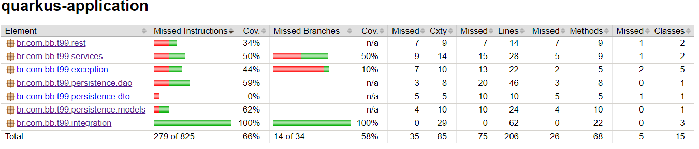

> :speech_balloon: Deixe o seu feedback sobre este roteiro no rodapé. [^1] 

# Testes com JUnit

Este roteiro detalha as descrições dos exemplos de testes com JUnit, presentes no arquivo [**TesteComJunit.java**](./TesteComJunit.java). Desenvolvedores podem utilizar a API do JUnit para criar testes, aproveitando classes como **Assert** para validar condições e anotações como **@Test** para marcar os métodos a serem executados como testes. 

## Configurações iniciais

Para garantir um ambiente de teste adequado, a anotação **@QuarkusTest** deve ser aplicada antes da classe de testes, assegurando a preparação correta do ambiente. Além disso, é crucial configurar corretamente a string de conexão para que os testes sejam executados de forma precisa.

Outro aspecto importante é a preparação dos dados de teste. Para isso, deve-se incluir na pasta **resources** o arquivo **carga_testes.sql**, que contém instruções DML (Data Manipulation Language) e DDL (Data Definition Language). Essas instruções são necessárias para criar um banco de dados na fase de testes, utilizando o banco de dados em memória H2. A escolha do H2 é justificada por sua versatilidade, independência em relação a outros servidores, desempenho e compatibilidade com o banco de dados especificado no atributo MODE.

## Teste 1: Verificar propriedades da classe Usuario

Este teste valida se a criação do usuário **João da Silva** na classe **Usuario** ocorreu e se é possível deixar a data de nascimento dele em branco. 

~~~java
@Test
void testUsuarioNomeDataNascimento(){
    Usuario usuario = new Usuario(7, "João da Silva", null);

    assertEquals("João da Silva", usuario.getNome());
    assertNull(usuario.getNascimento());
~~~

|Elemento|Descrição|
|---|---|
|**@Test**|Anotação que indica que o método é um teste.|
|**assertEquals("João da Silva", usuario.getNome())**|Verifica se o nome do usuário é **"João da Silva"**.|
|**assertNull(usuario.getNascimento())**|Verifica se a data de nascimento do usuário é **null**.|

> :information_source: **Observação** 
> 
> Valores **null** representam a ausência de dados ou a falta de referência a um objeto. Essenciais no gerenciamento de variáveis em Java, permitem que os DEVs lidem com situações em que os dados não estão disponíveis ou uma variável não deve apontar para nenhum objeto.

## Teste 2: Verificar a quantidade de usuários

Este teste verifica se a quantidade de usuários retornada pela função **buscaUsuarios()** do **UsuarioDao** é de 6 usuários. 

~~~java
@Test
@Order(1)
void testQuantidadeUsuarios(){
    var usuarios = dao.buscaUsuarios();

    assertFalse(usuarios.isEmpty());
    assertEquals(6, usuarios.size(),"O total de usuários deve ser 6.");
~~~

|Elemento|Descrição|
|---|---|
|**@Order(1)**| Anotação que define a ordem de execução do teste. Neste caso, o teste é o primeiro a ser executado.|
|**assertFalse(usuarios.isEmpty())**| Verifica se a lista de usuários não está vazia.|
|**assertEquals(6, usuarios.size(),"O total de usuários deve ser 6.")**|Verifica se o tamanho da lista de usuários é 6 e fornece uma mensagem personalizada.|

## Teste 3: Verificar o nome de um usuário

Este teste verifica se o nome do usuário retornado pela função **buscarUsuario(1L)** do **UsuarioDao** é igual a **"João da Silva"**. 

~~~java
@Test
@Order(2)
void testNomeUsuarioJoao(){
    var usuario = dao.buscarUsuario(1L);

    assertNotNull(usuario);
    assertTrue(usuario.getNome().equals("João da Silva"));
~~~

|Elemento|Descrição|
|---|---|
|**@Order(2)**| Anotação que define a ordem de execução do teste. Neste caso, o teste é o segundo a ser executado.|
|**assertNotNull(usuario)**|Verifica se o objeto **usuario** não é nulo.|
|**assertTrue(usuario.getNome().equals("João da Silva"))**|Verifica se o nome do usuário é **"João da Silva"**.| 

## Teste 4: Verificar usuário inexistente

Este teste verifica se o nome do usuário retornado pela função **buscarUsuario(7L)** do **UsuarioDao** será **null** quando não encontrar um usuário com o ID especificado. 

~~~java
@Test
void testNomeUsuarioNotFound(){
    var usuario = dao.buscarUsuario(7L);

    assertNull(usuario);
~~~

|Elemento|Descrição|
|---|---|
|**assertNull(usuario)**|Verifica se o objeto **usuario** é nulo, indicando que o usuário não foi encontrado pelo ID especificado.|   

## Teste 5: Verificar tentativa de adicionar usuário menor de idade

Este teste verifica se a tentativa de inserir um usuário que não cumpre com os critérios de idade definidos pelo sistema, resulta na exceção **ErrosSistema.ValidacaoIdadeUsuario**.

~~~java
@Test
void testInserirUsuarioMenorValido(){
    Usuario usuario = new Usuario(7, "João da Silva", new Date(System.currentTimeMillis()));

    assertThrows(ErrosSistema.ValidacaoIdadeUsuario.class, ()-> service.inserirUsuario(usuario));
~~~

|Elemento|Descrição|
|---|---|
|**assertThrows(ErrosSistema.ValidacaoIdadeUsuario.class, ()-> service.inserirUsuario(usuario))**| Verifica se o método **inserirUsuario()** do **UsuarioService** lança uma exceção do tipo **ErrosSistema.ValidacaoIdadeUsuario** ao tentar inserir o usuário menor de idade.|

## Teste 6: Verificar tentativa de adicionar usuário sem preencher todos os campos obrigatórios

Este teste verifica se a tentativa de inserir um usuário com a data de nascimento definida como **null** resulta na exceção **ErrosSistema.CampoNaoInformado**.

~~~java
@Test
void testInserirUsuarioDataNascimento(){
    Usuario usuario = new Usuario(7, "João da Silva", null);

    assertThrows(ErrosSistema.CampoNaoInformado.class, ()-> service.inserirUsuario(usuario));
~~~

|Elemento|Descrição|
|---|---|
|**assertThrows(ErrosSistema.CampoNaoInformado.class, ()-> service.inserirUsuario(usuario))**| Verifica se o método **inserirUsuario()** do **UsuarioService** lança uma exceção do tipo **ErrosSistema.CampoNaoInformado** ao tentar inserir o usuário sem informar a data de nascimento.|          

## Cobertura de testes

Testes são um tema importante quando se trata de desenvolvimento. Aqui na Cloud BB, temos algumas ferramentas para análise de código e cobertura de testes, como o Sonar, o Jacoco e o Motor de Liberação. O Motor de Liberação, por exemplo, pontua um artefato atribuindo uma nota de 0 a 260, o que afeta diretamente na hora de fazermos o release da aplicação. 

Dentre os critérios de avaliação, temos a cobertura de testes que é uma métrica essencial no desenvolvimento de software. Ela mede a quantidade de testes realizados, coletando informações sobre quais partes do código são executadas durante o teste. Isso revela quais partes foram verificadas e quais ainda necessitam de atenção.

Podemos conferir a cobertura de testes em projetos Java Quarkus ao executar o comando `mvn test`. O comando gera um arquivo HTML em **target > site > jacoco > index.html**. A figura abaixo mostra o resultado da cobertura de testes feita pelo Jacoco:
 
 

**Tags:** #testes #java #quarkus #junit

## Precisa de ajuda?
Em caso de problemas na execução de qualquer roteiro, abra uma [nova issue](https://fontes.intranet.bb.com.br/dev/publico/atendimento/-/issues) e relate a situação. O time de atendimento da devCloud está disponível para auxiliar!  

## Este roteiro foi útil?
[^1]: [👍👎](http://feedback.dev.intranet.bb.com.br/?origem=roteiros&url_origem=fontes.intranet.bb.com.br/dev/publico/roteiros/-/blob/master/testes/referencias/roteiroJUnit/Testes_JUnit.md&internalidade=testes/referencias/roteiroJUnit/Testes_JUnit)
