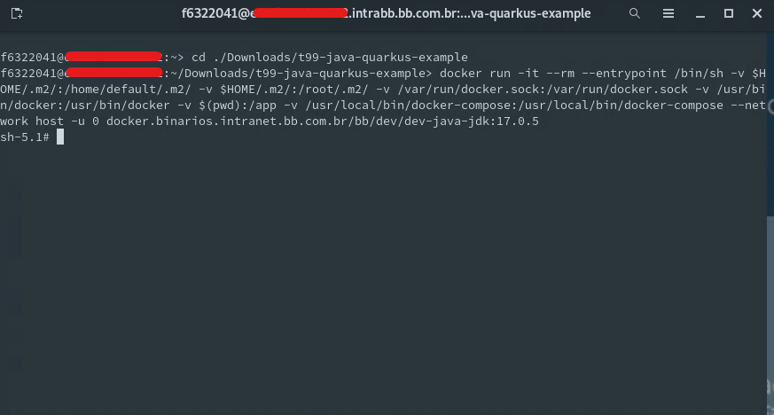
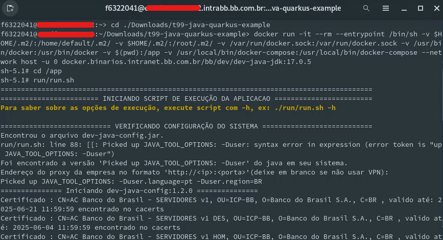

> :exclamation: Dê um feedback para esse documento no rodapé.[^1]


# Rodando aplicação Java 17 em VDI Suse utilizando Docker

Atualmente, a VDI Suse contêm suporte apenas ao Java 11. Para rodar uma aplicação em Java 17 é necessario executa-la dentro de uma imagem Docker.
Esse roteiro irá mostrar o passo-a-passo de como fazer

## Passos para Executar a Aplicação Java 17
1. Criar um Contêiner Docker:

* Abra o terminal na sua VDI
* Vá até o caminho aonde está seu projeto
* Execute o comando a seguir para rodar a imagem Docker:
```bash
docker run -it --rm --entrypoint /bin/sh -v $HOME/.m2/:/home/default/.m2/ -v $HOME/.m2/:/root/.m2/ -v /var/run/docker.sock:/var/run/docker.sock -v /usr/bin/docker:/usr/bin/docker -v $(pwd):/app -v /usr/local/bin/docker-compose:/usr/local/bin/docker-compose --network host -u 0 docker.binarios.intranet.bb.com.br/bb/dev/dev-java-jdk:17.0.5
```

A função desse comando e de cada uma de suas flags é a seguinte:
* docker run: Inicia um novo contêiner.
* -it: Permite interação com o terminal dentro do contêiner.
* --rm: Remove automaticamente o contêiner quando ele é encerrado.
* --entrypoint /bin/sh: Define o shell como ponto de entrada no contêiner.
* -v /home/f123456/.m2/:/home/default/.m2/: Monta o diretório .m2 da sua máquina local para dentro do contêiner, permitindo acesso aos artefatos Maven.
* -v /home/f123456/.m2/:/root/.m2/: Monta o mesmo diretório .m2 também para o usuário root dentro do contêiner.
* -v /var/run/docker.sock:/var/run/docker.sock: Permite que o contêiner acesse o socket do Docker no host.
* -v /usr/bin/docker:/usr/bin/docker: Monta o executável do Docker dentro do contêiner.
* -v $(pwd):/app: Monta o diretório atual (onde você está executando o comando) para dentro do diretório /app no contêiner.
* -v /usr/local/bin/docker-compose:/usr/local/bin/docker-compose: Monta o executável do docker-compose dentro do contêiner.
* --network host: Usa a rede do host para comunicação.
* -u 0: Executa o contêiner como usuário root.
* docker.binarios.intranet.bb.com.br/bb/dev/dev-java-jdk:17.0.5: Usa a imagem dev-java-jdk como base para o contêiner.

OBS: As criações de volume utilizando a flag -v utiliza os caminhos padrões da VDI Suse. É possível que os caminhos na sua VDI seja diferente. Confira-os e corrija caso necessário.

2. Compilar e Executar a Aplicação

Agora o seu terminal está executando dentro da imagem. Para compilar e executar a aplicação vá até o diretorio definido utilizando o comando `cd /app` e, então, execute o script run com o comando `run/run.sh`.



3. Teste a aplicação

Pronto! Sua aplicação Java 17 estará rodando na VDI Suse! Teste e utilize a sua aplicação.
Caso necessite sair da imagem Docker, pode sair a qualquer momento utilizando o comando `exit` ou o atalho `Ctrl + D` e voltar novamente quando necessario utilizando o comando `docker run` com as flags apresentadas no primeiro passo do roteiro

---
[^1]: [👍👎](http://feedback.dev.intranet.bb.com.br/?origem=roteiros&url_origem=fontes.intranet.bb.com.br/dev/publico/roteiros/-/blob/master/frameworks/quarkus/atualizacao-quarkus.md&internalidade=frameworks/quarkus/atualizacao-quarkus)